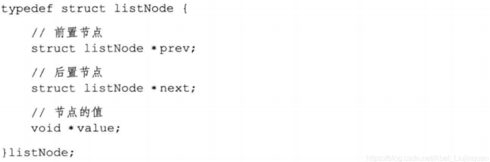
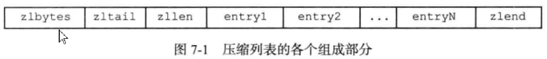
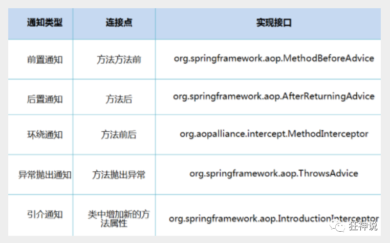
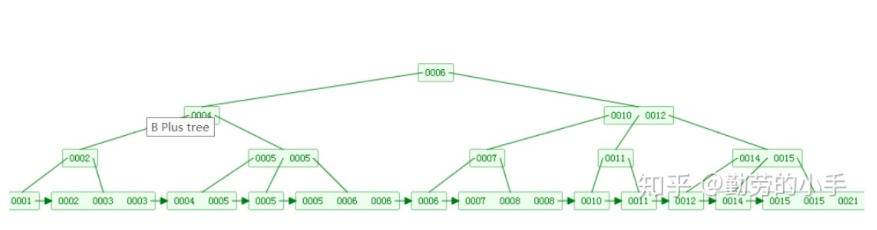
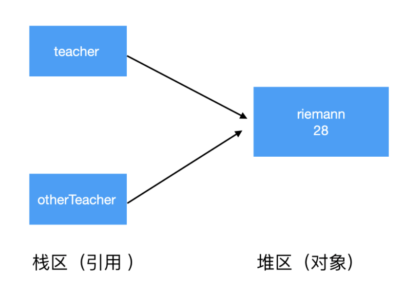

框架演进：


# 项目


### 基于数理统计与机器学习算法的故障预测软件

​		此项目是中国核动力研究设计院（成都）委托的横向项目，是一个基于C/S架构，实现对设备的样本数据进行管理、趋势预测建模、模型评估与测试、预测结果输出等功能的故障预测软件。

这个项目的目的是集成一个机器学习和数理统计方法来实现故障预测的工具箱。用户输入的数据是一些按时间排列的设备参数，根据需要选择模型进行故障预测。

首先是对训练Excel和测试的数据进行导入和管理，包括实现归一化、列的删除等。

其次，选定所需的特征列，设置时间长度等参数，生成待训练的特征空间。

然后，选定所需的机器学习或者数理统计方法，设置模型参数，开始训练。

最后，将模型保存的数据库，以便日后调用。

**主要工作**：

- 实现了多线程的功能；

  由于深度学习算法的迭代训练时间长，导致程序阻塞，为了可以在训练过程中可以执行其他操作，不影响用户体验，决定采用多线程实现训练。

  具体实现就是采用了线程池的方法，先实例化一个Executors.newFixedThreadPool(3);有训练任务的时候，就将其放到线程池中，，超出的线程会在队列中等待。

  就采用了Callable接口，返回一个future类型的对象接收训练结果。

优化：考虑采用线程池的方法。

- 　　第一：降低资源消耗。通过重复利用已创建的线程降低线程创建和销毁造成的消耗。 
- 　　第二：提高响应速度。当任务到达时，任务可以不需要等到线程创建就能立即执行。 
- 　　第三：提高线程的可管理性。 


- 对机器学习和数理统计算法的整合；

  调用了RunTime.getRuntime().exec()实现了调用服务器命令脚本来执行功能需要，在指定环境的独立进程中执行指定命令和变量。参数中放入本机安装的python环境路径和python 文件路径，来实现python的调用。

- 使用git实现代码的保存与合并。多人协作开发的时候，共享代码的手段依赖拷贝的导致开发效率低下，为了方便实现多人协作修改代码，我就采用了分布式版本控制。将工作目录添加到暂存区，写提交信息，再添加到本地仓库，最后添加到github上。


### 个人主页生成网站

**项目概述**：此项目制作了一个生成个人主页的网站。通过输入个人信息，可以生成一个在线的描述个人教育经历、工作经历以及技能特长信息的网站。

**主要工作**：

- 云数据库搭建

  - 购买 -- 集群搭建 -- 集群安全组 -- 权限账号 -- DMS连接集群 - -导入sql文件

  在控制台，设置集群白名单；

  ​	集群：

  - 应用程序只需连接一个集群地址，即可连接到多个节点。

  - 带有读写分离功能，写请求会自动发往主节点，读请求会自动根据各节点的负载发往主节点或只读节点。

  创建账号，

  申请公网地址，

  使用DMS连接集群，

- 浏览器与服务器之间的数据存取实现；

  创建5个表，分别存放基本信息、学习、技能、特长等。

  servlet层接收浏览器的数据，回复浏览器结果；

  Beans层封装从浏览器得到的数据信息；

  Dao层将数据存入数据库，或从数据库取出数据；

  service层将Dao层多个类的插入和查询进行封装，作为数据库操作和数据库的隔离。

  DBUtils连接、断开数据库。

- 云服务器搭建；

  - 服务器搭建过程：设置安全组（填写端口及其授权对象） --  重置镜像（宝塔控制面板 -- 服务器管理软件 输入“公网IP:8888”即可访问宝塔登录界面）-- 安装Tomcat

  设置安全组

  端口的设置。

  从外网访问到配置的网站，IP直接访问也不行。

  在设置安全组中，把8888端口号开放为本机ip，为了登录宝塔面板。

  把80端口号设置为0.0.0.0.

  .0.0.0/0已经不是一个真正意义上的IP地址了。它表示的是这样一个集合：所有未知的主机和目的网络。

  80端口：**HTTP协议的默认端口**，www.iis7.com:80网址后面接端口号，由于默认的WWW服务是80号端口，所以80号端口可以不写，直接输入www.iis7.com即可。

# 多线程

## 线程安全

### 产生原因

线程安全的问题只会出现在多线程环境中，导致线程不安全的原因，主要有三点：

- 原子性：一个或者多个操作在 CPU 执行的过程中被中断
  - count++的指令在实际执行的过程中不是原子性的，而是要分为读、改、写三步来进行；即先从内存中读出count的值，然后执行+1操作，再将结果写回内存中。
- 可见性：一个线程对共享变量的修改，另外一个线程不能立刻看到
- 有序性：程序执行的顺序没有按照代码的先后顺序执行。
  - 动态编译器为了程序的整体性能会对指令进行重排序，虽然重排序可以提升程序的性能，但是重排序之后会导致源代码中指定的内存访问顺序与实际的执行顺序不一样，就会出现线程不安全的问题。

### 线程安全方法

- 针对原子性：JDK里面提供了很多**atomic**类，比如AtomicInteger, AtomicLong, AtomicBoolean等等，这些类本身可以通过CAS来保证操作的原子性；另外Java也提供了各种锁机制，来保证锁内的代码块在同一时刻只能有一个线程执行。
- 针对可见性：同样可以通过**synchronized**关键字加锁来解决。与此同时，java还提供了一种轻量级的锁，即**volatile**关键字，要优于synchronized的性能，同样可以保证修改对其他线程的可见性。
- 针对有序性：可以通过synchronized关键字定义同步代码块或者同步方法保障有序性，另外也可以通过**Lock接口**保障有序性。

- 多实例、或者是多副本（**ThreadLocal**）：对应着思路2，ThreadLocal可以为每个线程的维护一个私有的本地变量
- 重入锁（**ReentrantLock**）来实现同步。

### volatile

（1）作用

一旦一个共享变量（类的成员变量、类的静态成员变量）被volatile修饰之后，那么就具备了两层语义：

　　1）保证了不同线程对这个变量进行操作时的可见性，即一个线程修改了某个变量的值，这新值对其他线程来说是立即可见的。

　　2）禁止进行指令重排序。

（2）底层实现：

处理器为了提高处理速度，不直接和内存进行通讯，而是先将系统内存的数据读到**内部缓存**（L1,L2 或其他）后再进行操作，但操作完之后不知道何时会写到内存。

JVM 向处理器发送一条 Lock 前缀的指令，将这个变量所在缓存行的数据写回到系统内存。但是就算写回到内存，如果其他处理器缓存的值还是旧的，再执行计算操作就会有问题，所以在多处理器下，为了保证各个处理器的缓存是一致的，就会实现**缓存一致性协议**，每个处理器通过嗅探在总线上传播的数据来检查自己缓存的值是不是过期了，当处理器发现自己缓存行对应的内存地址被修改，就会将当前处理器的缓存行设置成无效状态，当处理器要对这个数据进行修改操作的时候，会强制重新从系统内存里把数据读到处理器缓存里。

（3）无原子性

可见性只能保证每次读取的是最新的值，但是volatile没办法保证对变量的操作的原子性。

线程1对变量进行读取操作之后，被阻塞了的话，并没有对inc值进行修改。然后虽然volatile能保证线程2对变量inc的值读取是从内存中读取的，但是线程1没有进行修改，所以线程2根本就不会看到修改的值。

### ThreadLocal

ThreadLocal是线程局部变量.

当使用ThreadLocal维护变量时，ThreadLocal为每个使用该变量的线程提供独立的变量副本，所以每一个线程都可以独立地改变自己的副本，而不会影响其它线程所对应的副本。从线程的角度看，目标变量就像是线程的本地变量，这也是类名中“Local”所要表达的意思。.

set():设置当前线程的线程局部变量的值。

get():该方法返回当前线程所对应的线程局部变量。

实现原理：

ThreadLocal类中有一个Map，用于存储每一个线程的变量副本，Map中元素的键为线程对象，而值对应线程的变量副本。

#### 和多线程比较

在同步机制中，通过对象的**锁机制**保证同一时间只有一个线程访问变量。这时该变量是多个线程共享的，使用同步机制要求程序慎密地分析什么时候对变量进行读写，什么时候需要锁定某个对象，什么时候释放对象锁等繁杂的问题，程序设计和编写难度相对较大。

而ThreadLocal则从另一个角度来解决多线程的并发访问。ThreadLocal会为每一个线程提供一个独立的变量副本，从而隔离了多个线程对数据的访问冲突。因为每一个线程都拥有自己的变量副本，从而也就没有必要对该变量进行同步了。ThreadLocal提供了线程安全的共享对象，在编写多线程代码时，可以把不安全的变量封装进ThreadLocal。

概括起来说，对于多线程资源共享的问题，同步机制采用了“以时间换空间”的方式，而ThreadLocal采用了“以空间换时间”的方式。前者仅提供一份变量，让不同的线程排队访问，而后者为每一个线程都提供了一份变量，因此可以同时访问而互不影响。

## 线程间通信

方法一：等待/通知机制

wait（）的作用是使其执行线程被暂停 （其生命周期状态变更为 WAITING）；

暂停当前线程时释放的锁只是与该 wait 方法所属对象的内部锁。 当前线程所持有的其他内部锁、显式锁并不会因此而被释放。

notify （）的作用是唤醒一个被暂停的线程。

⼀个锁同⼀时刻只能被⼀个线程持有。⽽假如线程A现在持有了⼀ 个锁 lock 并开始执⾏，它可以使⽤ lock.wait() 让⾃⼰进⼊等待状态。这个时 候， lock 这个锁是被释放了的。 这时，线程B获得了 lock 这个锁并开始执⾏，它可以在某⼀时刻，使 ⽤ lock.notify() ，通知之前持有 lock 锁并进⼊等待状态的线程A，说“线程A你不 ⽤等了，可以往下执⾏了”。

方法二：锁机制

声明了⼀个名字为 lock 的对象锁。我们在 ThreadA 和 ThreadB 内需要同步的 代码块⾥，都是⽤ synchronized 关键字加上了同⼀个对象锁 lock 。 上⽂我们说到了，根据线程和锁的关系，同⼀时间只有⼀个线程持有⼀个锁，那么 线程B就会等线程A执⾏完成后释放 lock ，线程B才能获得锁 lock 。

### sleep和wait

两者都可以暂停线程的执行

- 类的不同：sleep() 是 Thread线程类的静态方法，wait() 是 Object类的方法。
- 是否释放锁：sleep() 不释放锁；wait() 释放锁。
- 用途不同：Wait 通常被用于线程间交互/通信，sleep 通常被用于暂停执行。
- 用法不同：wait() 方法被调用后，线程不会自动苏醒，需要别的线程调用同一个对象上的 notify()或者 notifyAll() 方法。sleep() 方法执行完成后，线程会自动苏醒。或者可以使用wait(longtimeout)超时后线程会自动苏醒。

## 并发编程

### 并发和并行的区别

- 并发：多个任务在同一个 CPU 核上，按细分的时间片轮流(交替)执行，从逻辑上来看那些任务是同时执行。

- 并行：单位时间内，多个处理器或多核处理器同时处理多个任务，是真正意义上的“同时进行”。

- 串行：有n个任务，由一个线程按顺序执行。由于任务、方法都在一个线程执行所以不存在线程不安全情况，也就不存在临界区的问题。

### 并发编程的优点

并发编程的目标是充分的利用处理器的每一个核，以达到最高的处理性能。

- 充分利用多核CPU的计算能力：充分的利用处理器的每一个核，以达到最高的处理性能。

- 现在的系统动不动就要求百万级甚至千万级的并发量，而多线程并发编程正是开发高并发系统的基础，利用好多线程机制可以大大提高系统整体的并发能力以及性能。面对复杂业务模型，并行程序会比串行程序更适应业务需求 。

### 并发编程三要素

原子性：原子，即一个不可再被分割的颗粒。原子性指的是一个或多个操作要么全部执行成功要么全部执行失败。

可见性：一个线程对共享变量的修改,另一个线程能够立刻看到。（synchronized,volatile）

有序性：程序执行的顺序按照代码的先后顺序执行。（处理器可能会对指令进行重排序）

出现线程安全问题的原因：

- 线程切换带来的原子性问题

- 缓存导致的可见性问题

- 编译优化带来的有序性问题

解决办法：

- JDK Atomic开头的原子类、synchronized、LOCK，可以解决原子性问题

- synchronized、volatile、LOCK，可以解决可见性问题

- Happens-Before 规则可以解决有序性问题

### 多线程

- 多线程：多线程是指程序中包含多个执行流，即在一个程序中可以同时运行多个不同的线程来执行不同的任务。

- 多线程的好处：

可以提高 CPU 的利用率。在多线程程序中，一个线程必须等待的时候，CPU 可以运行其它的线程而不是等待，这样就大大提高了程序的效率。也就是说允许单个程序创建多个并行执行的线程来完成各自的任务。

多线程的劣势：

线程也是程序，所以线程需要占用内存，线程越多占用内存也越多；

线程之间对共享资源的访问会相互影响，必须解决竞用共享资源的问题。

### 进程与线程

**进程**：

一个在内存中运行的应用程序。每个进程都有自己独立的一块内存空间，一个进程可以有多个线程。

**线程**：

进程中的一个执行任务（控制单元），负责当前进程中程序的执行。一个进程至少有一个线程，一个进程可以运行多个线程，多个线程可共享数据。

**根本区别**：进程是操作系统资源分配的基本单位，而线程是处理器任务调度和执行的基本单位

**资源开销**：每个进程都有独立的代码和数据空间（程序上下文），程序之间的切换会有较大的开销；线

程可以看做轻量级的进程，同一类线程共享代码和数据空间，每个线程都有自己独立的运行栈和程序计

数器（PC），线程之间切换的开销小。

**包含关系**：如果一个进程内有多个线程，则执行过程不是一条线的，而是多条线（线程）共同完成的；

线程是进程的一部分，所以线程也被称为轻权进程或者轻量级进程。

**内存分配**：同一进程的线程共享本进程的地址空间和资源，而进程之间的地址空间和资源是相互独立的

**影响关系**：一个进程崩溃后，在保护模式下不会对其他进程产生影响，但是一个线程崩溃整个进程都死

掉。所以多进程要比多线程健壮。

**执行过程**：每个独立的进程有程序运行的入口、顺序执行序列和程序出口。但是线程不能独立执行，必

须依存在应用程序中，由应用程序提供多个线程执行控制，两者均可并发执行.

### 上下文切换

多线程编程中一般线程的个数都大于 CPU 核心的个数，而一个 CPU 核心在任意时刻只能被一个线程使用，为了让这些线程都能得到有效执行，CPU 采取的策略是为每个线程分配时间片并轮转的形式。当一个线程的时间片用完的时候就会重新处于就绪状态让给其他线程使用，这个过程就属于一次上下文切换。

### 守护线程和用户线程

**用户线程**：运行在前台，执行具体的任务，如程序的主线程、连接网络的子线程等都是用户线程。

**守护线程**：运行在后台，为其他前台线程服务。也可以说守护线程是 JVM 中非守护线程的 “佣人”。一旦所有用户线程都结束运行，守护线程会随 **JVM** 一起结束工作。

用户线程结束，JVM 退出，不管这个时候有没有守护线程运行。而守护线程不会影响 JVM 的退出。

### 避免死锁

死锁是指两个或两个以上的进程（线程）在执行过程中，由于竞争资源或者由于彼此通信而造成的一种阻塞的现象，若无外力作用，它们都将无法推进下去。此时称系统处于死锁状态或系统产生了死锁，这些永远在互相等待的进程（线程）称为死锁进程（线程）。

多个线程同时被阻塞，它们中的一个或者全部都在等待某个资源被释放。由于线程被无限期地阻塞，因此程序不可能正常终止

**如何避免线程死锁**

我们只要破坏产生死锁的四个条件中的其中一个就可以了。

**破坏互斥条件**

这个条件我们没有办法破坏，因为我们用锁本来就是想让他们互斥的（临界资源需要互斥访问）。

**破坏请求与保持条件**

一次性申请所有的资源。

**破坏不剥夺条件**

占用部分资源的线程进一步申请其他资源时，如果申请不到，可以主动释放它占有的资源。

**破坏循环等待条件**

靠按序申请资源来预防。按某一顺序申请资源，释放资源则反序释放。破坏循环等待条件。

### 创建线程的方式

有4种方式可以用来创建线程：

- 继承Thread类

```
（1）定义Thread类的子类，并重写该类的run方法，该run方法的方法体就代表了线程要完成的任务。因此把run()方法称为执行体。

（2）创建Thread子类的实例，即创建了线程对象。

（3）调用线程对象的start()方法来启动该线程。
```

- 实现Runnable接口

```
（1）定义runnable接口的实现类，并重写该接口的run()方法，该run()方法的方法体同样是该线程的线程执行体。

（2）创建 Runnable实现类的实例（注意 ，这里声明的是实现类，构造方法也是实现类的构造方法），并依此实例作为Thread构造方法的参数来创建Thread对象，该Thread对象才是真正的线程对象。

（3）调用线程对象的start()方法来启动该线程。
```

- 使用Executor框架来创建线程池

实现Runnable接口这种方式更受欢迎，因为这不需要继承Thread类。在应用设计中已经继承了别的对象的情况下，这需要多继承（而Java不支持多继承），只能实现接口。同时，线程池也是非常高效的，很容易实现和使用。


- 实现Callable接口

```java
 * 1】创建Callable接口的实现类，并实现call()方法，然后创建该实现类的实例
 * 2】使用FutureTask类来包装Callable对象，该FutureTask对象封装了Callable对象的call()方法的返回值
 * 3】使用FutureTask对象作为Thread对象的target创建并启动线程（因为FutureTask实现了Runnable接口）
 * 4】调用FutureTask对象的get()方法来获得子线程执行结束后的返回值

public class MyThreadThree implements Callable<Integer> {
    public static void main(String[] args) {
        MyThreadThree myThreadThree = new MyThreadThree();
        FutureTask<Integer> ft = new FutureTask<>(myThreadThree);
        FutureTask<Integer> ft1 = new FutureTask<>(myThreadThree);
        System.out.println(Thread.currentThread().getName() + "===== ");
 
        new Thread(ft, "thread-1").start();
        new Thread(ft1, "thread-2").start();
        try {
            System.out.println("return thread-1'result ：" + ft.get());
            System.out.println("return thread-2'result ：" + ft1.get());
        } catch (InterruptedException e) {
            e.printStackTrace();
        } catch (ExecutionException e) {
            e.printStackTrace();
        }
    }
 
    @Override
    public Integer call() throws Exception {
        for (int i = 0; i < 10; i++) {
            System.out.println(Thread.currentThread().getName() + " " + i);
        }
        return 20;
    }
} 
```

#### **runnable** **和** **callable**

相同点

- 都是接口

- 都可以编写多线程程序

- 都采用Thread.start()启动线程

主要区别

- Runnable 接口 run 方法无返回值；Callable 接口 call 方法有返回值，是个泛型，和Future、FutureTask配合可以用来获取异步执行的结果

- Runnable 接口 run 方法只能抛出运行时异常，且无法捕获处理；Callable 接口 call 方法允许抛出异常，可以获取异常信息

#### run()和start()

new 一个 Thread，线程进入了新建状态。调用 start() 方法，会启动一个线程并使线程进入了就绪状态，当分配到时间片后就可以开始运行了。 start() 会执行线程的相应准备工作，然后自动执行 run() 方法的内容，这是真正的多线程工作。

而直接执行 run() 方法，会把 run 方法当成一个 main 线程下的普通方法去执行，并不会在某个线程中执行它，所以这并不是多线程工作。

总结： 调用 start 方法方可启动线程并使线程进入就绪状态，而 run 方法只是 thread 的一个普通方法调用，还是在主线程里执行

### **线程的状态**

1. **新建(new)**：新创建了一个线程对象。

2. **可运行(runnable)**：线程对象创建后，当调用线程对象的 start()方法，该线程处于就绪状态，等待被线程调度选中，获取cpu的使用权。

3. **运行(running)**：可运行状态(runnable)的线程获得了cpu时间片（timeslice），执行程序代码。注：就绪状态是进入到运行状态的唯一入口，也就是说，线程要想进入运行状态执行，首先必须处于就绪状态中；

4. **阻塞(block)**：处于运行状态中的线程由于某种原因，暂时放弃对 CPU的使用权，停止执行，此时进入阻塞状态，直到其进入到就绪状态，才 有机会再次被 CPU 调用以进入到运行状态。阻塞的情况分三种：

​	(一) 等待阻塞：运行状态中的线程执行 wait()方法，JVM会把该线程放入等待队列(waitting

queue)中，使本线程进入到等待阻塞状态；

​	(二) 同步阻塞：线程在获取 synchronized 同步锁失败(因为锁被其它线程所占用)，，则JVM会把

该线程放入锁池(lock pool)中，线程会进入同步阻塞状态；

​	(三) 其他阻塞: 通过调用线程的 sleep()或 join()或发出了 I/O 请求时，线程会进入到阻塞状态。当

sleep()状态超时、join()等待线程终止或者超时、或者 I/O 处理完毕时，线程重新转入就绪状态。

5. **死亡(dead)**：线程run()、main()方法执行结束，或者因异常退出了run()方法，则该线程结束生命周期。死亡的线程不可再次复生。

### **Java** **中用到的线程调度算法**

Java虚拟机采用抢占式调度模型，是指优先让可运行池中优先级高的线程占用CPU，如果可运行池中的线程优先级相同，那么就随机选择一个线程，使其占用CPU。处于运行状态的线程会一直运行，直至它不得不放弃 CPU。

#### **线程的调度策略**

线程调度器选择优先级最高的线程运行，但是，如果发生以下情况，就会终止线程的运行：

（1）线程体中调用了 yield 方法让出了对 cpu 的占用权利

（2）线程体中调用了 sleep 方法使线程进入睡眠状态

（3）线程由于 IO 操作受到阻塞

（4）另外一个更高优先级线程出现

（5）在支持时间片的系统中，该线程的时间片用完

**线程调度器(Thread Scheduler)和时间分片(Time Slicing )**

#### **与线程同步以及线程调度相关的方法**

（1） wait()：使一个线程处于等待（阻塞）状态，并且释放所持有的对象的锁；

（2）sleep()：使一个正在运行的线程处于睡眠状态，是一个静态方法，调用此方法要处理

InterruptedException 异常；

（3）notify()：唤醒一个处于等待状态的线程，当然在调用此方法的时候，并不能确切的唤醒某一个等

待状态的线程，而是由 JVM 确定唤醒哪个线程，而且与优先级无关；

（4）notityAll()：唤醒所有处于等待状态的线程，该方法并不是将对象的锁给所有线程，而是让它们竞

争，只有获得锁的线程才能进入就绪状态；


#### **调用** **wait()** 

处于等待状态的线程可能会收到**错误警报**和**伪唤醒**，如果不在循环中检查等待条件，程序就会在没有满足结束条件的情况下退出。

### 同步代码块和同步方法

加锁对象相同的话，同步方法锁的范围大于等于同步方法块。一般加锁范围越大，性能越差.

如果使用同步代码块，只将可能会出现多线程问题的代码放在同步代码块里面，那么当一个线程访问同步代码块里面的代码时，其他线程也可以访问方法里其他的代码，这样代码执行效率会大大增加。所以，通常情况下，能使用同步代码块就尽量使用同步代码块。

### 线程同步的方法

- 同步代码方法：sychronized 关键字修饰的方法

- 同步代码块：sychronized 关键字修饰的代码块

- 使用特殊变量域volatile实现线程同步：volatile关键字为域变量的访问提供了一种免锁机制

- 使用重入锁实现线程同步：reentrantlock类是可冲入、互斥、实现了lock接口的锁,他与sychronized方法具有相同的基本行为和语义

  可重入就是说某个线程已经获得某个锁，可以再次获取锁而不会出现死锁.

### **监视器(Monitor)**

在 java 虚拟机中，每个对象( Object 和 class )通过某种逻辑关联监视器,每个监视器和一个对象引用相关联，为了实现监视器的互斥功能，每个对象都关联着一把锁。

一旦方法或者代码块被 **synchronized** 修饰，那么这个部分就放入了监视器的监视区域，**确保一次只能有一个线程执行该部分的代码**，线程在获取锁之前不允许执行该部分的代码


# JVM

### 方法区

方法区是被所有线程共享的内存区域，用来存储已被虚拟机加载的**类信息、常量、静态变量**、JIT（just in time,即时编译技术）**编译后的代码**等数据。**运行时常量池**是方法区的一部分，用于存放编译期间生成的各种**字面常量和符号引用**。

### StackOverflowError

如果线程请求的栈深度大于虚拟机允许的深度，将抛出StackOverflowError异常；

### OutOfMemoryError

如果虚拟机栈可以动态扩展，在扩展时无法申请到足够的内存，就会抛出OutOfMemoryError异常。

### 线程池参数、类型

| 核心线程数（corePoolSize）    | 核心线程会一直存活，即使没有任务需要处理。                               刚创建线程池时，里面的核心线程数为0。                                                             当线程数小于核心线程数时，即使现有的线程空闲，线程池也会优先创建新线程来处理任务，而不是直接交给现有的线程处理； |
| ----------------------------- | ------------------------------------------------------------ |
| 最大线程数（maximumPoolSize） | 是在已经达到核心线程池参数，并且任务队列已经满的情况下，才去判断该参数。 |
| 线程存活时间（keepAliveTime） | 除了核心线程之外的线程在线程池中存活的时间。                 |
| 任务队列（workQueue）         | 该参数主要是在核心线程数都在执行任务时，用来缓存任务的队列。等待线程去执行。 |

类型

| FixedThreadPool         | 创建一个可重用固定线程数的线程池。适合使用在任务量比较固定但耗时长的任务。 |
| ----------------------- | ------------------------------------------------------------ |
| newWorkStealingPool     | 创建一个拥有多个任务队列（以便减少连接数）的线程池。适合使用在很耗时的任务中 |
| newSingleThreadExecutor | 返回一个只有一个线程的线程池,这个线程池可以在线程死后（或发生异常时）重新启动一个线程来替代原来的线程继续执行下去！适合使用在多个任务顺序执行的场景。 |
| newCachedThreadPool     | 创建一个可根据需要创建新线程的线程池，但是在以前构造的线程可用时将重用它们。适合使用在任务量大但耗时少的任务。 |
| newScheduledThreadPool  | 创建一个线程池，它可安排在给定延迟后运行命令或者定期地执行。适合使用在执行定时任务和具体固定周期的重复任务。 |

### 类加载机制

JVM把class文件加载到内存，并对数据进行校验、准备、解析、初始化，最终形成JVM可以直接使用的Java类型的过程。‘

- 加载：

将class字节码文件**加载到内存**中，并将这些数据转换成**方法区**中的运行时数据（静态变量、静态代码块、常量池等），在**堆**中生成一个Class类对象代表这个类（反射原理），作为方法区类数据的访问入口。

- 链接：

  将Java类的二进制代码合并到JVM的运行状态之中。

  - 验证：

    确保加载的类信息符合JVM规范，没有安全方面的问题。

  - 准备：

    正式为类变量(static变量)分配内存并设置类变量初始值的阶段，这些内存都将在**方法区**中进行分配。注意此时的设置初始值为默认值，具体赋值在初始化阶段完成。

  - 解析：

    虚拟机**常量池**内的符号引用替换为直接引用（地址引用）的过程。

- 初始化：

  初始化阶段是执行类构造器<clinit>()方法的过程。类构造器<clinit>()方法是由编译器自动收集类中的所有类变量的**赋值**动作和**静态语句块(static块)**中的语句合并产生的。

### 类加载器

**引导类加载器（bootstrap class loader）**
 （1）它用来加载 Java 的核心库(JAVA_HOME/jre/lib/rt.jar,sun.boot.class.path路径下的内容)

**扩展类加载器（extensions class loader）**
 （1）用来加载 Java 的扩展库(JAVA_HOME/jre/ext/*.jar，或java.ext.dirs路径下的内容) 。

**应用程序类加载器（application class loader）**
 （1）它根据 Java 应用的类路径（classpath，java.class.path 路径下的内容）来加载 Java 类。

**自定义类加载器**
 （1）开发人员可以通过继承 java.lang.ClassLoader类的方式实现自己的类加载器，以满足一些特殊的需求。

### 双亲委派机制

双亲委派机制描述 某个特定的类加载器在接到加载类的**请求时**，首先将加载任务委托给父类加载器，依次递归，如果父类加载器可以完成类加载任务，就成功返回；只有父类加载器无法完成此加载任务时，才自己去加载。

# 数据库

## 事务


### ACID

- 原子性：一个事务（transaction）中的所有操作，要么全部完成，要么全部不完成。
- 一致性：在事务开始之前和事务结束以后，数据库的**完整性**没有被破坏。
- 隔离性：数据库允许多个并发事务同时对其数据进行读写和修改的能力，隔离性可以防止多个事务并发执行时由于交叉执行而导致数据的不一致。事务隔离分为不同级别，包括读未提交（Read uncommitted）、读提交（read committed）、可重复读（repeatable read）和串行化（Serializable）。
- 持久性：事务处理结束后，对数据的修改就是永久的，即便系统故障也不会丢失。

### 日志

1、redolog

redo log叫做**重做**日志，是用来实现事务的持久性。该日志文件由两部分组成：重做日志缓冲（redo log buffer）以及重做日志文件（redo log）,前者是在内存中，后者在磁盘中。当**事务提交之后**会把所有修改信息都会存到该日志中。

作用：

记录已成功提交事务的修改信息，并且会把redo log持久化到磁盘，系统重启之后在读取redo log恢复最新数据。

**总结：** redo log是用来恢复数据的 用于保障，已提交事务的持久化特性

2、undo log

undo log 叫做回滚日志，用于记录数据**被修改前**的信息。他正好跟前面所说的重做日志所记录的相反，重做日志记录数据被修改后的信息。undo log主要记录的是数据的**逻辑变化**，为了在发生错误时回滚之前的操作，需要将之前的操作都记录下来，然后在发生错误时才可以回滚。

undo log 有什么作用？

undo log 记录事务修改之前版本的数据信息，因此假如由于系统错误或者rollback操作而回滚的话可以根据undo log的信息来进行回滚到没被修改前的状态。

**总结：** undo log是用来回滚数据的用于保障 未提交事务的原子性

### 读写锁

当有多个请求来读取表中的数据时可以不采取任何操作，但是多个请求里有读请求，又有修改请求时必须有一种措施来进行并发控制。不然很有可能会造成不一致。 **读写锁** 解决上述问题很简单，只需用两种锁的组合来对读写请求进行控制即可，这两种锁被称为：

共享锁(shared lock),又叫做"读锁" 读锁是可以共享的，或者说多个读请求可以共享一把锁读数据，不会造成阻塞。

排他锁(exclusive lock),又叫做"写锁" 写锁会排斥其他所有获取锁的请求，一直阻塞，直到写入完成释放锁。


### MVCC

多版本并发控制

InnoDB的 MVCC ，是通过在每行记录的后面保存**两个隐藏的列**来实现的。这两个列， 一个保存了行的创建时间，一个保存了行的过期时间， 当然存储的并不是实际的时间值，而是系统版本号。

主要实现思想是通过**数据多版本**来做到**读写分离**。从而实现不加锁读进而做到读写并行。

### 事务原理

前面讲的重做日志，回滚日志以及锁技术就是实现事务的基础。

- 原子性：使用 undo log ，从而达到回滚
- 持久性：使用 redo log，从而达到故障后恢复
- 隔离性：使用锁以及MVCC,运用的优化思想有读写分离，读读并行，读写并行
  - 读未提交：有写锁，无读锁。可实现读写并行，但会造成脏读。
  - 读提交：有写锁，无读锁，有MVCC。
  - 可重复读(Mysql默认隔离级别)：读写锁或者MVCC
  - 串行化
- 一致性：通过回滚，以及恢复，和在并发环境下的隔离做到一致性。

## 索引

### 索引种类

- 普通索引：仅加速查询

- 唯一索引：加速查询 + 列值唯一（可以有null）

- 主键索引：加速查询 + 列值唯一（不可以有null）+ 表中只有一个

- 组合索引：多列值组成一个索引，专门用于组合搜索，其效率大于索引合并

- 全文索引：对文本的内容进行分词，进行搜索。只能在CHAR,VARCHAR,TEXT类型字段上使用全文索引。

- 空间索引：空间索引是对空间数据类型的字段建立的索引，MySQL中的空间数据类型有四种，GEOMETRY、POINT、LINESTRING、POLYGON。

主键索引与唯一索引的区别：

    1. 主键是一种约束，唯一索引是一种索引，两者在本质上是不同的。
    
    2. 主键创建后一定包含一个唯一性索引，唯一性索引并不一定就是主键。
    
    3. 唯一性索引列允许空值，而主键列不允许为空值。
    
    4. 主键索引在创建时，已经默认为非空值+ 唯一索引了。
    
    5. 一个表最多只能创建一个主键索引，但可以创建多个唯一索引。
    
    6. 主键更适合那些不容易更改的唯一标识，如自动递增列、身份证号等。
    
    7. 主键可以被其他表引用为外键，而唯一索引不能。


## IO

### 同步异步多路复用

同步、异步强调的是，是否得到最终的结果，阻塞、非阻塞强调是时间，是否等待。

- 同步与异步区别在于：调用者是否得到了想要的**最终结果**。 同步就是一直要执行到返回最终结果； 异步就是直接返回了，但是返回的不是最终结果。调用者不能通过这种调用得到结果，需要通过被调用者的其它方式通知调用者，来取回最终结果。 

- 阻塞与非阻塞的区别：调用者是否还能干其他事。 阻塞，调用者就只能干等； 非阻塞，调用者可以先去忙会别的，不用一直等。

普通应用程序运行在用户空间（用户态）。应用程序想访问某些**硬件资源**就需要通过操作系统提供的**系统调用，**系统调用可以使用特权指令运行在内核空间，此时进程陷入内核态运行。系统调用完成，进程将返回到用户态执行用户空间代码。

IO两个阶段：

1. 数据准备阶段。内核从设备读取数据到内核空间的缓冲区

2. 内核空间复制回用户空间进程缓冲区阶段

   发生IO的时候：

3. 内核从IO设备读数据

4. 进程从内核复制数据

**同步IO**

- 阻塞IO

  进程等待（阻塞），直到读写完成。（全程等待）

- 非阻塞IO

  进程调用recvfrom操作，如果IO设备没有准备好，立即返回ERROR，进程不阻塞。用户可以再次发起系统调用（可以轮询）。如果内核已经**准备**好，就**阻塞**，然后复制数据到用户空间。

- IO多路复用

  IO多路复用是指内核一旦发现线程指定的一个或者多个IO条件准备读取，它就通知该进程。

  通过一种机制，一个进程可以监视多个描述符，一旦某个描述符就绪（一般是读就绪或者写就绪），能够通知程序进行相应的读写操作。

  

  

### select


### poll


### epoll

# Redis

## 什么是Redis?

Redis(Remote Dictionary Server) 是一个使用 C 语言编写的，开源的（BSD许可）高性能**非关系型**（NoSQL）的键值对数据库。

Redis 可以存储键和**五种不同类型**的值之间的映射。键的类型只能为字符串，值支持五种数据类型：字符串、列表、集合、散列表、有序集合。

与传统数据库不同的是 Redis 的数据是存在**内存**中的，所以读写速度非常快，因此 redis 被广泛应用于缓存方向。

Redis 也经常用来做分布式锁。除此之外，Redis 支持事务 、持久化、LUA脚本、LRU驱动事件、多种集群方案。

### 优缺点

优点：

- 读写性能优异， Redis能读的速度是110000次/s，写的速度是81000次/s。

- 支持数据持久化，支持AOF和RDB两种持久化方式。

- 支持事务，Redis的所有操作都是原子性的，同时Redis还支持对几个操作合并后的原子性执行。

- 数据结构丰富，除了支持string类型的value外还支持hash、set、zset、list等数据结构。

- 支持主从复制，主机会自动将数据同步到从机，可以进行读写分离。

缺点：

- 数据库容量受到**物理内存**的限制，不能用作海量数据的高性能读写，因 Redis适合的场景主要局限在较小数据量的高性能操作和运算上。

- Redis**不具备自动容错和恢复功能**，主机从机的宕机都会导致前端部分读写请求失败，需要等待机器重启或者手动切换前端的IP才能恢复。

- 主机宕机，宕机前有部分数据未能及时同步到从机，切换IP后还会引入**数据不一致**的问题，降低了系统的可用性。

- Redis **较难支持在线扩容**，在集群容量达到上限时在线扩容会变得很复杂。为避免这一问题，运维人员在系统上线时必须确保有足够的空间，这对资源造成了很大的浪费。

## 缓存

### 为什么要用缓存？

**高性能：**

假如用户第一次访问数据库中的某些数据。这个过程会比较慢，因为是从硬盘上读取的。将该用户访问的数据存在数缓存中，这样下一次再访问这些数据的时候就可以直接从缓存中获取了。操作缓存就是直接操作内存，所以速度相当快。如果数据库中的对应数据改变的之后，同步改变缓存中相应的数据即可！

**高并发：**

直接操作缓存能够承受的请求是远远大于直接访问数据库的，所以我们可以考虑把数据库中的部分数据转移到缓存中去，这样用户的一部分请求会直接到缓存这里而不用经过数据库。

### 为什么数据量大不适合磁盘数据库？

磁盘数据库需要频繁地访问磁盘来进行数据的操作，由于对磁盘读写数据的操作一方面要进行**磁头的机械移动**，另一方面受到**系统调用**（通常通过CPU中断完成，受到CPU时钟周期的制约）时间的影响，当数据量很大，操作频繁且复杂时，就会暴露出很多问题。


### 本地缓存和分布式缓存

以 Java 为例，使用自带的 map 或者 guava 实现的是本地缓存，最主要的特点是**轻量以及快速**，生命周期随着 jvm 的销毁而结束，并且在多实例的情况下，每个实例都需要各自保存一份缓存，**缓存不具有一致性**。

使用 redis 或 memcached 之类的称为**分布式缓存**，在多实例的情况下，各实例共用一份缓存数据，缓存具有一致性。缺点是需要保持 redis 或 memcached服务的高可用，整个程序架构上较为复杂。

### Redis快速的原因

1、**完全基于内存**，绝大部分请求是纯粹的内存操作，非常快速。数据存在内存中，类似于 HashMap，HashMap 的优势就是查找和操作的时间复杂度都是O(1)； 

2、采用**单线程**，避免了不必要的上下文切换和竞争条件，也不存在多进程或者多线程导致的切换而消耗 CPU，不用去考虑各种锁的问题，不存在加锁释放锁操作，没有因为可能出现死锁而导致的性能消耗；

3、使用**多路 I/O 复用模型，非阻塞 IO**； 

4、使用底层模型不同，它们之间底层实现方式以及与客户端之间通信的应用协议不一样，Redis 直接**自己构建了 VM 机制** ，因为一般的系统调用系统函数的话，会浪费一定的时间去移动和请求；

### Redis & Memcached

- **数据结构**：Memcached只支持简单的key/value数据结构，不像Redis可以支持丰富的数据类型。

- **持久化**：Memcached无法进行持久化，数据不能备份，只能用于缓存使用，且重启后数据全部丢失。

- **多线程**：Redis 使用单线程反而避免了多线程的频繁上下文切换问题，预防了多线程可能产生的竞争问题。

  Memcache 存在着支持并发性不好、可运维性欠佳、原子性操作不够、在误操作时产生数据不一致等问题。

  由于 **Redis** 只使用单核，而 **Memcached** 可以使用多核，所以 **Redis** 在存储小数据时比 **Memcached** 性能更高。而在 100k 以上的数据中，**Memcached** 性能要高于 **Redis**，虽然 **Redis** 最近也在存储大数据的性能上进行优化，但是比起 **Memcached**，还是稍有逊色。

- **分布式**：Redis原生支持集群模式，Memcached没有原生的集群模式。

  Redis 支持通过Replication进行数据复制，通过master-slave机制，可以实时进行数据的同步复制，支持多级复制和增量复制，master-slave机制是Redis进行HA的重要手段。

  

## 数据类型

### 基础


### 进阶

- Geo：可以用来保存地理位置，并作位置距离计算或者根据半径计算位置等。 应用场景：附近的人

- Pub/Sub：订阅/发布，应用场景：简单消息队列

- HyperLogLog：用来做基数统计的算法 ，比如数据集 {1, 3, 5, 7, 5, 7, 8}， 那么这个数据集的基数集为 {1, 3, 5 ,7, 8}, 基数(不重复元素)为5。 基数统计就是在误差可接受的范围内，快速计算基数。 应用场景：日活跃用户

- Bitmap：支持按bit位来存储信息，等同于byte数组，计数效率高，应用场景：日活跃用户、布隆过滤器。bitmaps存储一亿用户需要12.5M内存。

### 高级

**BloomFilter**

布隆过滤器可以用于**检索一个元素是否在一个集合中**。它的优点是**空间效率和查询时间**都远远超过一般的算法，缺点是有一定的**误识别率和删除困难**。 存在误判，可能要查到的元素并没有在容器中，但是hash之后得到的k个位置上值都是1。如果bloom filter中存储的是黑名单，那么可以通过建立一个白名单来存储可能会误判的元素。删除困难。一个放入容器的元素映射到bit数组的k个位置上是1，删除的时候不能简单的直接置为0，可能会影响其他元素的判断。

布隆过滤器的原理是，当一个元素被加入集合时，通过K个散列函数将这个元素映射成一个位数组中的K个点，把它们置为1。检索时，我们只要看看这些点是不是都是1就（大约）知道集合中有没有它了：如果这些点有任何一个0，则被检元素一定不在；如果都是1，则被检元素很可能在。这就是布隆过滤器的基本思想。

Bloom Filter跟单哈希函数Bit-Map不同之处在于：Bloom Filter使用了k个哈希函数，每个字符串跟k个bit对应。从而**降低了冲突的概率**。


应用场景：允许一定误差的大数据去重（举个栗子：黑名单、推荐和浏览历史去重）

### 底层数据结构

#### SDS

Redis 用SDS（Simple Dynamic String）来保存字符串，SDS还被用作缓冲区（buffer）AOF模块中的AOF缓冲区。


使用SDS的好处：

- 便于获取字符串长度

  - **SDS获取字符串长度复杂度为常数**

  - SDS通过获取len属性就可以得到字符串的长度，时间复杂度为：O(1)

    c字符串需要遍历字符串，时间复杂度为：O*(*N)

- 杜绝缓冲区溢出

  - c字符串如果没有重新分配空间，直接修改字符串的话，可能会造成数据溢出。
  - 当SDS的API需要对SDS进行修改时，API会先检查SDS的空间是否满足修改所需的需求，如果不满足，则自动将SDS空间扩展至所需大小。

- 减少修改字符串时带来的内存重分配次数

  SDS通过**空间预分配**和**惰性空间**释放两种优化策略来减少内存重分配次数。

  - 空间预分配

    Redis通过额外分配未使用的空间，优化了SDS的字符串增长操作，减少了连续执行字符串增长操作所需的内存分配次数。

  - 惰性空间释放

    惰性空间释放用于优化SDS的字符串缩短操作。当SDS缩短时，程序并不会立即回收缩短后多出来的空间，而是使用free属性将这些字节的数量记录起来，等待将来使用。

  注：如果需要真正地释放SDS的未使用空间，我们可以使用相应的API。 

- 二进制安全

  SDS API会以处理二进制的方式来处理SDS存放在buf数组里的数据，程序不会对其中的数据做任何的限制、过滤或者假设，所以SDS的API都是二进制安全的。

- 链表SDS兼容部分c字符串函数

  SDS之所以在末尾保存一个空字符’\0’，是为了使用一些c字符串<string.h>函数库，避免不必要的代码重复。

  例如 字符串对比函数：<string.h>/strcasecmp函数

#### 双向链表

List的底层实现之一就是链表.

链表结构


链表节点结构




- 双端：链表节点带有prev 和next 指针，获取某个节点的前置节点和后置节点的时间复杂度都是O（N）
- 无环：表头节点的 prev 指针和表尾节点的next 都指向NULL，对立案表的访问时以NULL为截止
- 表头和表尾：因为链表带有head指针和tail 指针，程序获取链表头结点和尾节点的时间复杂度为O(1)
- 长度计数器：链表中存有记录链表长度的属性 len.

#### 整数集合

整数集合是集合（set）的底层实现之一，当一个集合中只包含整数，且这个集合中的元素数量不多时，redis就会使用整数集合intset作为集合的底层实现。

```c++
typedef struct intset{
	//编码方式
	uint32_t enconding;
	// 集合包含的元素数量
	uint32_t length;
	//保存元素的数组
	int8_t contents[];
} 
```

- **encoding**：contents数组中元素的类型，有 INTSET_ENC_INT16、INTSET_ENC_INT32 和 INTSET_ENC_INT64 三种，分别表示contents数组中元素类型为 int16_t（16位二进制）、int32_t 和 int64_t 类型。

- **contents**：整数集合的每个元素都是contents数组的一个数组项，各个项在数组中按值的大小从小到大有序地排列，数组中不包含重复项。
- **length**：记录了整数集合包含的元素数量。


##### 2、整数集合的升级

如果我们想要添加一个新元素到整数集合里面，但是新元素的类型比整数集合原有的元素类型都要长时，我们就要对整数集合进行升级，然后才能将新元素添加到整数集合里面。

另外，还需注意，Redis的整数集合不支持降级。

**升级整数集合并添加新元素共分为三步进行：**

1）根据新元素的类型，扩展整数集合底层数组的空间大小，并为新元素分配空间。

2）将底层数组现有的所有元素都转换成与新元素相同的类型，并将类型转换后的元素继续维持底层数组的有序性质不变。

3）将新元素添加到底层数组里面。

升级步骤图解：

#### 字典

字典，又称为符号表（symbol table）、关联数组（associative array）或映射（map），是一种用于保存键值对的抽象数据结构。

字典用途：Redis数据库底层实现、哈希键底层实现。类似HashMap，当发生哈希冲突时，采用头插法向单向链表表头插入元素。

##### **1. 字典的实现结构**

Redis的字典使用哈希表作为底层实现，一个哈希表里面可以有多个哈希表节点，而每个哈希表节点就保存了字典中的一个键值对。

1）哈希表节点


- key属性保存着键值对中的键；

- v属性保存着键值对中的值，其中值用union定义，支持三种数据类型。

- next属性是指向另一个哈希表节点的指针，这个指针可以将多个哈希值相同的键值对连接在一起，以此来解决键冲突的问题。

2）哈希表


- table属性是一个数组，数组中的每个元素都是一个指向哈希表节点的指针，每个节点都保存着一个键值对；

- size属性记录了哈希表的大小，也就是table数组的大小；

- sizemask属性的值总是等于size-1，这个属性和哈希值一起决定一个键应该被放到table数组的那个索引上面；

- used属性记录了哈希表目前已有节点的数量。

3）字典


- type属性是一个指向dictType结构的指针，每个dictType结构保存了一簇用于操作特定类型键值对的函数；

- privdata属性保存了需要传给那些类型特定函数的可选参数；

- ht属性是一个包含两个项的数组，数组中的每个项都是一个dictht哈希表，ht[1]只有在对ht[0]哈希表进行rehash操作时使用；

- trehashidx属性是rehash索引，没有进行rehash操作时值都为-1.


rehash的时候将ht[0]数据重新分配到ht[1]中，将ht[0]释放，将ht[1]设置成ht[0]，最后为ht[1]分配一个空白哈希表。


##### 2. 哈希算法

当要将一个新的键值对添加到字典里面时，程序需要先根据键值对的键计算出哈希值和索引值，然后再根据索引值，将包含新键值对的哈希表节点放到哈希表数组的指定索引上。

若字典被用做数据库的底层实现，或者哈希键的底层实现时，Redis使用**MurmurHash2**算法来计算键的哈希值。

MurmurHash 是一种非 加密型 哈希函数，适用于一般的哈希检索操作。 由Austin Appleby在2008年发明， 并出现了多个变种，都已经发布到了 公有领域(public domain)。与其它流行的哈希函数相比，对于规律性较强的key，MurmurHash的随机分布特征表现更良好。

##### 3. 哈希表的重新散列（rehash）

随着操作的不断执行，哈希表保存的键值对会主键增多或者减少，当哈希表保存的键值对数量太多或者太少时，程序需要对哈希表的大小进行相应的**扩展或者收缩**。

扩展和收缩哈希表的工作可以通过执行rehash（重新散列）操作来完成，步骤如下：

**1）为字典的ht[1]哈希表分配空间，空间大小根据实际情况而定；**

**2）将ht[0]中所有键值对rehash到ht[1]中；**

注意：rehash指的是重新计算键的哈希值和索引值，然后将键值对放置到ht[1]哈希表的指定位置上

**3）释放ht[0]，将ht[1]设置为ht[0]，并在ht[1]新建一个空表，为下次rehash做准备。**

注：

rehash操作是渐进式的。

渐进式的rehash将rehash键值对所需的计算工作**均摊到对字典的每个添加、删除、查找和更新操作上**。

之所以这样做，是考虑到如果哈希表保存的键值对的数量是百万级甚至千万级时，一次性进行rehash可能会导致服务器停止服务，渐进式地rehash避免了对服务器性能造成影响。

#### 跳表

跳表（skiplist）是一种有序数据结构，它通过在每个节点中维持多个指向其他节点的指针，从而达到快速访问节点的目的。

跳跃表是一种随机化的数据,跳跃表以有序的方式在层次化的链表中保存元素，效率和平衡树媲美 ——查找、删除、添加等操作都可以在对数期望时间下完成，并且比起平衡树来说，跳表的实现要简单直观得多。

Redis使用跳跃表作为有序集合键的底层实现之一，如果一个有序集合包含的元素数量比较多，又或者有序集合中元素的成员是比较长的字符串时，Redis就会使用跳跃表来作为有序集合键的底层实现。

Redis 只在两个地方用到了跳表，一个是实现**有序集合键**，另外一个是在**集群节点**中用作**内部数据结构**。


#####  1、跳跃表节点的结构


- **层**：跳跃表节点的 level[] 数组可以包含多个元素，每个元素都包含一个指向其他节点的指针 和 跨度，下标从0开始为第一层； 

- **前进指针**：每个层都有一个指向表尾方向的前进指针，用于从表头向表尾方向访问节点；

- **跨度**：层的跨度用于记录两个节点之间的距离，指向NULL的所有前进指针的跨度为0；跨度用来计算节点的排位：在查找某个节点的过程中，将沿途访问过的所有层的跨度累计起来，得到的结果就是目标节点在跳跃表中的排位。

- **后退指针**：后退指针用于从表尾向表头方向访问节点，每次只能后退一个节点；

- **分值和成员**： 

  分值：一个double类型的浮点数，所有节点都按照分值从小到大排序，多个节点可以包含相同的分值；

  成员：一个指针，指向一个字符串对象，该字符串对象保存着一个SDS值，成员对象必须是唯一的。

##### **2、跳跃表的结构（zskiplist）**


- header 和 tail 指针分别指向跳跃表的表头和表尾节点；

- length 属性记录节点的数量；

- level 属性记录层数最高的几点的层数量；


跳表数据结构其实相当于给原始链表加上多级索引。


ps: 跳表是通过随机函数来维护“平衡性”。当我们往跳表中插入数据的时候，我们可以通过一个随机函数，来决定这个结点插入到哪几级索引层中，比如随机函数生成了值K，那我们就将这个结点添加到第一级到第K级这个K级索引中。


#### 压缩列表*

压缩列表是列表键和哈希键的底层实现之一。当一个列表键值包含少量列表键，并且每个列表项要么就是小整数值，要么就是长度比较短的字符串，那么Redis就会使用压缩列表来做列表键的底层实现。

##### **1、压缩列表的构成**

压缩列表是由一系列特殊编码的连续内存块组成的顺序型数据结构，一个压缩列表可以包含任意多个节点 （entry），每个节点可以保存一个字节数组或者一个整数值。



- zlbytes属性：表示压缩列表的总字节长度；

- zltail属性：记录压缩列表表尾节点距离压缩列表的起始地址有多少字节；

- zllen属性：记录了压缩列表包含的节点数量；

- entryX属性：压缩列表包含的各个节点；

- zlend属性：用于标记压缩列表的末端。

##### **2、压缩列表节点的结构**


- **previous_entry_length属性**：以字节为单位，记录压缩列表中前一个节点的长度。 程序可以通过指针运算，根据当前节点的起始地址来计算出前一个节点的起始地址，以此实现遍历操作。

- **encoding属性**：记录了节点的content属性所保存数据的类型和长度；

- **content属性**：保存节点的值，可以是一个字节数组或者整数，值的类型和长度由节点的 encoding属性决定。

**3、连锁更新**

假设压缩列表中所有节点的previous_entry_length属性都是用1字节来保存，那么节点的长度只要小于等于253字节previous_entry_length都可以记录，但是，如果添加一个长度大于253字节的节点，那么下一个节点的previous_entry_length就无法保存该长度的值，同样的，下下个节点也无法保存上个节点的长度，由此将导致连续多次空间扩展操作。

添加节点和删除节点都可能导致连锁更新，但是这种操作出现的几率很低。

## 持久化

持久化就是把内存的数据写到磁盘中去，防止服务宕机了内存数据丢失。

RDB做镜像全量持久化，AOF做增量持久化。因为RDB会耗费较长时间，不够实时，在停机的时候会导致大量丢失数据，所以需要AOF来配合使用。

### RDB（Redis DataBase）

RDB是Redis默认的持久化方式。按照一定的时间将内存的数据以快照的形式保存到硬盘中，对应产生的数据文件为dump.rdb。通过配置文件中的save参数来定义快照的周期。

**RDB**对**Redis**的性能影响非常小，是因为在同步数据的时候他只是**fork**了一个子进程去做持久化的，fork是指redis通过创建子进程来进行RDB操作，cow指的是**copy on write**，子进程创建后，父子进程共享数据段，父进程继续提供读写服务，写脏的页面数据会逐渐和子进程分离开来。

RDB在数据恢复时比AOF快，因为数据文件小，每条记录只保存了一次，AOF一条记录可能保存多次操作记录。RDB文件的存储格式和Redis数据在内存中的编码格式是一致的，不需要再进行数据编码工作，所以在CPU消耗上要远小于AOF日志的加载。

优点：

1、只有一个文件 dump.rdb，方便持久化。

2、容灾性好，一个文件可以保存到安全的磁盘。

3、性能最大化，fork 子进程来完成写操作，让主进程继续处理命令，所以是 IO 最大化。使用单独子进程来进行持久化，主进程不会进行任何 IO 操作，保证了 redis 的高性能

4.相对于数据集大时，比 AOF 的启动效率更高。

缺点：

1、数据安全性低。RDB 是**间隔一段时间**进行持久化，如果持久化之间 redis 发生故障，会发生数据丢失。所以这种方式更适合数据要求不严谨的时候) 

2、AOF（Append-only file)持久化方式： 是指所有的命令行记录以 redis 命令请 求协议的格式完全持久化存储)保存为 aof 文件。

### AOF（Append-only file)

AOF持久化(即Append Only File持久化)，则是将Redis执行的每次写命令记录到单独的日志文件中，当重启Redis会重新将持久化的日志中文件恢复数据。

当两种方式同时开启时，数据恢复Redis会优先选择AOF恢复。

根据默认配置，**RDB** 五分钟一次生成快照，但是 **AOF** 是一秒一次去通过一个后台的线程`fsync`操作，那最多丢这一秒的数据。

**AOF**在对日志文件进行操作的时候是以 `append-only` 的方式去写的，他只是追加的方式写数据，自然就少了很多磁盘寻址的开销了，写入性能惊人，文件也不容易破损。

**AOF**的日志是通过一个叫 **非常可读** 的方式记录的，这样的特性就适合做 **灾难性数据误删除** 的紧急恢复了，比如公司的实习生通过 **flushall** 清空了所有的数据，只要这个时候后台重写还没发生，你马上拷贝一份 **AOF** 日志文件，把最后一条 **flushall** 命令删了就完事了。

优点：

1、数据安全，aof 持久化可以配置 appendfsync 属性，有 always，每进行一次 命令操作就记录到 aof 文件中一次。

2、通过 append 模式写文件，即使中途服务器宕机，可以通过 redis-check-aof 工具解决数据一致性问题。

3、**AOF重写** 首先从数据库中读取键现在的值，然后用一条命令去记录键值对，代替之前记录这个键值对的多条命令 ，产生一个新的AOF文件，新AOF文件和原AOF保存的数据库状态一样，但体积更小；

在执行BGREWRITEAOF命令时，Redis会维护一个AOF重写缓冲区，该缓冲区会在**子进程**创建新的AOF文件期间，记录服务器执行的所有写命令。当子进程完成创建新AOF文件之后，服务器会将重写缓冲区中的所有内容追加到新的AOF文件的末尾。最后，服务器用新的AOF文件替换旧的AOF文件，以此来完成AOF文件重写操作。

缺点：

1、AOF 文件比 RDB 文件大，且恢复速度慢。

2、数据集大的时候，比 rdb 启动效率低。

配置项：

**no-appendfsync-on-rewrite**

是否在后台写时阻塞，默认值no(表示阻塞写操作)。no表示新的主进程的set操作会被阻塞掉，而yes表示新的主进程的set不会被阻塞，待整个后台写完成之后再将这部分set操作同步到aof文件中。但这可能会存在数据丢失的风险(机率很小)，如果对性能有要求，可以设置为yes，仅在后台写时会异步处理命令。

**auto-aof-rewrite-percentage**

AOF文件的体积比上一次重写之后的增长比例，假设用户对Redis设置了配置选项auto-aof-rewrite-percentage 100，那么当AOF文件的体积比上一次重写之后的文件大小大了至少一倍（100%）的时候，Redis将执行BGREWRITEAOF命令。

**auto-aof-rewrite-min-size**

触发AOF文件重写的最小的文件大小，即最开始AOF文件必须要达到这个文件大小时才触发重写，后面的每次重写就不会根据这个变量了(根据上一次重写完成之后的大小) 。

对比：

AOF文件比RDB更新频率高，优先使用AOF还原数据。

AOF比RDB更安全也更大

RDB性能比AOF好

如果两个都配了优先加载AOF

### 如何选择合适的持久化方式

- 一般来说， 如果想达到足以媲美PostgreSQL的数据安全性，你应该同时使用两种持久化功能。在这种情况下，当 Redis 重启的时候会优先载入AOF文件来恢复原始的数据，因为在通常情况下AOF文件保存的数据集要比RDB文件保存的数据集要完整。

- 如果你非常关心你的数据， 但仍然可以承受数分钟以内的数据丢失，那么你可以只使用RDB持久化。

- 有很多用户都只使用AOF持久化，但并不推荐这种方式，因为定时生成RDB快照（snapshot）非常便于进行数据库备份， 并且 RDB 恢复数据集的速度也要比AOF恢复的速度要快，除此之外，使用RDB还可以避免AOF程序的bug。

- 如果你只希望你的数据在服务器运行的时候存在，你也可以不使用任何持久化方式。

### 持久化数据和缓存扩容方式

- 如果Redis被当做缓存使用，使用一致性哈希实现动态扩容缩容。
- 如果Redis被当做一个持久化存储使用，必须使用固定的keys-to-nodes映射关系，节点的数量一旦确定不能变化。否则的话(即Redis节点需要动态变化的情况），必须使用可以在运行时进行数据再平衡的一套系统，而当前只有Redis集群可以做到这样。

## 内存淘汰

### 过期键的删除策略

- **定时过期**：每个设置过期时间的key都需要创建一个定时器，到过期时间就会立即清除。该策略可以立即清除过期的数据，对内存很友好；但是会占用大量的CPU资源去处理过期的数据，从而影响缓存的响应时间和吞吐量。

- **惰性过期**：只有当访问一个key时，才会判断该key是否已过期，过期则清除。该策略可以最大化地节省CPU资源，却对内存非常不友好。极端情况可能出现大量的过期key没有再次被访问，从而不会被清除，占用大量内存。

- **定期过期**：每隔一定的时间，会扫描一定数量的数据库的expires字典中一定数量的key，并清除其中已过期的key。该策略是前两者的一个折中方案。通过调整定时扫描的时间间隔和每次扫描的限定耗时，可以在不同情况下使得CPU和内存资源达到最优的平衡效果。(expires字典会保存所有设置了过期时间的key的过期时间数据，其中，key是指向键空间中的某个键的指针，value是该键的毫秒精度的UNIX时间戳表示的过期时间。键空间是指该Redis集群中保存的所有键。)

Redis中同时使用了惰性过期和定期过期两种过期策略。

### key的过期时间和永久有效设置

EXPIRE和PERSIST命令。

### **内存相关**

### MySQL里有2000w数据，redis中只存20w的数据，如何保证redis中的数据都是热点数据

redis内存数据集大小上升到一定大小的时候，就会施行数据淘汰策略。

### 内存淘汰策略

Redis的内存淘汰策略是指在Redis的用于缓存的内存不足时，怎么处理需要新写入且需要申请额外空间的数据。

#### 配置项

**maxmemory**

配置Redis存储数据时指定限制的内存大小，比如100m。当缓存消耗的内存超过这个数值时, 将触发数据淘汰。该数据配置为0时，表示缓存的数据量没有限制, 即LRU功能不生效。64位的系统默认值为0，32位的系统默认内存限制为3GB。

**maxmemory_policy**

触发数据淘汰后的淘汰策略

**常用的淘汰算法**：

- **FIFO**：First In First Out，先进先出。判断被存储的时间，离目前最远的数据优先被淘汰。

- **LRU**：Least Recently Used，最近最少使用。判断最近被使用的时间，目前最远的数据优先被淘汰。

- **LFU**：Least Frequently Used，最不经常使用。在一段时间内，数据被使用次数最少的，优先被淘汰。

**全局的键空间选择性移除**

- noeviction：当内存不足以容纳新写入数据时，新写入操作会报错。

- allkeys-lru：当内存不足以容纳新写入数据时，在键空间中，移除最近最少使用的key。（这个是**最常用**的）

- allkeys-random：当内存不足以容纳新写入数据时，在键空间中，随机移除某个key。

**设置过期时间的键空间选择性移除**

- volatile-lru：当内存不足以容纳新写入数据时，在设置了过期时间的键空间中，移除最近最少使用的key。
- volatile-random：当内存不足以容纳新写入数据时，在设置了过期时间的键空间中，随机移除某个key。
- volatile-ttl：当内存不足以容纳新写入数据时，在设置了过期时间的键空间中，有更早过期时间的key优先移除。

**maxmemory_samples**

随机采样的精度，也就是随即取出key的数目。该数值配置越大, 越接近于真实的LRU算法，但是数值越大，相应消耗也变高，对性能有一定影响，样本值默认为5。

**总结**

Redis的内存淘汰策略的选取并不会影响过期的key的处理。内存淘汰策略用于处理内存不足时的需要申请额外空间的数据；过期策略用于处理过期的缓存数据。

### 近似LRU算法

真实LRU算法需要一个双向链表来记录数据的最近被访问顺序，比较耗费内存。

Redis 通过对少量键进行取样，然后回收其中的最久未被访问的键。通过调整每次回收时的采样数量maxmemory-samples，可以实现调整算法的精度。

Redis 的键空间是放在一个哈希表中的，要从所有的键中选出一个最久未被访问的键，需要另外一个数据结构存储这些源信息，这显然不划算。最初，Redis只是随机的选3个key，然后从中淘汰，后来算法改进到N个key的策略，默认是5个。

Redis 3.0之后又改善了算法的性能，会提供一个待淘汰候选key的pool，里面默认有16个key，按照空闲时间排好序。更新时从Redis键空间随机选择N个key，分别计算它们的空闲时间 idle，key只会在pool不满或者空闲时间大于pool里最小的时，才会进入pool，然后从pool中选择空闲时间最大的key淘汰掉。

**Redis为什么不使用真实的LRU实现是因为这需要太多的内存。不过近似的LRU算法（approximated LRU）对于应用而言应该是等价的。**


- 浅灰色带是已经被回收的对象。
- 灰色带是没有被回收的对象。
- 绿色带是被添加的对象。
- 在**LRU**实现的理论中，我们希望的是，在旧键中的第一半将会过期。**Redis**的**LRU**算法则是概率的过期旧的键。

### 主要消耗物理资源

内存。

### 内存用完会发生什么？

如果达到设置的上限，Redis的写命令会返回错误信息（但是读命令还可以正常返回。）或者你可以配置内存淘汰机制，当Redis达到内存上限时会冲刷掉旧的内容。

### 内存优化

可以好好利用Hash,list,sorted set,set等集合类型数据，因为通常情况下很多小的Key-Value可以用更紧凑的方式存放到一起。尽可能使用散列表（hashes），散列表（是说散列表里面存储的数少）使用的内存非常小，所以你应该尽可能的将你的数据模型抽象到一个散列表里面。比如你的web系统中有一个用户对象，不要为这个用户的名称，姓氏，邮箱，密码设置单独的key，而是应该把这个用户的所有信息存储到一张散列表里面。

## 线程模型


Redis 内部使用文件事件处理器 `file event handler`，这个**文件事件处理器是单线程的**，所以 Redis 才叫做单线程的模型。它采用 IO 多路复用机制同时监听多个 Socket，根据 Socket 上的事件来选择对应的事件处理器进行处理。

多个 Socket 可能会并发产生不同的操作，每个操作对应不同的文件事件，但是 IO 多路复用程序会监听多个 Socket，会将 Socket 产生的事件放入队列中排队，事件分派器每次从队列中取出一个事件，把该事件交给对应的事件处理器进行处理。

- **多个socket**：socket文件事件就是对socket操作的抽象， 每当一个 socket 准备好执行连接accept、read、write、close等操作时， 就会产生一个文件事件。 一个服务器通常会连接多个socket， 多个socket可能并发产生不同操作，每个操作对应不同文件事件。

- **I/O 多路复用程序**会负责监听多个socket。尽管文件事件可能并发出现， 但 I/O 多路复用程序会将所有产生事件的socket放入**队列**， 通过该队列以有序、同步且每次一个socket的方式向文件事件分派器传送socket。当上一个socket产生的事件被对应事件处理器执行完后， I/O 多路复用程序才会向文件事件分派器传送下个socket。

  select 、 epoll 、 evport 和 kqueue 这些 I/O 多路复用函数库。

- **文件事件分派器**：接收 I/O 多路复用程序传来的socket， 并根据socket产生的事件类型， 调用相应的事件处理器。

- **文件事件处理器**

  服务器会为执行不同任务的套接字关联不同的事件处理器， 这些处理器是一个个函数， 它们定义了某个事件发生时， 服务器应该执行的动作。

  处理器映射

  Redis 为各种文件事件需求编写了多个处理器，若客户端：

  - 连接Redis，对连接服务器的各个客户端进行应答，就需要将socket映射到**连接应答处理器**
  - 写数据到Redis，接收客户端传来的命令请求，就需要映射到**命令请求处理器**
  - 从Redis读数据，向客户端返回命令的执行结果，就需要映射到**命令回复处理器**

  当主服务器和从服务器进行复制操作时， 主从服务器都需要映射到特别为复制功能编写的复制处理器。

- 文件事件的类型

  I/O 多路复用程序可以监听多个socket的 `ae.h/AE_READABLE` 事件和 `ae.h/AE_WRITABLE` 事件， 这两类事件和套接字操作之间的对应关系如下：

  - 当 socket 可读（比如客户端对 Redis 执行 write/close 操作），或有新的可应答的 socket 出现时（即客户端对 Redis 执行 connect 操作），socket 就会产生一个 AE_READABLE 事件。
  - 当socket可写时（比如客户端对Redis执行read操作），socket会产生一个AE_WRITABLE事件。

I/O 多路复用程序可以同时监听`AE_REABLE`和`AE_WRITABLE`两种事件，要是一个socket同时产生这两种事件，那么文件事件分派器优先处理`AE_REABLE`事件。即一个socket又可读又可写时， Redis服务器先读后写socket。


1. Redis启动初始化时，将**连接应答处理器**跟**AE_READABLE**事件关联。
2. 若一个客户端发起连接，会产生一个`AE_READABLE`事件，然后由**连接应答处理器**负责和客户端建立连接，创建客户端对应的socket，同时将这个socket的`AE_READABLE`事件和**命令请求处理器**关联，使得客户端可以向主服务器发送命令请求。
3. 当客户端向Redis发请求时（不管读还是写请求），客户端socket都会产生一个`AE_READABLE`事件，触发命令请求处理器。处理器读取客户端的命令内容， 然后传给相关程序执行。
4. 当Redis服务器准备好给客户端的响应数据后，会将socket的`AE_WRITABLE`事件和`命令回复处理器`关联，当客户端准备好读取响应数据时，会在socket产生一个`AE_WRITABLE`事件，由对应命令回复处理器处理，即将准备好的响应数据写入socket，供客户端读取。
5. 命令回复处理器全部写完到 socket 后，就会删除该socket的`AE_WRITABLE`事件和命令回复处理器的映射。

## 事务

### **什么是事务**

事务是一个单独的隔离操作：事务中的所有命令都会序列化、按顺序地执行。事务在执行的过程中，不会被其他客户端发送来的命令请求所打断。

事务是一个原子操作：事务中的命令要么全部被执行，要么全部都不执行。

### **Redis事务**

Redis 事务的本质是通过**MULTI、EXEC、WATCH**等一组命令的集合。事务支持一次执行多个命令，一个事务中所有命令都会被序列化。在事务执行过程，会按照顺序串行化执行队列中的命令，其他客户端提交的命令请求不会插入到事务执行命令序列中。

总结说：redis事务就是**一次性、顺序性、排他性**的执行一个队列中的一系列命令。

### **Redis事务的三个阶段**

1. 事务开始 MULTI

2. 命令入队

3. 事务执行 EXEC

事务执行过程中，如果服务端收到有EXEC、DISCARD、WATCH、MULTI之外的请求，将会把请求放入队列中排队。

### **Redis事务相关命令**

Redis事务功能是通过MULTI、EXEC、DISCARD和WATCH 四个原语实现的

Redis会将一个事务中的所有命令序列化，然后按顺序执行。

1. **redis** **不支持回滚**，“Redis 在事务失败时不进行回滚，而是继续执行余下的命令”， 所以 Redis 的内部可以保持简单且快速。

2. **如果在一个事务中的命令出现错误，那么所有的命令都不会执行**； 

3. **如果在一个事务中出现运行错误，那么正确的命令会被执行**。 

WATCH 命令是一个**乐观锁**，可以为 Redis 事务提供 check-and-set （CAS）行为。 可以监控一个或多个键，一旦其中有一个键被修改（或删除），之后的事务就不会执行，监控一直持续到EXEC命令。

MULTI命令用于**开启一个事务**，它总是返回OK。 MULTI执行之后，客户端可以继续向服务器发送任意多条命令，这些命令不会立即被执行，而是被放到一个队列中，当EXEC命令被调用时，所有队列中的命令才会被执行。

EXEC：**执行所有事务块内的命令**。返回事务块内所有命令的返回值，按命令执行的先后顺序排列。 当操作被打断时，返回空值 nil 。

通过调用DISCARD，客户端可以**清空事务队列**，并放弃执行事务， 并且客户端会从事务状态中退出。

UNWATCH命令可以取消watch对所有key的监控。


**Redis的事务总是具有ACID中的一致性和隔离性**，其他特性是不支持的。当服务器运行在*AOF*持久化模式下，并且appendfsync选项的值为always时，事务也具有耐久性。

## 分布式

### **主从复制**


**引入主从复制机制的目的有两个**

- 一个是读写分离，分担 "master" 的读写压力

- 一个是方便做容灾恢复

单机的 redis，能够承载的 QPS 大概就在上万到几万不等。对于缓存来说，一般都是用来支撑**读高并发**的。因此架构做成主从(master-slave)架构，一主多从，主负责写，并且将数据复制到其它的 slave 节点，从节点负责读。所有的**读请求全部走从节点**。这样也可以很轻松实现水平扩容，**支撑读高并发**。

**redis replication（复制） 的核心机制**

- redis 采用**异步方式**复制数据到 slave 节点，不过 redis2.8 开始，slave node 会周期性地确认自己每次复制的数据量； 

- 一个 master node 是可以配置多个 slave node 的；

- slave node 也可以连接其他的 slave node；

- slave node 做复制的时候，不会 block master node 的正常工作； 

- slave node 在做复制的时候，也不会 block 对自己的查询操作，它会用旧的数据集来提供服务；

- 但是复制完成的时候，需要删除旧数据集，加载新数据集，这个时候就会暂停对外服务了；

- slave node 主要用来进行横向扩容，做读写分离，扩容的 slave node 可以提高读的吞吐量。 

注意，如果采用了主从架构，那么建议必须**开启** master node 的持久化，不建议用 slave node 作为master node 的数据热备，因为那样的话，如果你关掉 master 的持久化，可能在 master 宕机重启的时候数据是空的，然后可能一经过复制， slave node 的数据也丢了。

另外，master 的各种备份方案，也需要做。万一本地的所有文件丢失了，从备份中挑选一份 rdb 去恢复 master，这样才能**确保启动的时候，是有数据的**，即使采用了后续讲解的高可用机制，slave node可以自动接管 master node，但也可能 sentinel 还没检测到 master failure，master node 就自动重启了，还是可能导致上面所有的 slave node 数据被清空。

**redis** **主从复制的核心原理**

当**启动**一个 slave node 的时候，它会发送一个 PSYNC 命令给 master node。

如果这是 slave node **初次**连接到 master node，那么会触发一次 full resynchronization 全量复制。此时 master 会启动一个后台线程，开始生成一份 RDB 快照文件，

同时还会将从客户端 client 新收到的所有写命令缓存在内存中。 RDB 文件生成完毕后， master 会将这个 RDB 发送给 slave，slave 会先**写入本地磁盘，然后再从本地磁盘加载到内存**中，

接着 master 会将内存中缓存的写命令发送到 slave，slave 也会同步这些数据。

slave node 如果跟 master node 有网络故障，**断开**了连接，会自动重连，连接之后 master node 仅会复制给 slave 部分缺少的数据。


**过程原理**

1. 当从库和主库建立MS关系后，会向主数据库发送SYNC命令

2. 主库接收到SYNC命令后会开始在后台保存快照(RDB持久化过程)，并将期间接收到的写命令缓存起来

3. 当快照完成后，主Redis会将快照文件和所有缓存的写命令发送给从Redis

4. 从Redis接收到后，会载入快照文件并且执行收到的缓存的命令

5. 之后，主Redis每当接收到写命令时就会将命令发送从Redis，从而保证数据的一致

##### 优点

可以进行读写分离，分担了主服务器读操作的压力

##### 缺点

Redis不具备自动容错和恢复功能，主机从机的宕机都会导致前端部分读写请求失败，较难支持在线扩容，在集群容量达到上限时在线扩容会变得很复杂。

所有的slave节点数据的复制和同步都由master节点来处理，会照成master节点压力太大，使用主从从结构来解决。

### 哨兵模式

应用于主从切换

哨兵模式是一种特殊的模式，首先Redis提供了哨兵的命令，哨兵是一个**独立的进程**，作为进程，它会独立运行。其原理是**哨兵通过发送命令，等待Redis服务器响应，从而监控运行的多个Redis实例。**


#### 作用

- **集群监控**：负责监控 redis master 和 slave 进程是否正常工作。
- 消息通知：如果某个 redis 实例有故障，那么哨兵负责发送消息作为报警通知给管理员。
- **故障转移**：如果 master node 挂掉了，会自动转移到 slave node 上。
- 配置中心：如果故障转移发生了，通知 client 客户端新的 master 地址。

##### 故障切换（failover）

假设主服务器宕机，哨兵1先检测到这个结果，系统并不会马上进行failover过程，仅仅是哨兵1主观的认为主服务器不可用，这个现象成为**主观下线**。当后面的哨兵也检测到主服务器不可用，并且数量达到一定值时，那么哨兵之间就会进行一次投票，投票的结果由一个哨兵发起，进行failover操作。切换成功后，就会通过发布订阅模式，让各个哨兵把自己监控的从服务器实现切换主机，这个过程称为**客观下线**。这样对于客户端而言，一切都是透明的。

##### 高可用

然而一个哨兵进程对Redis服务器进行监控，可能会出现问题，为此，我们可以使用多个哨兵进行监控。各个哨兵之间还会进行监控，这样就形成了多哨兵模式。

**哨兵用于实现** **redis** **集群的高可用**，本身也是分布式的，作为一个哨兵集群去运行，互相协同工作。

故障转移时，判断一个 master node 是否宕机了，需要大部分的哨兵都同意才行，涉及到了**分布式选举**的问题。

即使部分哨兵节点挂掉了，哨兵集群还是能正常工作的，因为如果一个作为高可用机制重要组成部分的故障转移系统本身是单点的，那就很坑爹了。

##### 优点

- 可以进行读写分离，分担了主服务器读操作的压力
- 主从可以自动切换，可用性更高

##### 缺点

- Redis较难支持在线扩容，在集群容量达到上限时在线扩容会变得很复杂

### 集群模式(服务端路由查询)*

Redis集群是Redis提供的分布式数据库方案，集群通过分片(sharding)来进行数据共享，并提供复制和故障转移功能。

redis集群是一个由**多个主从节点群**组成的分布式服务器群，它具有复制、高可用和分片特性。Redis集群不需要sentinel哨兵也能完成节点移除和故障转移的功能。需要将每个节点设置成集群模式，这种集群模式没有中心节点，可水平扩展，据官方文档称可以线性扩展到上万个节点(官方推荐不超过1000个节点)。redis集群的性能和高可用性均优于之前版本的哨兵模式，且集群配置非常简单。

集群模式有以下几个特点：

- 由多个Redis服务器组成的分布式网络服务集群；
- 集群之中有多个Master主节点，每一个主节点都可读可写；
- 节点之间会互相通信，两两相连；
- Redis集群无中心节点。

##### 优点

- 在哨兵模式中，仍然只有一个Master节点。当并发写请求较大时，哨兵模式并不能缓解**写压力**。 我们知道只有主节点才具有写能力，那如果在一个集群中，能够配置多个主节点，缓解写压力，redis-cluster集群模式能达到此类要求。

- 在Redis-Cluster集群中，可以给每一个主节点添加从节点，主节点和从节点直接遵循主从模型的特性。

  当用户需要处理更多读请求的时候，添加从节点可以扩展系统的读性能。

##### 故障转移

Redis集群的主节点内置了类似Redis Sentinel的节点故障检测和自动故障转移功能，当集群中的某个主节点下线时，集群中的其他在线主节点会注意到这一点，并对已下线的主节点进行故障转移。 集群进行故障转移的方法和Redis Sentinel进行故障转移的方法基本一样，不同的是，在集群里面，故障转移是由集群中其他在线的**主节点负责进行**的，所以集群不必另外使用Redis Sentinel。

##### 集群分片策略

常见的集群分片算法有：一般哈希算法、一致性哈希算法以及Hash Slot算法，Redis采用的是Hash Slot

###### 一般哈希算法

计算方式：hash(key)%N

**缺点**：如果增加一个redis，映射公式变成了 hash(key)%(N+1)

 如果一个redis宕机了，映射公式变成了 hash(key)%(N-1)

 在以上两种情况下，几乎所有的缓存都失效了。

###### 一致性哈希算法

先构造出一个长度为2^32整数环，根据节点名称的hash值（分布在[0,2^32-1]）放到这个环上。现在要存放资源，根据资源的Key的Hash值（也是分布在[0,2^32-1]），在环上顺时针的找到离它最近的一个节点，就建立了资源和节点的映射关系。

**优点**：一个节点宕机时，上面的数据转移到顺时针的下一个节点中，新增一个节点时，也只需要将部分数据迁移到这个节点中，对其他节点的影响很小

**缺点**：由于数据在环上分布不均，可能存在某个节点存储的数据比较多，那么当他宕机的时候，会导致大量数据涌入下一个节点中，把另一个节点打挂了，然后所有节点都挂了

**改进**：引进了虚拟节点的概念，**想象在这个环上有很多“虚拟节点”，数据的存储是沿着环的顺时针方向找一个虚拟节点，每个虚拟节点都会关联到一个真实节点**

###### Hash Slot算法

Redis采用的是Hash Slot分片算法，用来计算key存储位置的。集群将整个数据库分为16384个槽位slot，所有key-value数据都存储在这些slot中的某一个上。一个slot槽位可以存放多个数据，key的槽位计算公式为：slot_number=CRC16(key)%16384，其中CRC16为16位的循环冗余校验和函数。

客户端可能会挑选任意一个redis实例去发送命令，每个redis实例接收到命令，都会计算key对应的hash slot，如果在本地就在本地处理，否则返回moved给客户端，让客户端进行重定向到对应的节点执行命令

#### 节点

一个节点就是一个运行在集群模式下的Redis服务器。

一个Redis集群通常由多个节点(node)组成，在刚开始的时候，每个节点都是相互独立的，它们都处于一个只包含自己的集群当中。要组建一个真正可工作的集群，我们必须将各个独立的节点连接起来，构成一个包含多个节点的集群。

#### 槽指派

Redis集群通过分片的方式来保存数据库中的键值对:集群的整个数据库被分为16384个槽(slot) ，
数据库中的每个键都属于这16384个槽的其中-一个，集群中的每个节点可以处理0个或最多16384个槽。
当数据库中的16384个槽都有节点在处理时，集群处于上线状态(ok) ;相反地，如果数据库中有任何一个槽没有得到处理，那么集群处于下线状态(fail) 。

因为集群中的每个节点都会将自己的slots数组通过消息发送给集群中的其他节点，并且每个接收到slots数组的节点都会将数组保存到相应节点的clusterNode结构里面，因此，集群中的每个节点都会知道数据库中的16384个槽分别被指派给了集群中的哪些节点。

### 为什么哈希槽是16384个*

1、正常的心跳包携带节点的完整配置，可以用幂等方式替换旧节点以更新旧配置。 这意味着它们包含原始形式的节点的插槽配置，它使用带有16k插槽只需要2k空间，但使用65k插槽时将使用高达8k的空间。 

2、同时，由于其他设计权衡，Redis Cluster不太可能扩展到超过1000个主节点。因此，16k处于正确的范围内，以确保每个主站有足够的插槽，最多1000个主节点，但足够小的数字可以轻松地将插槽配置传播为原始位图。

**方案说明**

1. 通过哈希的方式，将数据分片，每个节点均分存储一定**哈希槽(哈希值)区间**的数据，默认分配了16384 个槽位

2. 每份数据分片会存储在多个互为主从的多节点上

3. 数据写入先写主节点，再同步到从节点(支持配置为阻塞同步) 

4. 同一分片多个节点间的数据不保持一致性

5. 读取数据时，当客户端操作的key没有分配在该节点上时，redis会返回转向指令，指向正确的节点

6. 扩容时时需要需要把旧节点的数据迁移一部分到新节点。

### 总结

- 节点通过握手来将其他节点添加到自己所处的集群当中。
- 集群中的16384个槽可以分别指派给集群中的各个节点，每个节点都会记录哪些槽指派给了自己，而哪些槽又被指派给了其他节点。
- 节点在接到一个命令请求时，会先检查这个命令请求要处理的键所在的槽是否由自己负责，如果不是的话，节点将向客户端返回一个MOVED错误，MOVED错误携带的信息可以指引客户端转向至正在负责相关槽的节点。
- 对Redis集群的重新分片工作是由redistrib负责执行的，重新分片的关键是将属于某个槽的所有键值对从一个节点转移至另一个节点。
- 如果节点A正在迁移槽i至节点B，那么当节点A没能在自己的数据库中找到命令指定的数据库键时，节点A会向客户端返回一个ASK错误，指引客户端到节点B继续查找指定的数据库键。
- MOVED错误表示槽的负责权已经从一个节点转移到了另一个节点，而ASK错误只是两个节点在迁移槽的过程中使用的一种临时措施。
- 集群里的从节点用于复制主节点，并在主节点下线时，代替主节点继续处理命令请求。
- 集群中的节点通过发送和接收消息来进行通信，常见的消息包括MEET、PING、 PONG、PUBLISH、 FAIL五种。

## 缓存异常

### 过期时间的设置

如果大量的key过期时间设置的过于集中，到过期的那个时间点，**Redis**可能会出现短暂的卡顿现象。严重的话会出现缓存雪崩，我们一般需要在时间上加一个随机值，使得过期时间分散一些。

**电商首页经常会使用定时任务刷新缓存，可能大量的数据失效时间都十分集中，如果失效时间一样，又刚好在失效的时间点大量用户涌入，就有可能造成缓存雪崩。**

### 缓存雪崩

大量缓存的key同时失效，同时大批量的请求落到了数据库上，数据库扛不住挂了。（处理方法：失效时间加上一个随机值，避免同时失效）

### 缓存穿透

用户不断访问缓存和数据库都没有的数据。（处理方式：请求参数校验，将查询不到数据的key放到缓存中，value设为null）

### 缓存击穿

对于热点数据，如果一直有高并发的请求，刚好缓存失效，这时大量的请求就会落在数据库上（设置热点期间不过期）

# JavaWeb

## 一、Servlet

### 1、原理

●Servlet就是sun公司开发动态web的一门技术
●Sun在这些API中提供-个接口叫做: Servlet, 如果你想开发-个Servlet程序,只需要完成两个小步骤:
	。编写一个类，实现Servlet接口
	。把开发好的Java类部署到web服务器中。
把实现了Servlet接口的Java程序叫做，Servlet

Maven中:

```xml
<dependency>
    <groupId>javax.serv1et</groupId>
    <artifactId>javax.servlet-api</artifactId>
    <version>4.0.1</version>
</dependency>

<dependency>
<groupId>javax.servlet.jsp</ groupId>
<artifactId>jsp-api</artifactId>
<version>2.3.1</version
</dependency>

```

接口：HttpServlet、GenericServlet


servlet接口：

```java
public interface Servlet {
    void init(Serv1etConfig var1) throws ServletException;
    Serv1etConfig getServletConfig();
    void service(ServletRequest var1, ServletResponse var2) throws ServletException, IOException;
    String getServ1etInfo();
    void destroy();
}
```

GenericServlet继承了servlet的service()函数，HttpServlet实现了service()函数，判断请求方式来调用doGet()或者doPost()。我们需要做的是重写HttpServlet中的doGet()和doPost();

由于get或者post只是请求实现的不同的方式，可以相互调用，业务逻辑都一样;


5.编写Servlet的映射
为什么需要映射:我们写的是JAVA程序，但是要通过浏览器访问，而浏览器需要连接web服务器，所以我们需要在web服务中注册我们写的Servlet，还需给他一个浏览器能够访问的路径; .

web.xml

```xml
<! --注册Servlet-->
<serv1et>
    <servlet-name>he11o</servlet-name>
    <servlet-class>com.kuang.serv1et.He11oServ1et</servlet-class>
</serv1et>
<! --Servlet的请求路径-->
<servlet-mapping>
    <servlet-name>he11o</servlet-name>
    <ur1-pattern>/he11o</ur1-pattern>
</serv1et-mapping>

```

6.配置Tomcat

注意:配置项目发布的路径就可以了

7、启动测试


web容器可以理解为Tomcat.

### 2、Mapping问题

1.一-个Servlet可以指定一个映射路径

```xml
<! --Servlet的请求路径-->
<servlet-mapping>
    <servlet-name>he11o</servlet-name>
    <ur1-pattern>/he11o</ur1-pattern>
</serv1et-mapping>
```

2.一个Servlet可以指定多个映射路径

```xml
<serv1et-mapping>
    <servlet-name>he11o</ servlet-name>
    <ur1-pattern>/he11o</ url-pattern>
</servlet-mapping>
<servlet-mapping>
    <servlet-name>he11o</ servlet-name>
    <url-pattern>/he11o2</url-pattern>
</ servlet-mapping>
<servlet-mapping>
    <servlet-name>he11o</ servlet-name>
    <url-pattern>/he11o3</url-pattern>
</servlet-mapping>
<servlet-mapping>
    < servlet-name>he11o</ servlet-name>
    <ur1-pattern>/he11o4< /url-pattern>
</ serv1et-mapping>
<servlet-mapping>
    <servlet-name>he11o</ servlet-name>
    <url-pattern> /he11o5</ur1-palttern>
</ servlet-mapping>

```

3. 一个Servlet可以指定通用映射路径

```xml
<servlet-mapping>
    <servlet-name>he11o</servlet-name>
    <ur1-pattern>/he11o/*</ur1-pattern>
</servlet-mapping>

```

4.默认请求路径

```xml
<!--默认请求路径-->
<serv1et-mapping>
    <servlet-name>he110</servlet-name>
    <ur1-pattern>/*</ur1-pattern>
</servlet-mapping>
```

5.指定一些后缀或者前缀等等...

```xml
<!--可以自定义后缀实现请求映射,注意点，*前面不能加项目映射的路径-->
<servlet-mapping>
<servlet-name>he11o</ servlet-name>
<url-pattern>* . ginjiang</url-pattern>
</ servlet-mapping>
```

6.优先级问题
指定了固有的映射路径优先级最高,如果找不到就会走默认的处理请求;

### 3、ServletContext

web容器在启动的时候，它会为每个web程序都创建一个对应的ServletContext对象，它代表了当前的web应用;


#### 3.1共享数据

我在这个Servlet中保存的数据，可以在另外- -个servlet中拿到; .

```java
public class HelloServlet extends HttpServ1et {
    @Override
    protected void doGet (HttpServletRequest req, HttpServletResponse resp) throws ServletException, IOException 	{
        //this . getServletContext() Servlet 上:下文
        Serv1etContext context = this. getServ1etContext();
        String username = "秦疆"; //数据
        context.setAttribute( s: "username", username); //将-个数据保存在ServLetContext中，名字为: username 。值username
    }
}
```

```java
public class GetServlet extends HttpServ1et {
	@Override
	protected void doGet(HttpServletRequest req, HttpServ1etResponse resp) throws ServletException, IOException 	{
		Serv1etContext context = this. getServletContext();
		String username = (String) context. getAttribute( s: "username");
		resp.setContentType("text/htm1");
		resp.setCharacterEncoding("utf-8");
		resp.getWriter().print("名字"+username);
    }
}
```

#### 3.2获取初始化参数

```xml
<!--配置一些web应用初始化参数-->
<context-param>
    <param-name>ur1</param-name>
    <param-value>jdbc :mysq1://localhost:3306/mybatis</param-value>
</context-param>

```

```java
protected void doGet CHttpservletRequest req， HttpServletResponse resp)
throws ServletException， IOException {
    Serv1etContext context = this. getServletContext() ;
    string ur1 = context. getInitParameter("ur1");
    resp.getwriter().print(ur1);
}

```

#### 3.3、请求转发


```java
@override
protected void doGet (HttpServletRequest req， HttpServ1etResponse resp)
throws Serv1etException， IOException {
	Serv1etContext context = this. getServletContext() ;
	System. out. print1n("进入了Serv1etDemo04");
	//RequestDi spatcher requestDispatcher = context. getRequestDispatcher("/gp"); //转发的请求路径
	//requestDispatcher . forward(req, resp); //调用forward实现请求转发;
	context. getRequestDi spatcher("/gp"). forward(req, resp) ;
}

```

#### 3.4、读取资源文件

Properties
	●在java目录下新建properties
	●在resources目录下新建properties
发现：都被打包到了同一个路径下: classes, 我们俗称这个路径为classpath;

思路：需要一个文件流。

```properties
use rname= root12312
password=Zxczxczxc
```


```java
public class ServletDemo05 extends HttpServlet {
	@override
	protected void doGet (HttpServletRequest req, HttpServletResponse resp) throws ServletException, IOException 	{
	InputStream is = this . getServletContext(). 			 getResourceAsStream( s3 "/WEB- INF/classes/ com/kuang/servlet/aa. properties")
	Properties prop = new Properties();
	prop.1oad(is);
	String user = prop. getProperty("username" );
	String pwd = prop. getProperty(”password");
	resp.getWriter().print(user+" :"+pwd);
    }
}
```


## 二、HttpServletResponse

web服务器接收到客户端的http请求,针对这个请求，分别创建一个代表请求的HttpServletRequest对象，一个代表响应的HttpServletResponse;

- 如果要获取客户端请求过来的参数:找HttpServletRequest
- 如果要给客户端响应一-些信息:找HttpServletResponse

## 三、HttpServletRequest

### 1、简单分类

负责向浏览器发送数据的方法

```java
ServletoutputStream getoutputStream() throws IOException;
PrintWriter getWriter( ) throws IOException;
```

负责向浏览器发送响应头的方法

```java
void setCharacterEncoding(String var1) ;
void setContentLength(int var1);
void setcontentLengthLong(1ong var1);
void setContentType(String var1) ;
void setDateHeader(String var1, 1ong var2) ;
void addDateHeader(String var1，1ong var2);
void setHeader(String var1, String var2);
void addHeader(String var1, String var2);
void setIntHeader(String var1, int var2) ;
void addIntHeader(string var1, int var2);
```

响应状态码

```java
int SC_ CONTINUE = 100;
int SC_ SWITCHING_ PROTOCOLS = 101;
int SC_ _OK = 200;
……
```

### 2、常见应用

#### 1、向浏览器输出消息

```java
protected void doGet CHttpservletRequest req， HttpServletResponse resp)
throws ServletException， IOException {
    Serv1etContext context = this. getServletContext() ;
    string ur1 = context. getInitParameter("ur1");
    resp.getwriter().print(ur1); //
}
```

#### 2、下载文件

​	1.要获取下载文件的路径
​	2.下载的文件名是啥?
​	3.设置想办法让浏览器能够支持下载我们需要的东西
​	4.获取下载文件的输入流
​	5.创建缓冲区
​	6.获取OutputStream对象
​	7.将FileOutputStream流写入到buffer缓冲区
​	8.使用OutputStream将缓冲区中的数据输出到客户端!

```java
@override
protected void doGet (HttpServletRequest req, HttpServletResponse resp) throws ServletException, IOException {
    //1.要获取下载文件的路径
    String realPath = "F:\\班级管理\\西开[19525]\\2、代码\\JavaWeb\ljavaweb-02-servlet\\responsel\targetlclasses\\秦疆. png
    System.out.println("下载文件的路径: "+realPath);
    // 2.下载的文件名是啥?
    String fileName = realPath.substring(realPath. lastIndexOf(str: "\\") + 1);
    // 3.设置想办法让浏览器能够支持( Content-Disposition)下载我们需要的东西，中文文件名URLEncoder. encode编码，否则有可能乱码
    resp.setHeader( s: "Content-Disposition" , s1: "attachment; filename="+URLEncoder.encode(fileName, enc: "UTF-8"));
    // 4.获取下载文件的输入流
    FileInputStream in = new FileInputStream(realPath);
    // 5.创建缓冲区
    intlen=0
    byte[] buffer = new byte[1024];
    // 6.获取OutputStream对象
    Servlet0utputstream out = resp.getoutputStream();
    // 7.将FiLeOutputStream流写入到buffer缓冲区，使用outputStream将缓冲区中的数据输出到客户端!
    while ((1en = in.read(buffer))>0){
    	out.write(buffer, off:0,len);
    }
    in.close();
    out.close( );
}
```

#### 3、验证码功能

需要用到Java的图片类，生产一个图片。

```java
@Override
protected void doGet(HttpServletRequest req, HttpServletResponse resp) throws ServletException, IOException {
    //.如何让浏览器3秒自动刷新-一次;
    resp. setHeader( s: "refresh", s1: "3");
    //在内存中创建一个图片
    BufferedImage image = new BufferedImage( width: 80, height: 20 , BufferedImage . TYPE_ INT_ RGB);
    //得到图片
    Graphics2D g = (Graphics2D)image.getGraphics(); //笔
    //设置图片的背景颜色
    g. setColor(Color.white);
    g. fil1Rect( x: 0, y: 0, width: 80, height: 20);
    //给图片写数据
    g. setColor(Color.BLUE);
    g. setFont(new Font( name: nu1l, Font.BOLD, size: 20));
    g. drawString (makeNum(), x: 0, y: 20);

    //告诉浏览器，这个请求用图片的方式打开
    resp. setContentType(" image/jpeg");
    //网站存在缓存，不让测览器缓存
    resp.setDateHeader( s: "expires", -1);
    resp.setHeader( s: "Cache-Control", s1: "no-cache");
    resp.setHeader( s: "Pragma", s1: "no-cache");
    //把图片写给浏览器
    ImageIO.write( image, formatName: "jpg", resp. getoutputStream()); .
}
//生成随机数
private String makeNum(){
    Random random = new Random() ;
    String num = random. nextInt( bound: 9999999) +"";
    StringBuffer sb = new StringBuffer();
    //0填充
    for (int i = 0; i < 7-num. 1ength() ; i++) {
    	sb.append("0");
    }
    return sb.toString();
}
```

#### 4、实现重定向


一个web资源（B）收到客户端（A）请求后，他（B）会通知客户端（A）去访问另外一个web资源（C），这个过程叫重定向。

常见场景:

- 用户登录

  ```java
  void sendRedirect(String var1) throws IOException;
  ```

  

# Spring

## 概述

### 什么是Spring？

Spring是**一个轻量级Java开发框架**，最早有**Rod Johnson**创建，目的是为了解决企业级应用开发的业务逻辑层和其他各层的耦合问题。它是一个分层的JavaSE/JavaEE full-stack（一站式）轻量级开源框架，为开发Java应用程序提供全面的基础架构支持。Spring负责基础架构，因此Java开发者可以专注于应用程序的开发。

Spring最根本的使命是**解决企业级应用开发的复杂性，即简化Java开发**。

Spring底层都依赖于它的两个核心特性，也就是**依赖注入（dependency injection，DI）**和**面向切面编程（aspect-oriented programming，AOP）**。

为了降低Java开发的复杂性，Spring采取了以下4种关键策略

- 基于POJO的轻量级和最小侵入性编程；

- 通过依赖注入和面向接口实现松耦合；

- 基于切面和惯例进行声明式编程；

- 通过切面和模板减少样板式代码。

### 用到的设计模式

1. 工厂模式：BeanFactory就是简单工厂模式的体现，用来创建对象的实例；

2. 单例模式：Bean默认为单例模式。

3. 代理模式：Spring的AOP功能用到了JDK的动态代理和CGLIB字节码生成技术；

4. 模板方法：用来解决代码重复的问题。比如. RestTemplate, JmsTemplate, JpaTemplate。 

5. 观察者模式：定义对象键一种一对多的依赖关系，当一个对象的状态发生改变时，所有依赖于它的对象都会得到通知被制动更新，如Spring中listener的实现–ApplicationListener。

### 核心模块*


**核心容器（Spring Core）**

　　核心容器提供Spring框架的基本功能。Spring以bean的方式组织和管理Java应用中的各个组件及其关系。Spring使用BeanFactory来产生和管理Bean，它是工厂模式的实现。BeanFactory使用控制反转(IoC)模式将应用的配置和依赖性规范与实际的应用程序代码分开。

**应用上下文（Spring Context）**

　　Spring上下文是一个配置文件，向Spring框架提供上下文信息。Spring上下文包括企业服务，如JNDI、EJB、电子邮件、国际化、校验和调度功能。

### 事件类型

1. 上下文更新事件（ContextRefreshedEvent）：在调用ConfifigurableApplicationContext 接口中的refresh()方法时被触发。

2. 上下文开始事件（ContextStartedEvent）：当容器调用ConfifigurableApplicationContext的Start()方法开始/重新开始容器时触发该事件。

3. 上下文停止事件（ContextStoppedEvent）：当容器调用ConfifigurableApplicationContext的Stop()方法停止容器时触发该事件。

4. 上下文关闭事件（ContextClosedEvent）：当ApplicationContext被关闭时触发该事件。容器被关闭时，其管理的所有单例Bean都被销毁。

5. 请求处理事件（RequestHandledEvent）：在Web应用中，当一个http请求（request）结束触发该事件。如果一个bean实现了ApplicationListener接口，当一个ApplicationEvent 被发布以后，bean会自动被通知。

### 组件

- 接口 - 定义功能。

- Bean 类 - 它包含属性，setter 和 getter 方法，函数等。

- Bean 配置文件 - 包含类的信息以及如何配置它们。

- Spring 面向切面编程（AOP） - 提供面向切面编程的功能。

- 用户程序 - 它使用接口。

### 优缺点

#### 优点

- 方便解耦，简化开发

  Spring就是一个大工厂，可以将所有对象的创建和依赖关系的维护，交给Spring管理。

- AOP编程的支持

  Spring提供面向切面编程，可以方便的实现对程序进行权限拦截、运行监控等功能。

- 声明式事务的支持

  只需要通过配置就可以完成对事务的管理，而无需手动编程。

- 方便程序的测试

  Spring对Junit4支持，可以通过注解方便的测试Spring程序。

- 方便集成各种优秀框架

  Spring不排斥各种优秀的开源框架，其内部提供了对各种优秀框架的直接支持（如：Struts、Hibernate、MyBatis等）。

- 降低JavaEE API的使用难度

  Spring对JavaEE开发中非常难用的一些API（JDBC、JavaMail、远程调用等），都提供了封装，使这些API应用难度大大降低。

#### 缺点

- Spring明明一个很轻量级的框架，却给人感觉大而全

- Spring依赖反射，反射影响性能

- 使用门槛升高，入门Spring需要较长时间

### **应用场景**

**应用场景**：JavaEE企业应用开发，包括SSH、SSM等

**Spring价值**：

- Spring是非侵入式的框架，目标是使应用程序代码对框架依赖最小化；

- Spring提供一个一致的编程模型，使应用直接使用POJO开发，与运行环境隔离开来；

- Spring推动应用设计风格向面向对象和面向接口开发转变，提高了代码的重用性和可测试性；

## 代理

代理类实现了被代理类的接口，同时与被代理类是组合关系。

## 动态代理

#### JDK自带方法

最核心的一个接口和一个方法：

1.首先是java.lang.reflect包里的InvocationHandler接口：

```java
public interface InvocationHandler {
    public Object invoke(Object proxy, Method method, Object[] args)
        throws Throwable;
}
```

我们对于被代理的类的操作都会由该接口中的invoke方法实现，其中的参数的含义分别是：

- proxy：被代理的类的实例
- method：调用被代理的类的方法
- args：该方法需要的参数

使用方法首先是需要实现该接口，并且我们可以在invoke方法中调用被代理类的方法并获得返回值，自然也可以在调用该方法的前后去做一些额外的事情，从而实现动态代理。

2.另外一个很重要的静态方法是java.lang.reflect包中的Proxy类的newProxyInstance方法。

```java
public static Object newProxyInstance(ClassLoader loader,
                                      Class<?>[] interfaces,
                                      InvocationHandler h)
    throws IllegalArgumentException
```

其中的参数含义如下：

- loader：被代理的类的类加载器
- interfaces：被代理类的接口数组
- invocationHandler：就是刚刚介绍的调用处理器类的对象实例

该方法会返回一个被修改过的类的实例，从而可以自由的调用该实例的方法。

##### 缺点：被代理的类一定要是实现了某个接口的。

#### CGLIB库的方法

CGlib是一个字节码增强库，为AOP等提供了底层支持。

是一个强大的，高性能，高质量的Code生成类库，它可以在运行期扩展Java类与实现Java接口。

```java
import net.sf.cglib.proxy.Enhancer;
import net.sf.cglib.proxy.MethodInterceptor;
import net.sf.cglib.proxy.MethodProxy;
import java.lang.reflect.Method;

public class CGlibAgent implements MethodInterceptor {

    private Object proxy;

    public Object getInstance(Object proxy) {
        this.proxy = proxy;
        // 通过CGLIB动态代理获取代理对象的过程
        Enhancer enhancer = new Enhancer();
        // 设置enhancer对象的父类
        enhancer.setSuperclass(this.proxy.getClass());
        // 回调方法
        enhancer.setCallback(this);
        // 创建代理对象
        return enhancer.create();
    }
	//回调方法
    /**
     * o：cglib生成的代理对象
     * method：被代理对象方法
     * objects：方法入参
     * methodProxy: 代理方法
     */
    @Override
    public Object intercept(Object o, Method method, Object[] objects, MethodProxy methodProxy) throws Throwable {
        System.out.println(">>>>before invoking");
		//真正调用
        Object ret = methodProxy.invokeSuper(o, objects);
        System.out.println(">>>>after invoking");
        return ret;
    }

    public static void main(String[] args) {
        CGlibAgent cGlibAgent = new CGlibAgent();
        Apple apple = (Apple) cGlibAgent.getInstance(new Apple());
        apple.show();
    }
}
```

## AOP

AOP（Aspect Oriented Programming）意为：**面向切面编程**，通过预编译方式和运行期动态代理实现程序功能的统一维护的一种技术。AOP是OOP的延续，是软件开发中的一个热点，也是Spring框架中的一个重要内容，是函数式编程的一种衍生范型。利用AOP可以对业务逻辑的各个部分进行隔离，从而使得业务逻辑各部分之间的耦合度降低，提高程序的可重用性，同时提高了开发的效率。

### 基本概念

1、**切面（Aspect）**：横切关注点 被模块化 的特殊对象。即，它是一个类。

2、**连接点（Joinpoint）** ：程序执行过程中的某一行为。

3、**通知（Advice）** ：“切面”对于某个“连接点”所产生的动作，它是类中的一个方法。。

4、**切入点（Pointcut）** ：匹配连接点的断言，在 AOP 中通知和一个切入点表达式关联。

5、**目标对象（Target Object）** ：被一个或者多个切面所通知的对象。

6、**AOP 代理（AOP Proxy）**： 在 Spring AOP 中有两种代理方式，JDK 动态代理和 CGLIB 代理。



Spring中支持5种类型的Advice:

1、**前置通知**（Before advice）：在某连接点（JoinPoint）之前执行的通知，但这个通知不能阻止连接点前的执行。ApplicationContext 中在<aop:aspect> 里面使用 <aop:before> 元素进行声明；

2、**后置通知**（After advice）：当某连接点退出的时候执行的通知（不论是正常返回还是异常退出）。ApplicationContext 中在 <aop:aspect> 里面使用 <aop:after> 元素进行声明。

3、**返回后通知**（After return advice ：在某连接点正常完成后执行的通知，不包括抛出异常的情况。ApplicationContext 中在 <aop:aspect> 里面使用 <after-returning> 元素进行声明。

4、**环绕通知**（Around advice）：包围一个连接点的通知，类似 Web 中 Servle t规范中的 Filter 的 doFilter 方法。可以在方法的调用前后完成自定义的行为，也可以选择不执行。ApplicationContext 中在 <aop:aspect> 里面使用 <aop:around> 元素进行声明。

5、**抛出异常后通知**（After throwing advice）： 在方法抛出异常退出时执行的通知。 ApplicationContext 中在 <aop:aspect> 里面使用<aop:after-throwing> 元素进行声明。

### **AOP 的配置文件**

```xml
<aop:config> 
    <!-- 这是定义一个切面，切面是切点和通知的集合--> 
    <aop:aspect id="do" ref="PermissionVerification"> 
        <!-- 定义切点 ，后面是 expression 语言，表示包括该接口中定义的所有方法都会被执行--> 
        <aop:pointcut id="point" expression="execution(* wokao666.club.aop.spring01.Subject.*(..))" /> 
        <!-- 定义通知 --> 
        <aop:before method="canLogin" pointcut-ref="point" /> 
        <aop:after method="saveMessage" pointcut-ref="point" /> 		       </aop:aspect> 
</aop:config>
```


# 计算机网络

## 架构

OSI模型七层：物理层、数据链路层、网络层、传输层、会话层、表示层、应用层

http协议--应用层，报文；TCP（面向字节流）/UDP（面向报文），端口--传输层；IP--网络层，IP数据报，数据分组；MAC地址--数据链路层，帧；物理层，比特


端口属于:传输层。 一共分为七层物理层、数据链路层、网络层、传输层、会话层、表示层和应用层 数据报在传输层加源端口号和目的端口号; 在网络层加上原ip和目的ip ; 在数据链路层转化成数据桢进行校验; 在物理层变成信号(电、光、等信号)发送出去。

## 三次握手


①浏览器向服务器发送一个报文，报文里标志位是SYN，被置为1，表示希望建立连接，序列号seq为x，
②服务器收到数据包后，知道浏览器希望建立连接，返回一个SYN为1,ACK为1，序列号seq为y，确认序列号ack为x+1的报文
③浏览器收到报文后，知道服务器确认收到报文，于是对服务器的响应进行确认，发送一个ACK为1，序列号seq为x+1,确认序列号ack为y+1的报文。
其中刚开始的序列号x、y是随机产生的

##### 不可以两次握手的原因

​	为了防止已经失效的连接请求报文段突然又传送到了 B，因而产生错误。比如下面这 种情况：A 发出的第一个连接请求报文段并没有丢失，而是在网路结点长时间滞留了，以 致于延误到连接释放以后的某个时间段才到达 B。本来这是一个早已失效的报文段。但是 B 收到此失效的链接请求报文段后，就误认为 A 又发出一次新的连接请求。于是就向 A 发 出确认报文段，同意建立连接。 

​	对于上面这种情况，如果不进行第三次握手，B 发出确认后就认为新的运输连接已经 建立了，并一直等待 A 发来数据。B 的许多资源就这样白白浪费了。 如果采用了三次握手，由于 A 实际上并没有发出建立连接请求，所以不会理睬 B 的 确认，也不会向 B 发送数据。B 由于收不到确认，就知道 A 并没有要求建立连接。 

##### 不需要四次握手的原因 

​	有人可能会说 A 发出第三次握手的信息后在没有接收到 B 的请求就已经进入了连接 状态，那如果 A 的这个确认包丢失或者滞留了怎么办？ 我们需要明白一点，完全可靠的通信协议是不存在的。在经过三次握手之后，客户端 和服务端已经可以确认之前的通信状况，都收到了确认信息。所以即便再增加握手次数也 不能保证后面的通信完全可靠，所以是没有必要的。

#### 四次挥手


数据传输结束后，通信的双方都可以释放连接。现在 A 和 B 都处于 ESTABLISHED 状态。 

第一次挥手： A 的应用进程先向其 TCP 发出连接释放报文段，并停止再发送数据，主动关闭 TCP 连接。A 把连接释放报文段首部的终止控制位 FIN 置 1，其序号 seq = u（等于前面已传 送过的数据的最后一个字节的序号加 1），这时 A 进入 FIN-WAIT-1(终止等待1)状态，等 待 B 的确认。请注意：TCP 规定，FIN 报文段即使不携带数据，也将消耗掉一个序号。 

第二次挥手： B 收到连接释放报文段后立即发出确认，确认号是 ack = u + 1，而这个报文段自己 的序号是 v（等于 B 前面已经传送过的数据的最后一个字节的序号加1），然后 B 就进入 CLOSE-WAIT(关闭等待)状态。TCP 服务端进程这时应通知高层应用进程，因而从 A 到 B 这个方向的连接就释放了，这时的 TCP 连接处于半关闭（half-close）状态，即 A 已经没 有数据要发送了，但 B 若发送数据，A 仍要接收。也就是说，从 B 到 A 这个方向的连接并 未关闭，这个状态可能会持续一段时间。 A 收到来自 B 的确认后，就进入 FIN-WAIT-2(终止等待2)状态，等待 B 发出的连接释放报 文段。 

第三次挥手： 若 B 已经没有要向 A 发送的数据，其应用进程就通知 TCP 释放连接。这时 B 发出的 连接释放报文段必须使 FIN = 1。假定 B 的序号为 w（在半关闭状态，B 可能又发送了一 些数据）。B 还必须重复上次已发送过的确认号 ack = u + 1。这时 B 就进入 LASTACK(最后确认)状态，等待 A 的确认。 

第四次挥手： A 在收到 B 的连接释放报文后，必须对此发出确认。在确认报文段中把 ACK 置 1，确 认号 ack = w + 1，而自己的序号 seq = u + 1（前面发送的 FIN 报文段要消耗一个序 号）。然后进入 TIME-WAIT(时间等待) 状态。请注意，现在 TCP 连接还没有释放掉。必 须经过时间等待计时器设置的时间 2MSL（MSL：最长报文段寿命）后，A 才能进入到 CLOSED 状态，然后撤销传输控制块，结束这次 TCP 连接。当然如果 B 一收到 A 的确认 传了 SYN，为啥还要传 ACK？就进入 CLOSED 状态，然后撤销传输控制块。所以在释放连接时，B 结束 TCP 连接的时 间要早于 A。

##### 为什么A在TIME-WAIT状态等待2MSL

1.为了保证 A 发送的最后一个 ACK 报文段能够到达 B。这个 ACK 报文段有可能丢失， 因而使处在 LAST-ACK 状态的 B 收不到对已发送的 FIN + ACK 报文段的确认。B 会超时 重传这个 FIN+ACK 报文段，而 A 就能在 2MSL 时间内（超时 + 1MSL 传输）收到这个 重传的 FIN+ACK 报文段。接着 A 重传一次确认，重新启动 2MSL 计时器。最后，A 和 B 都正常进入到 CLOSED 状态。如果 A 在 TIME-WAIT 状态不等待一段时间，而是在发送完 ACK 报文段后立即释放连接，那么就无法收到 B 重传的 FIN + ACK 报文段，因而也不会 再发送一次确认报文段，这样，B 就无法按照正常步骤进入 CLOSED 状态。 

2、防止已失效的连接请求报文段出现在本连接中。A 在发送完最后一个 ACK 报文段后， 再经过时间 2MSL，就可以使本连接持续的时间内所产生的所有报文段都从网络中消失。 这样就可以使下一个连接中不会出现这种旧的连接请求报文段。

##### 保活计时器

​	除时间等待计时器外，TCP 还有一个保活计时器（keepalive timer）。设想这样的 场景：客户已主动与服务器建立了 TCP 连接。但后来客户端的主机突然发生故障。显然， 服务器以后就不能再收到客户端发来的数据。因此，应当有措施使服务器不要再白白等待 下去。这就需要使用保活计时器了。 

​	服务器每收到一次客户的数据，就重新设置保活计时器，时间的设置通常是两个小 时。若两个小时都没有收到客户端的数据，服务端就发送一个探测报文段，以后则每隔 75 秒钟发送一次。若连续发送 10个 探测报文段后仍然无客户端的响应，服务端就认为客户端 出了故障，接着就关闭这个连接。

## TCP涉及到的主要特点

面向连接确保数据在端之间可靠传输的协议。

校验和 序列号 确认应答 超时重传 连接管理 流量控制 拥塞控制

##### 校验和 

计算方式：在数据传输的过程中，将发送的数据段都当做一个16位的整数。将这些整数加起来。并且前面的进位不能丢弃，补在后面，最后取反，得到校验和。 

发送方：在发送数据之前计算检验和，并进行校验和的填充。 

接收方：收到数据后，对数据以同样的方式进行计算，求出校验和，与发送方的进行比对。

##### 序列号（可以去除重复数据）与确认应答 

序列号：TCP传输时将每个字节的数据都进行了编号，这就是序列号。

确认应答：TCP传输的过程中，每次接收方收到数据后，都会对传输方进行确认应答。也就是发送ACK 报文。这个ACK报文当中带有对应的确认序列号，告诉发送方，接收到了哪些数据，下一次的数据从哪里发。

##### ARQ协议（自动重传请求） 

ARQ 协议是一个自动重传请求协议，主要通过确认和超时两个机制，在不可靠服务的基础上实现可靠信息的发送。如果发送方在发送后的一段时间没有接收到确认，则会自动再次重新发送，ARQ 协议包含停止等待 ARQ 协议和连续 ARQ 协议

停止等待 ARQ 协议：
 停止等待 ARQ 协议实现了可靠信息的传输。它的基本实现原理是每一次发送完一个分组后就会停止发送，等待接收方确认，如果在一段时间后，没有接收到接收方的确认，则认为没有发送成功，会继续重新发送这个分组，直到接收到确认后才会发送下一个分组，如果接收方接收到重复的分组，则会丢弃这个分组，同时需要发送确认
 缺点：信道利用率低，等待时间久

连续 ARQ 协议：
 连续 ARQ 协议提高了信道利用率，发送方维护了一个发送窗口，凡是位于这个发送窗口内的分组都可以连续发送，而不需要等待接收方确认，这种方式的优点提高了信道的利用率，但是接收方没有办法向发送方反映出是否正确的接收到所有分组发送的消息


在进行TCP传输时，由于确认应答与序列号机制，也就是说发送方发送一部分数据后，都会等待接收方发送的ACK报文，并解析ACK报文，判断数据是否传输成功。如果发送方发送完数据后，迟迟没有等到 接收方的ACK报文，

首先，发送方没有介绍到响应的ACK报文原因可能有两点：

1. 数据在传输过程中由于网络原因等直接全体丢包，接收方根本没有接收到。 
2. 接收方接收到了响应的数据，但是发送的ACK报文响应却由于网络原因丢包了。

 TCP在解决这个问题的时候引入了一个新的机制，叫做超时重传机制。简单理解就是发送方在发送完数 据后等待一个时间，时间到达没有接收到ACK报文，那么对刚才发送的数据进行重新发送。如果是刚才 第一个原因，接收方收到二次重发的数据后，便进行ACK应答。如果是第二个原因，接收方发现接收的数据已存在（判断存在的根据就是序列号，所以上面说序列号还有去除重复数据的作用），那么直接丢弃，仍旧发送ACK应答。

500ms为一个单位进行控制，每次判定超时重发的超时时间都是500ms的整数倍。重发一次后，仍未响应，那么等待2500ms的时间后，再次重 传。等待4500ms的时间继续重传。以一个指数的形式增长。累计到一定的重传次数，TCP就认为网络或者对端出现异常，强制关闭连接。

##### 连接管理 

三次握手、四次挥手

##### 流量控制 

接收方每次收到数据包，可以在发送确定报文的时候，同时告诉发送方自己的缓存区还剩余多少是空闲 的，我们也把缓存区的剩余大小称之为接收窗口大小，用变量win来表示接收窗口的大小。 发送方收到之后，便会调整自己的发送速率，也就是调整自己发送窗口的大小，当发送方收到接收窗口 的大小为0时，发送方就会停止发送数据，防止出现大量丢包情况的发生。

重新发送接收数据的两种方法：

1.当接收方处理好数据，接受窗口 win > 0 时，接收方发个通知报文去通知发送方，告诉他可以继续发送数据了。当发送方收到窗口大于0的报文时，就继续发送数据。

2.当发送方收到接受窗口 win = 0 时，这时发送方停止发送报文，并且同时开启一个定时器，每隔一段时间就发个测试报文去询问接收方，打听是否可以继续发 送数据了，如果可以，接收方就告诉他此时接受窗口的大小；如果接受窗口大小还是为0，则发送方再次 刷新启动定时器。

##### 拥塞控制（慢开始、拥塞避免、快重传、快恢复）

慢开始与拥塞避免 

发送方维持一个叫做拥塞窗口cwnd（congestion window）的状态变量。拥塞窗口的大小取决于网络 的拥塞程度，并且动态地在变化。发送方让自己的发送窗口等于拥塞窗口，另外考虑到接受方的接收能 力，发送窗口可能小于拥塞窗口。 慢开始算法的思路就是，不要一开始就发送大量的数据，先探测一下网络的拥塞程度，也就是说由小到 大逐渐增加拥塞窗口的大小。 这里用报文段的个数的拥塞窗口大小举例说明慢开始算法，实时拥塞窗口大小是以字节为单位的。如下 图：当然收到单个确认但此确认多个数据报的时候就加相应的数值。所以一次传输轮次之后拥塞窗口就加 倍。这就是乘法增长，和后面的拥塞避免算法的加法增长比较。 为了防止cwnd增长过大引起网络拥塞，还需设置一个慢开始门限ssthresh状态变量。ssthresh的用法如 下： 当cwndssthresh时，改用拥塞避免算法。 当cwnd=ssthresh时，慢开始与拥塞避免算法任意。 拥塞避免算法让拥塞窗口缓慢增长，即每经过一个往返时间RTT就把发送方的拥塞窗口cwnd加1，而不 是加倍。这样拥塞窗口按线性规律缓慢增长。 无论是在慢开始阶段还是在拥塞避免阶段，只要发送方判断网络出现拥塞（其根据就是没有收到确 认，虽然没有收到确认可能是其他原因的分组丢失，但是因为无法判定，所以都当做拥塞来处理），就 把慢开始门限设置为出现拥塞时的发送窗口大小的一半。然后把拥塞窗口设置为1，执行慢开始算法。

快重传

要求接收方在收到一个失序的报文段后就立即发出重复确认（为的是使发送方及早知道有报文段 没有到达对方）而不要等到自己发送数据时捎带确认。快重传算法规定，发送方只要一连收到三个重复 确认就应当立即重传对方尚未收到的报文段，而不必继续等待设置的重传计时器时间到期。

快恢复算法，

有以下两个要点: ①当发送方连续收到三个重复确认时，就执行“乘法减小”算法，把ssthresh门限减半。但是接下去并不执行慢开始算法。

②考虑到如果网络出现拥塞的话就不会收到好几个重复的确认，所以发送方现在认为网络可能没有出现拥塞。所以此时不执行慢开始算法，而是将cwnd设置为ssthresh的大小，然后执行拥塞避免算法。

拥塞控制是TCP在传输时尽可能快的将数据传输，并且避免拥塞造成的一系列问题。是可靠性的保证， 同时也是维护了传输的高效性。

## http

### get 和 post 请求方式的区别:

- get 请求方式： 请求数据会以？ 的形式隔开拼接在请求头中， 不安全， 没有请求实体部分。HTTP 协议虽然没有规定请求数据的大小， 但是浏览器对 URL 的长度是有限制的， 所以 get 请求不能携带大量的数据。
- post 请求方式： 请求数据在请求实体中进行发送， 在 URL 中看不到具体的请求数据，安全。 适合数据量大的数据发送。

### 响应格式的帧结构

响应行(状态行)： HTTP 版本、 状态码、 状态消息 响应头： 消息报头， 客户端使用的附加信息 空行： 响应头和响应实体之间的， 必须的。 响应实体： 正文， 服务器返回给浏览器的信息

### 常见的状态码

- 200 OK //客户端请求成功 
- 400 Bad Request //客户端请求有语法错误， 不能被服务器所理 解 
- 401 Unauthorized //请求未经授权， 这个状态代码必须和 WWW-Authenticate 报头域一起使用 
- 403 Forbidden //服务器收到请求， 但是拒绝提供服务 404 Not Found //请求资源不存在， eg： 输入了错误的 URL
-  500 Internal Server Error //服务器发生不可预期的错误 
- 503 Server Unavailable //服务器当前不能处理客户端的请求， 一段时间后可能恢复正常。

### http和https的区别

1、安全性：http是超文本传输协议，信息是**明文传输**。如果攻击者截取了Web浏览器和网站服务器之间的传输报文，就可以直接读懂其中的信息。HTTPS是具有安全性的**ssl加密传输**协议，为浏览器和服务器之间的通信加密，确保数据传输的安全。

2、连接方式：http的连接很简单，是无状态的。https协议是由SSL＋HTTP协议构建的可进行加密传输、身份认证的网络协议。

1. 无连接：无连接的含义是限制每次连接只处理一个请求。服务器处理完客户的请求，并收到客户的应答后，即断开连接。采用这种方式可以节省传输时间。
2. 无状态：HTTP 协议是无状态协议。无状态是指协议对于事务处理没有记忆能力。缺少状态意味着如果后续处理需要前面的信息，则它必须重传，这样可能导致每次连接传送的数据量增大。另一方面，在服务器不需要先前信息时它的应答就较快。 1.1版本之后支持可持续性连接。

3、端口不同：http：80。https：443。

4、证书申请方式不同：http：免费申请。https：需要到CA申请证书，一般免费证书很少，需要交费。

http的问题：

- 通信使用明文(不加密)，内容可能被窃听；

- 不验证通信方的身份，因此有可能遭遇伪装；
- 无法证明报文的完整性，所以可能遭篡改。

HTTPS 并非是应用层的一种新协议。只是 HTTP 通信接口部分用 SSL(Secure Socket Layer)和 TLS(Transport Layer Security)协议代替而已。

### https的具体流程

对称加密和非对称加密结合方式（**证书验证**阶段使用非对称加密，**内容传输**上用的是对称加密）

- 对称加密：客户端和服务器公用一个密匙用来对消息加解密。


- 非对称加密：非对称加密算法需要两个密钥：公开密钥（publickey:简称公钥）和私有密钥（privatekey:简称私钥）。公钥与私钥是一对，如果用公钥对数据进行加密，只有用对应的私钥才能解密。如果用公钥对数据进行加密，只有用对应的私钥才能解密。因为加密和解密使用的是两个不同的密钥，所以这种算法叫作非对称加密算法。

  1.客户端要向服务器发送信息，客户端和服务器都要产生一对用于加密和解密的公钥和私钥。
  2.客户端的私钥保密，客户端的公钥告诉服务器；服务器的私钥保密，服务器的公钥告诉客户端。
  3.客户端要给服务器发送信息时，客户端用服务器的公钥加密信息，因为服务器的公钥是公开的，客户端可以得到。
  4.客户端将这个消息发给服务器（已经用服务器的公钥加密消息）。
  5.服务器收到这个消息后，服务器用自己的私钥解密客户端的消息。其他所有收到这个报文的人都无法解密，因为只有服务器才有服务器的私钥。


**HTTPS加密请求（一次握手）过程**


1.浏览器使用Https的URL访问服务器，建立SSL链接。
2.服务器收到SSL链接，发送非对称加密的公钥A返回给浏览器
3.浏览器生成随机数，作为对称加密的密钥B
4.浏览器使用公钥A，对自己生成的密钥B进行加密，得到密钥C
5.浏览器将密钥C，发送给服务器。
6.服务器用私钥D对接受的密钥C进行解密，得到对称加密钥B。
7.浏览器和服务器之间可以用密钥B作为对称加密密钥进行通信。


### **SSL协议的握手过程**

先用语言来阐述下：

1. **第一步**：爱丽丝（浏览器）给出支持SSL协议版本号，一个客户端**随机数**(Client random，请注意这是第一个随机数)，客户端支持的加密方法等信息；
2. **第二步：**鲍勃（服务器）收到信息后，确认双方使用的加密方法，并返回数字证书，一个服务器生成的**随机数**(Server random，注意这是第二个随机数)等信息；
3. **第三步：**爱丽丝确认数字证书的有效性，然后生成一个新的**随机数**(Premaster secret)，然后使用数字证书中的公钥，加密这个随机数，发给鲍勃。
4. **第四步：**鲍勃使用自己的私钥，获取爱丽丝发来的**随机数**(即Premaster secret)；(第三、四步就是非对称加密的过程了)
5. **第五步：**爱丽丝和鲍勃通过约定的加密方法(通常是[AES算法](https://link.zhihu.com/?target=https%3A//zh.wikipedia.org/wiki/%E9%AB%98%E7%BA%A7%E5%8A%A0%E5%AF%86%E6%A0%87%E5%87%86))，使用前面三个随机数，生成**对话密钥**，用来加密接下来的通信内容；


尽管非对称加密设计奇妙,但它加解密的效率比对称加密要慢多了。那我们就将对称加密与非对称加密结合起来,充分利用两者各自的优势，将多种方法组合起来用于通信。

**在交换密钥环节使用非对称加密方式，之后的建立通信交换报文阶段则使用对称加密方式。**

具体做法是：**发送密文的一方使用对方的公钥进行加密处理“对称的密钥”，然后对方用自己的私钥解密拿到“对称的密钥”，这样可以确保交换的密钥是安全的前提下，使用对称加密方式进行通信。**所以，HTTPS 采用对称加密和非对称加密两者并用的混合加密机制。


## 访问一个URL的全过程

1：DNS解析，得到IP地址
2：浏览器根据IP地址，访问服务器，建立TCP连接
3：建立完TCP连接后，浏览器向服务器发送http请求
4：服务器返回http响应给浏览器
5：浏览器根据响应渲染页面呈现给用户
6：浏览器关闭TCP连接

**详细版**：

①应用层：浏览器将域名发送给DNS服务器，让它解析为 IP 地址。客户端发送http请求。

②传输层：HTTP 是基于 TCP 协议的。TCP传输报文： 位于传输层的TCP协议为传输报文提供可靠的字节流服务。所谓的字节流服务（Byte Stream Service） 是指：TCP协议为了方便传输，将大块的数据分割成以报文段为单位的数据包，并为他们编号，方便服务端接收数据后能够进行准确的还原。TCP采用三次握手的方式来保证数据传输的安全可靠性。

③网络层：IP、ARP   IP协议查询MAC地址：IP协议的作用是把TCP分割好的各种数据包传送给接收方。而要保证确实能传到接收方还需要接收方的MAC地址，也就是物理地址。IP地址和MAC地址是一一对应的关系，一个网络设备的IP地址可以更换，但是MAC地址一般是固定不变的。ARP协议可以将IP地址解析成对应的MAC地址。

④数据链路层：在找到对方的MAC地址后，就将数据发送到数据链路层传输。这时，客户端发送请求的阶段结束。⑤物理层：服务端：接收端的服务器在链路层接收到数据包，再层层向上直到应用层。这过程中包括在运输层通过TCP协议讲分段的数据包重新组成原来的HTTP请求报文。服务接收到客户端发送的HTTP请求后，查找客户端请求的资源，并返回响应报文，响应报文中包括一个重要的信息——状态码。


200 OK表示请求成功。301表示永久重定向，即请求的资源已经永久转移到新的位置。在返回301状态码的同时，响应报文也会附带重定向的url，客户端接收到后将http请求的url做相应的改变再重新发送。404 not found 表示客户端请求的资源找不到。

- HTTP 请求的准备：

应用层上，浏览器将域名发送给DNS服务器，让它解析为 IP 地址。

传输层上，HTTP 是基于 TCP 协议的，当然是要先建立 TCP 连接。tcp连接要经过三次握手之后,开始传输数据, 而且因为http设置了keep-alive,所以单次http请求完成之后这条tcp连接并不会断开, 而是可以让下一次http请求直接使用.当然keep-alive肯定也有timeout, 超时关闭.

- HTTP 请求的构建：

建立了连接以后，浏览器就要发送 HTTP 的请求。

HTTP 的报文大概分为三大部分。第一部分是请求行（方法，URL，版本），第二部分是请求的首部（正文格式），第三部分才是请求的正文实体。

- HTTP 请求的发送：

在发送给每个报文段的时候，都需要对方有一个回应 ACK，来保证报文可靠地到达了对方。如果没有回应，那么 TCP 这一层会进行重新传输，直到可以到达。

网络层：TCP 层发送每一个报文的时候，都需要加上自己的地址（即源地址）和它想要去的地方（即目标地址），将这两个信息放到 IP 头里面，交给 IP 层进行传输。

IP 层需要查看目标地址和自己是否是在同一个局域网。如果是，就发送 ARP 协议来请求这个目标地址对应的 MAC 地址，然后将源 MAC 和目标 MAC 放入 MAC 头，发送出去即可；如果不在同一个局域网，就需要发送到网关，还要需要发送 ARP 协议，来获取网关的 MAC 地址，然后将源 MAC 和网关 MAC 放入 MAC 头，发送出去。

网关收到包发现 MAC 符合，取出目标 IP 地址，根据路由协议找到下一跳的路由器，获取下一跳路由器的 MAC 地址，将包发给下一跳路由器。

最后一跳的路由器能够发现，目标地址就在自己的某一个出口的局域网上。于是，在这个局域网上发送 ARP，获得这个目标地址的 MAC 地址，将包发出去。

目标的机器发现 MAC 地址符合，就将包收起来；

发现 IP 地址符合，根据 IP 头中协议项，知道自己上一层是 TCP 协议，于是解析 TCP 的头，里面有序列号，需要看一看这个序列包是不是我要的，如果是就放入缓存中然后返回一个 ACK，如果不是就丢弃。TCP 头里面还有端口号，HTTP 的服务器正在监听这个端口号。于是，目标机器自然知道是 HTTP 服务器这个进程想要这个包，于是将包发给 HTTP 服务器。HTTP 服务器的进程看到，原来这个请求是要访问一个网页，于是就把这个网页发给客户端。

##### ARP协议

​	在TCP/IP模型中，ARP协议属于IP层；在OSI模型中，ARP协议属于链路层。

​	 网络层的 ARP 协议完成了 IP 地址与物理地址的映射。首先，每台主机都会在自己的 ARP 缓冲区中建立一个 ARP 列表，以表示 IP 地址和 MAC 地址的对应关系。当源主机需 要将一个数据包要发送到目的主机时，会首先检查自己 ARP 列表中是否存在该 IP 地址对应的 MAC 地址：如果有，就直接将数据包发送到这个 MAC 地址；如果没有，就向本地网段发起一个 ARP 请求的广播包，查询此目的主机对应的 MAC 地址。

# MySQL

MySQL的逻辑架构


### SQL语句

有数据定义语言(DDL)，例如：CREATE、DROP、ALTER等语句；
数据操作语言(DML)，例如：INSERT（插入）、UPDATE（修改）、DELETE（删除）语句；
数据查询语言(DQL)，例如：SELECT语句；
数据控制语言(DCL)，例如： COMMIT、ROLLBACK、GRANT、REVOKE等语句

#### 一条更新语句执行的顺序


### 关系型数据库

RDBMS 即关系数据库管理系统(Relational Database Management System)的特点：

- 1.数据以表格的形式出现
- 2.每行为各种记录名称
- 3.每列为记录名称所对应的数据域
- 4.许多的行和列组成一张表单
- 5.若干的表单组成database

### 数据库三范式

1、第一范式：强调的是列的原子性，即数据库表的每一列都是不可分割的原子数据项；

 2、第二范式：要求实体的属性完全依赖于主关键字。所谓完全依赖是指不能存在仅依赖主关键字一部分的属性； 

3、第三范式：任何非主属性不依赖于其它非主属性。

### 数据结构：B+树

#### 平衡二叉树

**概念**：平衡二叉树是基于二分法的策略提高数据的查找速度的二叉树的数据结构；

**特点：**

平衡二叉树是采用二分法思维把数据按规则组装成一个树形结构的数据，用这个树形结构的数据减少无关数据的检索，大大的提升了数据检索的速度；平衡二叉树的数据结构组装过程有以下规则：

（1）非叶子节点只能允许最多两个子节点存在。

（2）每一个非叶子节点数据分布规则为左边的子节点小于当前节点的值，右边的子节点大于当前节点的值(这里值是基于自己的算法规则而定的，比如hash值)；

平衡树的层级结构：因为平衡二叉树查询性能和树的层级（h高度）成反比，h值越小查询越快、为了保证树的结构左右两端数据大致平衡降低二叉树的查询难度一般会采用一种算法机制实现节点数据结构的平衡，实现了这种算法的有比如[Treap](https://link.zhihu.com/?target=http%3A//baike.baidu.com/item/Treap)（**树堆**（英语：Treap），是有一个随机附加域满足[堆](https://baike.baidu.com/item/堆)的性质的[二叉搜索树](https://baike.baidu.com/item/二叉搜索树)）、红黑树，使用平衡二叉树能保证数据的左右两边的节点层级相差不会大于1.，通过这样避免树形结构由于删除增加变成线性链表影响查询效率，保证数据平衡的情况下查找数据的速度近于二分法查找；

总结平衡二叉树特点：

（1）非叶子节点最多拥有两个子节点；

（2）非叶子节值大于左边子节点、小于右边子节点；

（3）树的左右两边的层级数相差不会大于1;

（4）没有值相等重复的节点;

#### B树

**概念：**B树和平衡二叉树稍有不同的是B树属于多叉树又名平衡多路查找树（查找路径不只两个），数据库索引技术里大量使用者B树和B+树的数据结构;

**规则：**

（1）排序方式：所有节点关键字是按递增次序排列，并遵循左小右大原则；

（2）子节点数：非叶节点的子节点数>1，且<=M ，且M>=2，空树除外（注：M阶代表一个树节点最多有多少个查找路径，M=M路,当M=2则是2叉树,M=3则是3叉）；

（3）关键字数：子节点的关键字数量大于等于ceil(m/2)-1个且小于等于M-1个（注：ceil()是个朝正无穷方向取整的函数 如ceil(1.1)结果为2);

（4）所有叶子节点均在同一层、叶子节点除了包含了关键字和关键字记录的指针外也有指向其子节点的指针只不过其指针地址都为null对应下图最后一层节点的空格子;


**B树节点的删除**

**规则：**

（1）节点合并规则：当前是要组成一个5路查找树，那么此时m=5,关键字数必须大于等于ceil（5/2）（这里关键字数<2就要进行节点合并）；

（2）满足节点本身比左边节点大，比右边节点小的排序规则;

（3）关键字数小于二时先从子节点取，子节点没有符合条件时就向向父节点取，取中间值往父节点放；

**特点：**

B树相对于平衡二叉树的不同是，每个节点包含的关键字增多了，特别是在B树应用到数据库中的时候，数据库充分利用了磁盘块的原理（磁盘数据存储是采用块的形式存储的，每个块的大小为4K，每次IO进行数据读取时，同一个磁盘块的数据可以一次性读取出来）把节点大小限制和充分使用在磁盘快大小范围；把树的节点关键字增多后树的层级比原来的二叉树少了，减少数据查找的次数和复杂度;

#### B+树

**概念**：B+树是B树的一个升级版，相对于B树来说B+树更充分的利用了节点的空间，让查询速度更加稳定，其速度完全接近于二分法查找。

**规则**

（1）B+跟B树不同B+树的**非叶子**节点不保存关键字记录的指针，只进行数据索引，这样使得B+树每个**非叶子**节点所能保存的关键字大大增加；

（2）B+树**叶子**节点保存了父节点的所有关键字记录的指针，所有数据地址必须要到叶子节点才能获取到。所以每次数据查询的次数都一样；

（3）B+树叶子节点的关键字从小到大有序排列，左边结尾数据都会保存右边节点开始数据的指针。

（4）非叶子节点的子节点数=关键字数（来源百度百科）（根据各种资料 这里有两种算法的实现方式，另一种为非叶节点的关键字数=子节点数-1（来源维基百科)，虽然他们数据排列结构不一样，但其原理还是一样的Mysql 的B+树是用第一种方式实现）;




#### B+树和B树的区别

B+树的非叶子节点关键字有n个，B树有n-1个，B+树的非叶子节点不存放数据，只用作索引，数据都在叶子节点，B树每个节点都存储索引和数据（B+树非叶子节点不存储数据，所以一个节点可以容纳更多索引）。
B+树每一层的数据更多，层数少，所以访问速度更快。
B+树数据都在叶子节点，每次访问次数相同，B树查找到位置不管元素位置，离根节点越近，访问越快。B+树查找更稳定。
B+树每个叶子节点都有相邻节点的指针，叶子节点本身依照关键字大小从小到大顺序链接，形成一个有序链表，更加便于查找。找到范围下限后，B+树只用遍历叶子节点链表即可，B树却需要不断重复中序遍历。

### 存储引擎

#### InnoDB

​	MySQL 默认的事务型存储引擎，只有在需要它不支持的特性时，才考虑使用其它存储引擎。 

​	实现了四个标准的隔离级别，默认级别是：可重复读（REPEATABLE READ）。在可重复读隔离级别下，通过多版本并发控制（MVCC）+ 间隙锁（Next-Key Locking）防止幻读。 

​	主索引是聚簇索引，在索引中保存了数据，从而避免直接读取磁盘，因此对查询性能有很大的提升。

​	内部做了很多优化，包括从磁盘读取数据时采用的可预测性读、能够加快读操作并且 自动创建的自适应哈希索引、能够加速插入操作的插入缓冲区等。 支持真正的在线热备份。其它存储引擎不支持在线热备份，要获取一致性视图需要停止对所有表的写入，而在读写混合场景中，停止写入可能也意味着停止读取。

​	

#### MyISAM

​	设计简单，数据以紧密格式存储。对于只读数据，或者表比较小、可以容忍修复操作，则依然可以使用它。

​	提供了大量的特性，包括压缩表、空间数据索引等。


#### Innodb和MYISAM比较 

1、事务：InnoDB 是事务型的，可以使用 Commit 和 Rollback 语句。 

2、并发：MyISAM 只支持表级锁，而 InnoDB 还支持行级锁。 

3、外键：InnoDB 支持外键。

 4、备份：InnoDB 支持在线热备份。 

5、崩溃恢复：MyISAM 崩溃后发生损坏的概率比 InnoDB 高很多，而且恢复的速度也更 慢。 

6、其它特性：MyISAM 支持压缩表和空间数据索引。

### 索引(在存储引擎层实现)

在关系数据库中，索引是一种单独的，物理的对数据库表中一列或者多列的值进行排序的一种存储结构。

索引提供指向存储在表中的指定列的数据值的指针， 根据你指定的排序顺序对这些指针排序。数据库使用索引找到特定值，然后顺指针找到包含该值得行。

索引是为了加速对表中的数据行的检索而创建的一种分散的存储结构。索引页面中的行都有逻辑指针。

`	索引`是一种`特殊的文件`，它们`包含着对所有记录的引用指针`，索引文件指的是为逻辑记录和物理记录之间建立一个对应关系表--索引表。索引可以`极大地提高数据查询速度`，`但是会降低插入删除更新表的速度`，因为在执行这些操作是，`还要操作索引文件用来维护`，所以说索引不是建的越多越好而是要建在合理的字段，比如用户表，可以建在手机号，邮箱号上。

#### 索引的作用？ 

1.快速读取数据

2.保证数据记录的唯一性

3.实现表与表之间的参照完整性

4.在使用orderby ，group by子句进行检索时，索引可以减少排序和分组的时间。

#### 优点

1.大大加快数据的检索速度

2.创建唯一性索引，保证数据库中的每一行数据的唯一性。

3.加速表与表之间的连接

4.在使用分组和排序进行检索时，可以显著的减少查询的时间。

#### 缺点

1.索引占物理空间，

2.当对表中的数据进行增加，删除和修改的时候，索引也要动态的维护，降低了数据的维护速度。


#### 普通索引

（由关键字KEY或INDEX定义的索引）的`唯一任务是` **加快对数据的访问速度**。普通索引允许被索引的数据列`包含重复的值`。如果能确定某个数据列将`只包含彼此各不相同的值`，在为这个数据列常创建索引时应该用就用`关键字UNIQUE`把他定义成一个`唯一索引`。也就是说，`唯一索引可以保证数据记录的唯一性`。

#### 唯一索引

不允许两行具有相同的索引值。唯一索引可以为null，但只能有一个null。

#### 主键

​	一种特殊的唯一索引，一张表中`只能定义一个主键索引`，通常有`一列或列组合`，`用于唯一标识一条记录`，使用关键字`PRIMARY KEY`来创建。为表定义一个`主键`将`自动创建主键索引（聚簇索引）`。当在查询中使用主键索引时，它还`允许快速访问数据`。

#### 组合索引（联合索引）

可以`覆盖多个数据列`，像`INDEX(columnA, columnB)`索引，这就是联合索引。

#### 主键索引和唯一索引的区别

(1) `对于主键`/unique constraint ， oracle/sql server/mysql等都`会自动建立唯一索引`；
(2) `主键不一定只包含一个字段`，所以`在主键的其中一个字段`建`唯一索引`还是有必要的；
(3) 主键`可作外键`，唯一索引不可；
(4) 主键`不可为空`，唯一索引可；
(5) 主键`可是多个字段的组合`；
(6) 主键与唯一索引不同的是：
	a.有`not null`属性；
	b.每个表`只能有一个`。
(7) 主键索引一定是唯一索引， `唯一索引不是主键索引`
(8) 主键`可以与外键 构成 参照完整性约束`， `防止数据不一致`

#### B+树索引

##### 聚集索引和非聚集索引

聚集索引：是对磁盘上实际数据重新组织以按指定的一个或多个列的值排序的算法。 特点是存储数据的顺序和索引顺序一致。一般情况下主键会默认创建聚簇索引，且一 张表只允许存在一个聚簇索引。

非聚集索引： 索引顺序与物理存储顺序不同

聚簇索引和非聚簇索引的区别：聚簇索引的叶子节点就是数据节点，而非聚簇索引的 叶子节点仍然是索引节点，只不过有指向对应数据块的指针。


##### InnoDB的索引

​	InnoDB其数据文件本身就是索引文件。相比 MyISAM的索引文件和数据文件是分 离的，其表数据文件本身就是按 B+Tree 组织的一个索引结构，树的叶节点 data 域 保存了完整的数据记录。这个索引的 key 是数据表的主键，因此 InnoDB 表数据文件本身就是主索引。（聚集索引）

​	而其余的索引都作为辅助索引，辅助索引的 data 域存储相应记录主键的值而不是地址，这也是和 MyISAM 不同的地方。在 根据主索引搜索时，直接找到 key 所在的节点即可取出数据；在根 据辅助索引查找时，则需要先取出主键的值，再走一遍主索引。 因此，在设计表的时 候，不建议使用过长的字段作为主键，也不建议使用非单调的字段作为主键，这样会 造成主索引频繁分裂。

##### MyISAM的索引

​	MyISAM： B+ 树叶节点的 data 域存放的是数据记录的地址【物理地址】。在索引 检索的时候，首先按照 B+Tree 搜索算法搜索索引，如果指定的 Key 存在，则取出 其 data 域的值，然后以 data 域的值为地址读取相应的数据记录。（非聚集索引）

####  哈希索引 

哈希索引能以 O(1) 时间进行查找，但是失去了有序性： 1.无法用于排序与分组； 2.只支持精确查找，无法用于部分查找和范围查找。 InnoDB 存储引擎有一个特殊的功能叫“自适应哈希索引”，当某个索引值被使用的 非常频繁时，会在 B+ 树索引之上再创建一个哈希索引，这样就让 B+Tree 索引具有哈希 索引的一些优点，比如快速的哈希查找。

#### 全文索引 

​	MyISAM 存储引擎支持全文索引，用于查找文本中的关键词，而不是直接比较是否相等。 

​	查找条件使用 MATCH AGAINST，而不是普通的 WHERE。 全文索引使用倒排索引实现，它记录着关键词到其所在文档的映射。 InnoDB 存储引擎在 MySQL 5.6.4 版本中也开始支持全文索引。

#### 空间数据索引 

MyISAM 存储引擎支持空间数据索引（R-Tree），可以用于地理数据存储。空间数据 索引会从所有维度来索引数据，可以有效地使用任意维度来进行组合查询。 必须使用 GIS 相关的函数来维护数据

#### 索引优化

##### 独立的列

在进行查询时，索引列不能是表达式的一部分，也不能是函数的参数，否则无法使用索引。

##### 多列索引

在需要使用多个列作为条件进行查询时，使用多列索引比使用多个单列索引性能更好。

##### 索引列的顺序

让选择性最强的索引列放在前面。索引的选择性是指：不重复的索引值和记录总数的比值。最大值为 1，此时每个记录 都有唯一的索引与其对应。选择性越高，查询效率也越高。

##### 前缀索引

对于 BLOB、TEXT 和 VARCHAR 类型的列，必须使用前缀索引，只索引开始的部分 字符。 对于前缀长度的选取需要根据索引选择性来确定。

##### 覆盖索引

索引包含所有需要查询的字段的值。当能通过检索索引就可以读取想要的数据，那就不需要再到数据表中读取行了。如果 一个索引包含了（或覆盖了）满足查询语句中字段与条件的数据就叫做覆盖索引。

具有以下优点： 

1.索引通常远小于数据行的大小，只读取索引能大大减少数据访问量。

2.一些存储引擎（例如 MyISAM）在内存中只缓存索引，而数据依赖于操作系统来缓 存。因此，只访问索引可以不使用系统调用（通常比较费时）。 

3.对于 InnoDB 引擎，若辅助索引能够覆盖查询，则无需访问主索引。

#### 索引的优点

1、大大减少了服务器需要扫描的数据行数。

2、帮助服务器避免进行排序和分组，以及避免创建临时表（B+ 树索引是有序的，可以用 于 ORDER BY 和 GROUP BY 操作。临时表主要是在排序和分组过程中创建，因为不需要 排序和分组，也就不需要创建临时表）。

3、将随机 I/O 变为顺序 I/O（B+ 树索引是有序的，会将相邻的数据都存储在一起）。

#### 索引失效

1、索引列参与表达式计算：

2、函数运算：

3、%词语%--模糊查询：

4、字符串与数字比较不走索引：

5、查询条件中有 or ，即使其中有条件带索引也不会使用。换言之，就是要求使用的所有 字段，都必须建立索引：

6、正则表达式不使用索引。

7、MySQL 内部优化器会对 SQL 语句进行优化，如果优化器估计使用全表扫描要比使用 索引快，则不使用索引。

#### 回表查询

### 事务

#### 事务需要达到的效果

可靠性：数据库要保证当insert或update操作时抛异常或者数据库crash的时候需要保障数据的操作前后的一致，想要做到这个，我需要知道我修改之前和修改之后的状态，所以就有了undo log和redo log。

并发处理：也就是说当多个并发请求过来，并且其中有一个请求是对数据修改操作的时候会有影响，为了避免读到脏数据，所以需要对事务之间的读写进行隔离，至于隔离到啥程度得看业务系统的场景了，实现这个就得用MySQL 的隔离级别。

#### 实现事务功能的三个技术

日志文件(redo log 和 undo log)，锁技术以及MVCC

#### **读写锁** 

解决上述问题很简单，只需用两种锁的组合来对读写请求进行控制即可，这两种锁被称为：

共享锁(shared lock),又叫做"读锁" 读锁是可以共享的，或者说多个读请求可以共享一把锁读数据，不会造成阻塞。

排他锁(exclusive lock),又叫做"写锁" 写锁会排斥其他所有获取锁的请求，一直阻塞，直到写入完成释放锁。

####  **MVCC基础**

MVCC (MultiVersion Concurrency Control) 叫做多版本并发控制。

> InnoDB的 MVCC ，是通过在每行记录的后面保存两个隐藏的列来实现的。这两个列， 一个保存了行的创建时间，一个保存了行的过期时间， 当然存储的并不是实际的时间值，而是系统版本号。

他的主要实现思想是通过**数据多版本**来做到**读写分离**。从而实现不加锁读进而做到读写并行。

#### 事务的特性

事务是访问数据库的一个操作序列，数据库应用系统通过事务集来完成对数据库的存取。**事务的正确执行使得数据库从一种状态转换为另一种状态**。

1、原子性： 一个事务必须被视为不可分割的最小工作单位，一个事务中的所有操作要么全部成功提交，要么全部失败回滚，对于一个事务来说不可能只执行其中的部分操作； 

2、一致性： 数据库在事务执行前后都保持一致性状态。在一致性状态下，所有事务对同一个数据的读取结果都是相同的。 

3、隔离性： 并发访问数据库时，一个用户的事务不被其他事务所干扰，各并发事务之间数据库是独立的； 

4、持久性： 一个事务被提交之后。它对数据库中数据的改变是持久的，即使数据库发生故障也不应该对其有任何影响。

#### 事务的实现

事务的最终目的是要保障数据的可靠性，一致性。在事务的四个特性中，原子性，持久性，隔离性都是为于实现一致性。也就是说实现事务的原子性、持久性和隔离性即可实现事务的一致性，即实现了事务。

- 事务的原子性是通过 undo log 来实现的
- 事务的持久性是通过 redo log 来实现的
- 事务的隔离性是通过 (读写锁+MVCC)来实现的
- 而事务的一致性是通过原子性，持久性，隔离性来实现的

##### 1.原子性的实现

​		1.1 undo log的生成

​		数据的变更都伴随着回滚日志的产生，每条数据变更(insert/update/delete)操作都伴随一条undo log的生成,并且回滚日志必须先于数据持久化到磁盘上。（所谓的回滚就是根据回滚日志做逆向操作，比如delete的逆向操作为insert，insert的逆向操作为delete，update的逆向为update等）

假设有两个表 bank和finance，表中原始数据如图所示，当进行插入，删除以及更新操作时生成的undo log如下面图所示：


​		1.2 根据undo log进行回滚

​		为了做到同时成功或者失败，当系统发生错误或者执行rollback操作时需要根据undo log 进行回滚。回滚操作就是要还原到原来的状态，undo log记录了数据被修改前的信息以及新增和被删除的数据信息，根据undo log生成回滚语句，比如：

如果在回滚日志里有新增数据记录，则生成删除该条的语句

如果在回滚日志里有删除数据记录，则生成生成该条的语句

如果在回滚日志里有修改数据记录，则生成修改到原先数据的语句


##### 2.持久性的实现

事务一旦提交，其所作做的修改会永久保存到数据库中，此时即使系统崩溃修改的数据也不会丢失。

先了解一下MySQL的数据存储机制，MySQL的表数据是存放在磁盘上的，因此想要存取的时候都要经历磁盘IO,然而即使是使用SSD磁盘IO也是非常消耗性能的。
为此，为了提升性能InnoDB提供了缓冲池(Buffer Pool)，Buffer Pool中包含了磁盘数据页的映射，可以当做缓存来使用：

读数据：会首先从缓冲池中读取，如果缓冲池中没有，则从磁盘读取在放入缓冲池；
写数据：会首先写入缓冲池，缓冲池中的数据会定期同步到磁盘中；

上面这种缓冲池的措施虽然在性能方面带来了质的飞跃，但是它也带来了新的问题，当MySQL系统宕机，断电的时候可能会丢数据！！！

因为我们的数据已经提交了，但此时是在缓冲池里头，还没来得及在磁盘持久化，所以我们急需一种机制需要存一下已提交事务的数据，为恢复数据使用。


##### 3.隔离性的实现


#### 实现事务采取了那些技术以及思想

- 原子性：使用 undo log ，从而达到回滚
- 持久性：使用 redo log，从而达到故障后恢复
- 隔离性：使用锁以及MVCC,运用的优化思想有读写分离，读读并行，读写并行
- 一致性：通过回滚，以及恢复，和在并发环境下的隔离做到一致性。

#### 事务的嵌套

嵌套是子事务在父事务中执行，子事务是父事务的一部分，在进入子事务之前，父事务建立一个回滚点，叫save point，然后执行子事务，这个子事务的执行也算是父事务的一部分，然后子事务执行结束，父事务继续执行。

可以通过下述的问答进一步去熟悉嵌套事务？
1)如果子事务回滚，会发生什么？ 
          父事务会回滚到进入子事务前建立的save point，然后尝试其他的事务或者其他的业务逻辑，父事务之前的操作不会受到影响，更不会自动回滚。
2)如果父事务回滚，会发生什么？ 
          父事务回滚，子事务也会跟着回滚！为什么呢，因为父事务结束之前，子事务是不会提交的，我们说子事务是父事务的一部分，正是这个道理。
3)事务的提交，是什么情况？ 
          父事务先提交，然后子事务提交，还是子事务先提交，父事务再提交？答案是第二种情况，还是那句话，子事务是父事务的一部分，由父事务统一提交。
————————————————


#### 事务隔离级别

1、READ_UNCOMMITTED（未提交读）: 最低的隔离级别，允许读取尚未提交的数据变更，可能会导致脏读、不可重复读或幻读 

2、READ_COMMITTED（提交读）: 允许读取并发事务已经提交的数据，可以阻止脏读，但是幻读或不可重复读仍有可能发生 

3、REPEATABLE_READ（可重复读）: 对同一字段的多次读取结果都是一致的，除非数据是被本身事务自己所修改，可以阻止脏读和不可重复读，但幻读仍有可能发生。 

4、SERIALIZABLE（串行化）: 最高的隔离级别，完全服从ACID的隔离级别。所有的事务依次逐个执行，这样事务之间就完全不可能产生干扰，也就是说，该级别可以防止脏读、 不可重复读以及幻读。但是这将严重影响程序的性能。通常情况下也不会用到该级别。

MySQL 默认采用的 REPEATABLE_READ隔离级别 Oracle 默认采用的 READ_COMMITTED 隔离级别。

##### 并发下事务会产生的问题

脏读 ：表示一个事务能够读取另一个事务中还未提交的数据。比如，某个事务尝试插入记录 A，此时该事务还未提交，然后另一个事务尝试读取到了记录 A。 

不可重复读 ：是指在一个事务内，多次读同一数据。 不可重复读的重点是修改，同样的条件，你读取过的数据, 再次读取出来发现值不一样了。在这个事务还没有结束时，另外一个事务也访问该同一数据。那么，在第一个事务中的两次读数据之间，由于第二个事务的修改，那么第一个事务两次读到的的数据可能是不一样的。这样就发生了在一个事务内两次读到的数据是不一样的，因此称为是不可重复读。

幻读 ：指同一个事务内多次查询返回的结果集不一样。比如同一个事务 A 第一次查 询时候有 n 条记录，但是第二次同等条件下查询却有 n+1 条记录，这就好像产生了 幻觉。发生幻读的原因也是另外一个事务新增或者删除或者修改了第一个事务结果集 里面的数据，同一个记录的数据内容被修改了，所有数据行的记录就变多或者变少了。幻读的重点在于新增或者删除，同样的条件, 第1次和第2次读出来的记录数不一样


### 脏页

#### 脏页的概念

当内存数据页跟磁盘数据页内容不一致的时候，我们称这个内存页为“脏页”。

内存数据写入到磁盘后，内存和磁盘上的数据页的内容就一致了，称为“干净页”。

平时很快的更新操作，都是在写内存和日志,他并不会马上同步到磁盘数据,这时内存数据页跟磁盘数据页内容不一致,我们称之为“脏页”。

一条 SQL 语句，正常执行的时候特别快，偶尔很慢。那这时候可能就是在将脏页同步到磁盘中了

#### 什么时候会引起将脏页同步到磁盘中

(1) 当 redo log写满了。这时候系统就会停止所有的更新操作，将更新的这部分日志对应的脏页同步到磁盘中，此时所有的更新全部停

止，此时写的性能变为0，必须待刷一部分脏页后才能更新,这时就会导致 sql语句 执行的很慢。

(2) 也可能是系统内存不足时，需要将一部分数据页淘汰掉，如果淘汰的是脏页，则需要先将脏页同步到磁盘,空出来的给别的数据页使用。

(3) MySQL 认为系统“空闲”的时候,反正闲着也是闲着反正有机会就同步到磁盘一些数据

(4) MySQL 正常关闭。这时候，MySQL 会把内存的脏页都同步到磁盘上，这样下次 MySQL 启动的时候，就可以直接从磁盘上读数据，启动速度会很快。

#### 会造成的影响

##### **1 如果是redo log写满了**

尽量要避免的。因为出现这种情况的时候，整个系统就不能再接受更新了，所有的更新都都会停止。此时写的性能变为0，必须待刷一部分脏页后才能更新,这时就会导致 sql语句 执行的很慢

##### **2 内存不够用了**

常态，很正常。

### 数据库日志

#### 日志记录的几种形式

（1） <start T> 事务T 开始

（2）<commit T>事务已经成功提交

注：如果要确保<commit T>日志记录写到磁盘上，则在commit后日志管理器应给出一个刷新日志命令告诉缓冲管理器把以前没有拷贝到磁盘的日志记录强行写到磁盘上

（3）<abort T> 表示事务不能成功完成

T终止，日志管理器要保证事务的更新不出现在磁盘上

如果已经写到磁盘上，则要消除之。

#### 重做日志/事务日志（redo日志）

​	记录了InnoDB存储引擎的事务日志，用于数据库故障的恢复，以保证数据的完整性。
​	在事务Commit的时候一定会写入。系统一旦写入redo日志，则可以确认数据已经提交，之后，数据库才会选择在合适的时间更新磁盘数据记录。
​	redo log是指在回放日志的时候把已经commit的事务重做一遍，对于没有commit的事务按照abort处理。日志回放并不会处理任何没有commit的事务，
​	因此，在COMMIT日志持久化之前，不能将数据的修改持久化。因为如果数据在COMMIT之前持久化，那么在系统异常退出的情况下，这种部分修改的事务就会处于一种不一致状态。

同时，由于重做事务，因此事务日志中必须记录事务修改以后的值。redo log必须满足以下规则：

- R1:在修改磁盘上的任何数据库元素X以前，要保证与X的这一修改相关的所有的日志记录，包括更新记录<T,X,v>及<COMMIT>记录，都必须出现在磁盘上。

当使用redo日志时，与一个事务相关的材料写到磁盘的顺序为：

1. 指出被修改元素的日志记录
2. 写COMMIT日志
3. 修改数据库元素自身

##### 写入时机

在页面修改完成之后，在脏页刷入磁盘之前，写入REDO日志
日志先行，日志一定比数据页先写回磁盘。
聚簇索引、二级索引、undo页面修改，均需要记录REDO日志。


##### 删除时机

不删除，会循环写日志，最后一个redo日志写满，则回溯到第一个。
有几种场景可能会触发redo log写文件：
1). Redo log buffer空间不足时
2). 事务提交
3). 后台线程
4). 做checkpoint
5). 实例shutdown时
6). binlog切换时

##### 使用日志恢复与checkpoint

对于没有checkpoint的日志进行恢复需要：首先从后往前扫描日志：记录所有已经commit的事务，对于没有commit的事务在日志末尾追加abort； 然后从前往后扫描日志，redo所有已经commit的事务日志。

redo log生成checkpoint的方法：

写日志START_CKPT<T1, T2, ..., Tn>；其中Ti表示当前正在进行还没有commit的事务
当START_CKPT记录写入日志，把所有已提交事务在缓冲区的新值写到磁盘上去。
写日志END_CKPT
在从后往前扫描日志文件的时候，

当然，可能通过特定的方式将一个事务的所有日志串接起来，减少日志的扫描数量。


​	该图展示了一组4个文件的redo log日志，checkpoint之前表示擦除完了的，即可以进行写的，擦除之前会更新到磁盘中，write pos是指写的位置，当write pos和checkpoint相遇的时候表明redo log已经满了，这个时候数据库停止进行数据库更新语句的执行，转而进行redo log日志同步到磁盘中。


undo log不是redo log的逆向过程，其实它们都算是用来恢复的日志：
**1.redo log通常是物理日志，记录的是数据页的物理修改，而不是某一行或某几行修改成怎样怎样，它用来恢复提交后的物理数据页(恢复数据页，且只能恢复到最后一次提交的位置)。**
**2.undo用来回滚行记录到某个版本。undo log一般是逻辑日志，根据每行记录进行记录。**

https://juejin.im/entry/5ba0a254e51d450e735e4a1f


#### 回滚日志(Undo日志)

​	undo log就是把所有没有COMMIT的事务回滚到事务开始之前的状态(撤销事务在系统崩溃前可能还没有完成的影响来恢复数据库状态)，对于已经commit的事务不做任何处理。 因为对于commit的事务不做任何 处理，那么在写COMMIT日志记录之前，事务对数据的修改都已经持久化，如果只有一部分持久化，事务修改的数据会处于不一致状态。

每条数据变更(insert/update/delete)操作都伴随一条undo log的生成,并且回滚日志必须先于数据持久化到磁盘上

所谓的回滚就是根据回滚日志做逆向操作，比如delete的逆向操作为insert，insert的逆向操作为delete，update的逆向为update等。

undo log必须满足的两条规则：

- U1:如果事务T改变了数据库元素X，那么形如<T,X,v>的日志记录必须在X的新值(事务T开始前X的值为v)写到磁盘之前写到磁盘中
- U2:如果事务已提交，则其COMMIT日志记录必须在事务改变的所有数据库元素写到磁盘之后写到磁盘中，但应尽快。
- 简要概括规则U1和U2，与一个事务相关额内容必须按如下顺序写到磁盘：
  1. 指明所改变数据库元素的日志记录
  2. 改变的数据库元素数据本身
  3. COMMIT日志记录

##### 缺点

每个事务commit之前必须把对数据的修改写到磁盘上，这样会导致性能问题， 因为每次事务都回带来一次数据文件的同步写入，而使用日志的主要目的就是减少磁盘的写操作。 因此undo log存在较大的性能问题，因此在实际中使用并不太多。

##### 生成时机	

​    DML操作修改聚簇索引前，记录UNDO日志
​	二级索引记录的修改，不记录UNDO日志
​	注意：undo页面的修改，同样需要记录REDO日志。

##### 使用undo日志恢复

系统重启回放日志，只需要从后往前扫描日志文件，对于所有没有commit的事务按照日志记录中的数据做回滚操作。在扫描过程中，恢复管理器记住所有<COMMIT T>或<ABORT T>记录的事务T。同时在向后扫描过程中，如果它看见记录<T,X,v>,则

1 如果T的COMMIT记录已被扫描到，则什么也不做。T已经提交因而不需要撤销

2 否则，T是一个未完成的事务或一个中止的事务。恢复管理器必须将数据库中X的值改为v，以防万一恰好在系统崩溃前X已经被修改了。

##### CheckPoint （检查点）

按照上述方法回放日志，需要扫描所有日志文件，并且日志文件不能删除。但是实践上我们可以看到， 如果一个事务已经commit了那么之前的 日志记录其实就可以不回放了。因此引入checkpoint的概念。

最简单的checkpoint做法是在做checkpoint的时候阻塞所有更新，直到所有未决的事务都commi或者abort， 然后记录。在日志回放的时候， 如果碰到就停止回放日志。阻塞更新当然不是优雅的处理方式。 下面介绍一种不阻塞更新的checkpoint方法。

生成checkpoint的过程为：

记录START_CKPT<T1,T2,...,Tn>，其中Ti表示开始生成checkpoint的时候未决的事务（没有提交的事务）
等待所有事务提交
记录END_CKPT
日志回放的时候，如果首先遇到END_CKPT，只需要回放日志到下一个START_CKPT为止，START_CKPT之前的日志可以丢弃；如果首先碰到的是START_CKPT， 只需要回放第一步中记录的所有事务最早开始的地方，再之前的日志记录可以直接删除。

#### 既然redo log也需要存储，也涉及磁盘IO为啥还用它？为什么先写日志后写数据库

1. redo log 的存储是顺序存储，而缓存同步是随机操作。
2. 缓存同步是以数据页为单位的，每次传输的数据大小大于redo log。

#### redo日志与undo日志的主要区别


#### 单独使用的Undo/Redo日志的缺陷

Undo  日志要求数据在事务结束后立即写到磁盘，可能增加磁盘I/O数

Redo日志要求我们在事务提交和日志记录刷新以前将所有修改过的块保留在缓冲区中，可能增加事务需要的平均缓冲区数

如果数据库元素不是完整的块或块块集，在检测点处理过程中，Undo日志和Redo日志在如何处理缓冲区上存在矛盾。

#### undo/redo log

undo/redo log是指在日志回放的时候像undo log那样回滚所有没有commit的事务； redo log一样redo所有已经commit的事务。由于同时要进行redo和undo，因此日志记录中必须同时记录修改前的值和修改后的值。 <T, X, v, w>，表示事务T修改了元素X的内容，修改之前X的值为v，修改之后值为w。同时undo/redo log对于数据和日志的持久化 顺序要求很低：

​	URl ：在由于某个事务T所做改变而修改磁盘上的数据库元素X前，更新记录  <T, X, v, w> 必须出现在磁盘上
就是说，在读数据库进行修改前，必须前必须先写事务更新日志。undo/redo log也被称作write ahead log。

##### 当使用undo/redo日志时，与一个事务相关的材料写到磁盘的顺序为：

1. 记录update日志
2. 更新数据库（不一定持久化，写入缓存中）
3. 在合适的时候写commit日志 (在磁盘上任何数据库元素的修改之前或之后，即第3步可能比第2步可能早，或者可能晚)

##### 使用日志恢复与checkpoint

没有checkpoint的日志进行恢复很简单：首先从后往前遍历所有日志，undo所有没有commit的事务，并追加abort，同时记录所有 已经提交的事务；然后从前往后遍历日志，redo所有已经提交的事务。

redo/undo log的checkpoint方式与redo log相似：

写日志START_CKPT<T1, T2, ..., Tn>；其中Ti表示当前正在进行还没有commit的事务
将所有缓存中的脏数据持久化到磁盘
写日志END_CKPT
与redo log checkpoint的区别是：在第二步，undo/redo log可以将刷新所有的脏缓冲区，包括还没有commit的事务；而 redo log在第二步的时候只能够将所有已经commit的事务的脏数据持久化到磁盘。

关于undo/redo log的checkpoint有一段这样的描述：

​     事务在不确定其不会在中止之前不能写入任何值（甚至来呢写到哦主存缓冲区也不允许） 

#### 二进制日志（binlog）

binlog是属于MySQL Server层面的，又称为归档日志，属于逻辑日志，是以二进制的形式记录的是这个语句的原始逻辑，依靠binlog是没有`crash-safe`能力的

记录了对数据库执行更改的所有操作，但是不包壳Select和Show这些对数据本身没有修改的操作。
如果一个操作本身并没有导致数据库变化，它也有肯能会被写入binglog。比如update的条件不存在。
数据恢复：某些数据的恢复需要二进制日志。用户可以通过二进制日志进行point-in-time的恢复。
集群复制：
主备和mysql集群都是通过复制binlog文件来进行数据实时同步的。
审计：
用户对二进制日志中的信息进行审计，判断是否对数据库进行了注入攻击。

##### Mysql的binlog支持三种记录格式：STATEMENT, ROW, MIXED

STATEMENT: 记录的是逻辑SQL语句
ROW: 记录表的行更改情况。该模式下，innoDB的事务隔离基本支持READ COMMITTED，这样可以获得更好的并发性能。
MIXED：混合模式，Mysql默认会采用statement进行日志记录，但是某些情况下会使用ROW格式，比如使用了uuid，user，current_user等不确定函数，用户自定义UDF函数，临时表，INSERT DELAY等语句场景。

#### redo log 与binlog的区别

redo log是InnoDB存储引擎层的日志，binlog是MySQL Server层记录的日志， 两者都是记录了某些操作的日志(不是所有)自然有些重复（但两者记录的格式不同）。


#### 错误日志（error log）

记录Mysql启动，运行过程中的错误信息，其包含所有的错误信息，以及一些警告信息或者正确信息。
强制开启，无法被禁止

##### 生成时机

Mysql启动，运行，关闭过程中，发生错误的时候。

##### 删除时机

只能重命名原来错误日志文件，抽共冲洗日志创建一个新的日志文件。

##### 存储位置

mysql数据目录，${hostname}.err

### MySQL优化与问题排查

#### 优化数据访问

减少请求的数据量 

1、只返回必要的列：最好不要使用 SELECT * 语句。 2、只返回必要的行：使用 LIMIT 语句来限制返回的数据。 3、缓存重复查询的数据：使用缓存可以避免在数据库中进行查询，特别在要查询的数据经 常被重复查询时，缓存带来的查询性能提升将会是非常明显的。

减少服务器端扫描的行数 

最有效的方式是使用索引来覆盖查询。

#### MySQL 问题排查都有哪些手段？

1、使用 show processlist 命令查看当前所有连接信息； 

2、使用 explain 命令查询 SQL 语句执行计划； 

3、开启慢查询日志，查看慢查询的 SQL

#### 如何做 MySQL 的性能优化？

1、为搜索字段创建索引；

 2、避免使用 select * ，列出需要查询的字段； 

3、垂直分割分表； 

4、选择正确的存储引擎。

# 操作系统

```undefined
操作系统（英语：Operating System，简称OS）是管理计算机硬件与软件资源的程序，是计算机系统的内核与基石；
操作系统本质上是运行在计算机上的软件程序 ；
为用户提供一个与系统交互的操作界面 ；
操作系统分内核与外壳（我们可以把外壳理解成围绕着内核的应用程序，而内核就是能操作硬件的程序）。
```

#### 内存管理

简单分为连续分配管理方式和非连续分配管理方式这两种。连续分配管理方式是指为一个用户程序分配 一个连续的内存空间，常见的如 块式管理 。同样地，非连续分配管理方式允许一个程序使用的内存分 布在离散或者说不相邻的内存中，常见的如页式管理 和段式管理。

块式管理 ：远古时代的计算机操系统的内存管理方式。将内存分为几个固定大小的块，每个块中 只包含一个进程。如果程序运行需要内存的话，操作系统就分配给它一块，如果程序运行只需要很 小的空间的话，分配的这块内存很大一部分几乎被浪费了。这些在每个块中未被利用的空间，我们 称之为碎片。 

页式管理 ：把主存分为大小相等且固定的一页一页的形式，页较小，相对相比于块式管理的划分 力度更大，提高了内存利用率，减少了碎片。页式管理通过页表对应逻辑地址和物理地址。 

段式管理 ：页式管理虽然提高了内存利用率，但是页式管理其中的页实际并无任何实际意义。段 式管理把主存分为一段一段的，每一段的空间又要比一页的空间小很多 。但是，最重要的是段是 有实际意义的，每个段定义了一组逻辑信息，例如,有主程序段 MAIN、子程序段 X、数据段 D 及 栈段 S 等。段式管理通过段表对应逻辑地址和物理地址。 

段页式管理机制 ：段页式管理机制结合了段式管理和页式管理的优点。简单来说段页式管理机制 就是把主存先分成若干段，每个段又分成若干页，也就是说 段页式管理机制 中段与段之间以及段 的内部的都是离散的。

#### 虚拟地址

虚拟地址是操作系统给运行在用户态的应用程序看到的假地址，每一个虚拟地址，如果有一个对应的物 理地址，那么就是一个合法的虚拟地址，应用程序实际访问的是其对应的物理地址；否则就是一个非法 的虚拟地址。一旦应用程序访问非法的虚拟地址，CPU 当然就会产生异常了。一旦出现这样的异常，操 作系统就会及时进行处理，甚至是杀死掉这个应用程序。虚拟地址与物理地址的对应关系，一般是通过 页表来实现。

 总结来说：如果直接把物理地址暴露出来的话会带来严重问题，比如可能对操作系统造成伤害以及给同 时运行多个程序造成困难。

#### 进程和线程的区别

根本区别：进程是操作系统资源分配的基本单位，而线程是处理器任务调度和执行的基本单位

资源开销：每个进程都有独立的代码和数据空间（程序上下文），程序之间的切换会有较大的开销；线程可以看做轻量级的进程，同一类线程共享代码和数据空间，每个线程都有自己独立的运行栈和程序计数器，但线程之间没有单独的地址空间，线程之间切换的开销小。 

包含关系：如果一个进程内有多个线程，则执行过程不是一条线的，而是多条线（线程）共同完成 的；线程是进程的一部分，所以线程也被称为轻权进程或者轻量级进程。 

内存分配：同一进程的线程共享本进程的地址空间和资源，而进程之间的地址空间和资源是相互独立的 

影响关系：一个进程崩溃后，在保护模式下不会对其他进程产生影响，但是一个线程崩溃整个进程都死掉。所以多进程要比多线程健壮。 

执行过程：每个独立的进程有程序运行的入口、顺序执行序列和程序出口。但是线程不能独立执行，必须依存在应用程序中，由应用程序提供多个线程执行控制，两者均可并发执行。

#### 进程和线程的上下文切换

开销分成两种，一种是直接开销、一种是间接开销。 

直接开销就是在切换时，cpu必须做的事情，包括： 

1、切换页表全局目录 

2、切换内核态堆栈 

3、切换硬件上下文（进程恢复前，必须装入寄存器的数据统称为硬件上下文）

 ip(instruction pointer)：指向当前执行指令的下一条指令 bp(base pointer): 用于存放执行中的函数对应的栈帧的栈底地址 sp(stack poinger): 用于存放执行中的函数对应的栈帧的栈顶地址 cr3:页目录基址寄存器，保存页目录表的物理地址 ......

 4、刷新TLB

 5、系统调度器的代码执行 

间接开销主要指的是虽然切换到一个新进程后，由于各种缓存并不热，速度运行会慢一些。如果进程始 终都在一个CPU上调度还好一些，如果跨CPU的话，之前热起来的TLB、L1、L2、L3因为运行的进程已 经变了，所以以局部性原理cache起来的代码、数据也都没有用了，导致新进程穿透到内存的IO会变 多。 

进程切换分为3步: 

切换页目录以使用新的地址空间 

切换内核栈 

切换硬件上下文 

线程切换只需要第2,3步,因此进程的切换代价比较大。

#### 进程间通信

##### 管道/匿名管道

用于具有亲缘关系的父子进程间或者兄弟进程之间的通信。匿名管道由于没有名字，只能用于亲缘关系的进程间通信。

##### 有名管道

有名管道是单向、先进先出、无结构、固定大小的字节流，它把一个进程的标准输出和 另一个进程的标准输入连接在一起。可以实现本机任意两个进程通信。 

写进程在管道的尾端写入数据，读进程在管道的首端读取数据，数据读取后将从管道中移 走，其他进程不能再读到这些数据。 虽然 FIFO 允许双向通信，但只允许半双工传输（数据在同一时间内只能按一个方向传输）。 如果数据要在两个方向上传输，那么通常使用两个 FIFO。此外，通信进程应位于同一台机器 上。如果需要不同系统之间的通信，那么应使用套接字。任何进程间都能通讯，但速度慢

##### 信号：

信号是一种比较复杂的通信方式，用于通知接收进程某个事件已经发生。

##### 信号量：

信号量是一个计数器，通过PV操作来控制多个进程对共享资源的访问。 P操作：申请资源操作。V操作：释放资源操作。 不能传递复杂消息，只能用来同步。

##### 消息队列：

是一个在系统内核中用来保存消息的队列，它在系统内核中是以消息链表的形式出现 的。消息队列克服了信号传递信息少、管道只能承载无格式字节流以及缓冲区大小受限等缺点。

##### 共享内存：（速度最快的通信方式）

使得多个进程可以访问同一块内存空间，不同进程可以及时看到对方进程中对共享内存 中数据的更新。这种方式需要依靠某种同步操作，如互斥锁和信号量等。可以说这是最有用的进程 间通信方式。 速度快，但要保持同步，一个进程在写的时候，另一个进程要注意读写的问题，相当于线程 中的线程安全

##### 套接字：

此方法主要用于在客户端和服务器之间通过网络进行通信。套接字是支持TCP/IP的网络 通信的基本操作单元，可以看做是不同主机之间的进程进行双向通信的端点，简单的说就是通信的 两方的一种约定，用套接字中的相关函数来完成通信过程。

#### 共享内存通信方式的实现原理 

首先申请一块物理内存,然后将这块物理内存通过页表映射到需要进行通信的进程的虚拟地址空间 中,然后进程可以通过访问虚拟地址从而间接的访问共享物理内存,每一个与共享物理内存建立映射 关系的进程都可以实现进程间通信

#### 为什么说共享内存是进程间最快的通信方式 

相比较其他的进程通信方式,共享内存确实是最快的,比如说,管道通信,管道通信需要两次数据拷贝的 过程. 以进程1 和进程2实现进程间通信为例 进程1 和进程2 要想进行进程间通信,首先进程1 需要将数据从用户态空间拷贝到,内核态空间,接着 进程2 从内核态空间中将数据拷贝到进程2中,于是进程间通信完成了。然而共享内存没有数据的拷 贝过程,因此效率最高。

#### 线程共享进程的哪些资源，不共享哪些资源？ 

共享的资源：堆、全局变量和静态变量、文件等公共资源 

独享的资源：栈、寄存器

#### 操作系统线程模型

##### 1.线程实现在用户空间下

当线程在用户空间下实现时，操作系统对线程的存在一无所知，操作系统只能看到进程，而不能看到线程。所有的线程都是在用户空间实现。在操作系统看来，每一个进程只有一个线程。过去的操作系统大部分是这种实现方式，这种方式的好处之一就是即使操作系统不支持线程，也可以通过库函数来支持线程。

在这在模型下，**程序员需要自己实现线程的数据结构、创建销毁和调度维护。也就相当于需要实现一个自己的线程调度内核**，而同时这些线程运行在操作系统的一个进程内，最后操作系统直接对进程进行调度。

##### 2.线程实现在操作系统内核中

内核线程就是直接由操作系统内核（Kernel）支持的线程，这种线程由内核来完成线程切换，内核通过操纵调度器（Scheduler）对线程进行调度，并负责将线程的任务映射到各个处理器上。每个内核线程可以视为内核的一个分身，这样操作系统就有能力同时处理多件事情，支持多线程的内核就叫做多线程内核（Multi-Threads Kernel）
轻量级进程(LWP)是建立在内核之上并由内核支持的用户线程，它是内核线程的高度抽象，每一个轻量级进程都与一个特定的内核线程关联。内核线程只能由内核管理并像普通进程一样被调度。

##### 3.使用用户线程加轻量级进程混合实现

在这种混合实现下，即存在用户线程，也存在轻量级进程。用户线程还是完全建立在用户空间中，因此用户线程的创建、切换、析构等操作依然廉价，并且可以支持大规模的用户线程并发。而操作系统提供支持的轻量级进程则作为用户线程和内核线程之间的桥梁，这样可以使用内核提供的线程调度功能及处理器映射，并且用户线程的系统调用要通过轻量级进程来完成，大大降低了整个进程被完全阻塞的风险。在这种混合模式中，用户线程与轻量级进程的数量比是不定的，即为N:M的关系：

#### 用户态和内核态概念

当一个进程在执行用户自己的代码时处于用户运行态（用户态），此时特权级最低，为3级，是普通的用户进程运行的特权级，大部分用户直接面对的程序都是运行在用户态。Ring3状态不能访问Ring0的地址空间，包括代码和数据；当一个进程因为系统调用陷入内核代码中执行时处于内核运行态（内核态），此时特权级最高，为0级。执行的内核代码会使用当前进程的内核栈，每个进程都有自己的内核栈。

用户运行一个程序，该程序创建的进程开始时运行自己的代码，处于用户态。如果要执行文件操作、网络数据发送等操作必须通过write、send等系统调用，这些系统调用会调用内核的代码。进程会切换到Ring0，然后进入3G-4G中的内核地址空间去执行内核代码来完成相应的操作。内核态的进程执行完后又会切换到Ring3，回到用户态。这样，用户态的程序就不能随意操作内核地址空间，具有一定的安全保护作用。这说的保护模式是指通过内存页表操作等机制，保证进程间的地址空间不会互相冲突，一个进程的操作不会修改另一个进程地址空间中的数据

#### 用户态和内核态的切换

（1）系统调用

这是用户态进程主动要求切换到内核态的一种方式。用户态进程通过系统调用申请使用操作系统提供的服务程序完成工作。例如fork（）就是执行了一个创建新进程的系统调用。系统调用的机制和新是使用了操作系统为用户特别开放的一个中断来实现，如Linux的int 80h中断。

（2）异常

当cpu在执行运行在用户态下的程序时，发生了一些没有预知的异常，这时会触发由当前运行进程切换到处理此异常的内核相关进程中，也就是切换到了内核态，如缺页异常。

（3）外围设备的中断

当外围设备完成用户请求的操作后，会向CPU发出相应的中断信号，这时CPU会暂停执行下一条即将要执行的指令而转到与中断信号对应的处理程序去执行，如果前面执行的指令时用户态下的程序，那么转换的过程自然就会是 由用户态到内核态的切换。如硬盘读写操作完成，系统会切换到硬盘读写的中断处理程序中执行后边的操作等。

#### 用户态到内核态具体的切换步骤：

（1）从当前进程的描述符中提取其内核栈的ss0及esp0信息。

（2）使用ss0和esp0指向的内核栈将当前进程的cs,eip,eflags,ss,esp信息保存起来，这个过程也完成了由用户栈到内核栈的切换过程，同时保存了被暂停执行的程序的下一条指令。

（3）将先前由中断向量检索得到的中断处理程序的cs,eip信息装入相应的寄存器，开始执行中断处理程序，这时就转到了内核态的程序执行了。


#### 操作系统线程与java线程的区别

JDK1.2之前，**程序员们为JVM开发了自己的一个线程调度内核，而到操作系统层面就是用户空间内的线程实现。**而到了JDK1.2及以后，JVM选择了更加稳健且方便使用的操作系统原生的线程模型，**通过系统调用，将程序的线程交给了操作系统内核进行调度**

对于Sun JDK来说，它的Windows版与Linux版都是使用一对一的线程模型实现的，一条Java线程就映射到一条轻量级进程之中，因为Windows和Linux系统提供的线程模型就是一对一的。

**现在的Java中线程的本质，其实就是操作系统中的线程**，Linux下是基于`pthread`库实现的**轻量级进程**，Windows下是原生的系统`Win32 API`提供系统调用从而实现**多线程**。

#### 死锁

在两个或者多个并发进程中，如果每个进程持有某种资源而又等待其它进程释放它或它们现在保持着的资源，在未改变这种状态之前都不能向前推进，称这一组进程产生了死锁。通俗的讲，就是两个或多个进程无限期的阻塞、相互等待的一种状态。

#### 死锁的检测

死锁检测算法 

每种类型一个资源的死锁检测算法 通过检测资源分配图是否存在环来实现，从一个节点出发进行深度优先搜索，对访问过的节点进行标记，如果访问了已经标记的节点，就表示有向图存在环，也就是检测到死锁的发生。 

首先为每个进程和每个资源指定一个唯一的号码；然后建立资源分配表和进程等待表。

何时检测死锁 

每当有资源请求时去检测。毫无疑问越早发现越好，但这种方法会占用昂贵的CPU时间。 每隔k分钟检测一次 或者当CPU的使用率降到某一域值时去检测。

#### 死锁的恢复

##### 资源剥夺法 

剥夺陷于死锁的进程所占用的资源，但并不撤销此进程，直至死锁解除。 

##### 进程回退法 

根据系统保存的检查点让所有的进程回退，直到足以解除死锁，这种措施要求系统建立保存检查 点、回退及重启机制。

##### 进程撤销法 

撤销陷入死锁的所有进程，解除死锁，继续运行。 逐个撤销陷入死锁的进程，回收其资源并重新分配，直至死锁解除。 可选择符合下面条件之一的先撤销： 1. CPU消耗时间最少者 2. 产生的输出量最小者 3. 预计剩余执行时间最长者 4.分得的资源数量最少者后优先级最低者 

##### 系统重启法 

结束所有进程的执行并重新启动操作系统。这种方法很简单，但先前的工作全部作废，损失很大。

#### 死锁产生的四个必要条件

1、互斥条件：进程要求对所分配的资源进行排它性控制，即在一段时间内某资源仅为一进程所占用。
2、请求和保持条件：当进程因请求资源而阻塞时，对已获得的资源保持不放。
3、不剥夺条件：进程已获得的资源在未使用完之前，不能剥夺，只能在使用完时由自己释放。
4、循环等待条件：存在一个进程等待序列{P1，P2，...，Pn}，其中P1等待P2所占有的某一资源，P2等待P3所占有的某一源，......，而Pn等待P1所占有的的某一资源，形成一个进程循环等待环。若干进程之间形成一种头尾相接的循环等待资源关系。

#### 预防死锁

资源一次性分配：一次性分配所有资源，这样就不会再有请求了：（破坏请求条件）
只要有一个资源得不到分配，也不给这个进程分配其他的资源：（破坏请求保持条件）
可剥夺资源：即当某进程获得了部分资源，但得不到其它资源，则释放已占有的资源（破坏不可剥夺条件）
资源有序分配法：系统给每类资源赋予一个编号，每一个进程按编号递增的顺序请求资源，释放则相反（破坏环路等待条件）

银行家算法（Banker’s Algorithm）是一个避免死锁（Deadlock）的著名算法，是由艾兹格·迪 杰斯特拉在1965年为T.H.E系统设计的一种避免死锁产生的算法。它以银行借贷系统的分配策略为 基础，判断并保证系统的安全运行。

在银行中，客户申请贷款的数量是有限的，每个客户在第一次申请贷款时要声明完成该项目所需的 最大资金量，在满足所有贷款要求时，客户应及时归还。银行家在客户申请的贷款数量不超过自己 拥有的最大值时，都应尽量满足客户的需要。在这样的描述中，银行家就好比操作系统，资金就是资源，客户就相当于要申请资源的进程。 

银行家算法是一种最有代表性的避免死锁的算法。在避免死锁方法中允许进程动态地申请资 源，但系统在进行资源分配之前，应先计算此次分配资源的安全性，若分配不会导致系统进入不安 全状态，则分配，否则等待。

#### 活锁

活锁：是指线程1可以使用资源，但它很礼貌，让其他线程先使用资源，线程2也可以使用资源，但它很 绅士，也让其他线程先使用资源。这样你让我，我让你，最后两个线程都无法使用资源。

任务或者执行者没有被阻塞，由于某些条件没有满足，导致一直重复尝试，失败，尝试，失败。

#### 活锁的解决 

比如引入一些随机性。例如如果检测到冲突，那么就暂停随机的一定时间进行重试。这回大大减少碰撞的可能性。 典型的例子是以太网的CSMA/CD检测机制。 另外为了避免可能的死锁，适当加入一定的重试次数也是有效的解决办法。尽管这在业务上会引起 一些复杂的逻辑处理。 

比如约定重试机制避免再次冲突。 例如自动驾驶的防碰撞系统（假想的例子），可以根据序列号 约定检测到相撞风险时，序列号小的飞机朝上飞， 序列号大的飞机朝下飞。

#### 饥饿

如果一个线程因为处理器时间全部被其他线程抢走而得不到处理器运行时间，这种状态被称之为 饥饿 ， 一般是由高优先级线程吞噬所有的低优先级线程的处理器时间引起的。 可运行的进程尽管能继续执行，但被调度器无限期地忽视，而不能被调度执行的情况。 java语言在 Thread 类中提供了修改线程优先级的成员方法 setPriority ，并且定义了10个优先级级 别。不同操作系统有不同的线程优先级，java会把这10个级别映射到具体的操作系统线程优先级上边。 操作系统的线程调度会按照自己的调度策略来轮番执行我们定义的线程。 我们所设置的线程优先级对操作系统来说只是一种 建议 ，当我们尝试提高一个线程的优先级的时候，可 能起不到任何作用，也可能使这个线程过度优先执行，导致别的线程得不到处理器分配的时间片，从而 导致饿死。所以我们尽量不要修改线程的优先级，具体效果取决于具体的操作系统，并且可能导致某些 线程 饿死 。

#### 饥饿的解决

引入公平锁，公平的分配资源

#### 公平锁与非公平锁

公平锁（Fair）：加锁前检查是否有排队等待的线程，优先排队等待的线程，先来先得
非公平锁（Nonfair）：加锁时不考虑排队等待问题，直接尝试获取锁，获取不到自动到队尾等待

**Java中的ReentrantLock 默认的lock（）方法采用的是非公平锁。**
也就是不用考虑其他在排队的线程的感受，lock()的时候直接询问是否可以获取锁，而不用在队尾排队。

# JAVA

## 一、Java数据类型

### 1、对象    引用   实例   实例化

**String book=new String("hadoop");**

- new String(）;  是一个对象，放在堆（heap）空间，`new`是用来在堆上创建对象用的。

- hadoop属于new String()里面的是一个实例（放在常量池中）
- book属于一个**引用**，是String**类的实例**，是String类的引用变量，放在**栈（stack）**空间，**要操作对象必须通过引用间接操作**。这个地址是指向new String()这个对象的。

Vehicle veh1 = new Vehicle();

- **通常把这条语句的动作称之为创建一个对象，也就是实例化**。它包含了四个动作。

  1）右边的“new Vehicle”，是以Vehicle类为模板，在堆空间里创建一个Vehicle类对象（也简称为Vehicle对象）。

  2）末尾的()意味着，在对象创建后，立即调用Vehicle类的构造函数，对刚生成的对象进行初始化。构造函数是肯定有的。如果你没写，Java会给你补上一个默认的构造函数。

  3）左边的“Vehicle veh1”创建了一个Vehicle类[引用变量](http://wenwen.sogou.com/z/Search.e?sp=S引用变量&ch=w.search.yjjlink&cid=w.search.yjjlink)。所谓Vehicle类引用，就是以后可以用来指向Vehicle对象的对象引用。

  4）“=”操作符使对象引用指向刚创建的那个Vehicle对象。

### 2、Integer 和 int

①int 是 Java 的八种基本数据类型之一，而 Integer 是 Java 为 int 类型提供的封装类；

②int 型变量的默认值是 0，Integer 变量的默认值是 null，这一点说明 Integer 可以区分出未赋值和值为 0 的区分；

③Integer 变量必须实例化后才可以使用，而 int 不需要。

#### 详细版：

①两个通过 new 生成的 Integer 变量比较：永远是不相等的，因为 Integer 变量实际上是对一个 Integer 对象的引用，其内存地址是不同的；

②Integer 变量和 int 变量比较：只要两个变量的值是相等的，则结果为 true。因为Java 会自动拆包装类为 int，然后进行比较，实际上就是两个 int 型变量在进行比较；

③非 new 生成的 Integer 变量和 new Integer() 生成的变量进行比较：结果为false。因为非 new 生成的 Integer 变量指向的是 Java 常量池中的对象，而 new

Integer() 生成的变量指向堆中新建的对象，两者在内存中的地址不同；

④两个非 new 生成的 Integer 对象进行比较：如果两个变量的值在区间[-128, 127] 之间，则比较结果为 true，否则为 false。

Java 在编译 Integer i = 100 时，会编译成 Integer i =Integer.valueOf(100)

Java 对于 [-128, 127] 之间的数会进行缓存，比如：Integer i = 127，会将 127 进行缓存，下次再写 Integer j = 127 的时候，就会直接从缓存中取出，而对于这个区间之外的数就需要 new 了。

### 3、装箱和拆箱

**装箱就是自动将基本数据类型转换为包装器类型（int-->Integer）；调用方法：Integer的valueOf(int)方法**

**拆箱就是自动将包装器类型转换为基本数据类型（Integer-->int）。调用方法：Integer的intValue方法**

在通过valueOf方法创建Integer对象的时候，如果数值在[-128,127]之间，

便返回指向IntegerCache.cache中已经存在的对象的引用；否则创建一个新的Integer对象。

==对象时不能直接进行运算的，而是要转化为基本数据类型后才能进行加减乘除==

==在某个范围内的整型数值的个数是有限的，而浮点数却不是。==

### 4、switch 语句能否作用在 byte 上，能否作用在 long 上，能否作用在 String 上？

 在 switch(expr 1) 中，expr1 只能是一个整数表达式或者枚举常量。而整数表达式可以是 int 基本数据类型或者 Integer 包装类型。

byte、short、char 都可以隐式转换为 int，所以，这些类型以及这些类型的包装类型也都是可以的。

而 long 和 String 类不能被隐式的转换为 int 类型，所以，它们不能作用于 switch 语句中。不过，需要注意的是在 JDK1.7 版本之后 switch 就可以作用在String 上了。

## 二、JAVA语言基本特性

### 1、面向对象的三大特性

**封装：**面向对象的封装就是把描述一个对象的属性和行为（方法）的代码封装在一个类中，有些属性是不希望公开的，或被其他对象访问，所以我们使用private修饰该属性，使其隐藏起来，对数据的访问只能通过已定义的接口。

**继承：**在定义和实现一个类的时候，可以在一个已经存在的类的基础之上来进行，使用extends关键字实现继承；子类中可以加入若干新的内容，或修改原来的方法使之更适合特殊的需要，这就是继承。继承是子类自动共享父类数据和方法的机制。（若继承的是抽象类，则必须重写）

**多态：** 分为编译时多态（方法重载）和运行时多态（方法重写）。要实现多态需要做两件事：一是子类继承父类并重写父类中的方法，二是用父类引用子类对象，这样同样的引用调用同样的方法就会根据子类对象的不同而表现出不同的行为。（当使用多态方式调用方法时，首先检查父类中是否有该方法，如果没有，则编译错误；如果有，再去调用子类的同名方法。）

#### 多态

我们在程序中定义的**引用变量所指向的具体类型**和通过该引用变量的方法调用在**编程的时候并不确定**，当处于**运行期间才确定**。

这样不用修改源码就可以把变量绑定到不同的类实例上，让程序拥有了多个运行状态，这就是多态。

##### 实现机制

父类或者接口定义的引用变量可以指向子类或者具体实现类的实例对象，由于程序调用方法是在运行期才动态绑定的，那么引用变量所指向的具体实例对象在运行期才确定。所以这个对象的方法是运行期正在内存运行的这个对象的方法而不是引用变量的类型中定义的方法。

术语版本：

我们将引入Java静态分派和动态分派这个概念。

- 静态分派:所有依赖静态类型来定位方法执行版本的分派动作。静态分派发生在编译阶段，因此确定静态分派的动作实际上不是由虚拟机来执行的，而是由编译器来完成。（编译时多态）
- 动态分派：在运行期根据实际类型确定方法执行版本的分派动作。（运行时多态）

https://blog.csdn.net/sunxianghuang/article/details/52280002


### 2、重写和重载

**重写(Override)**： 

1.发生在父类与子类之间

 2.方法名，参数列表，返回类型（除过子类中方法的返回类型是父类中返回类型的子类）必须相同 

3.访问修饰符的限制一定要大于被重写方法的访问修饰符

（public>protected>default>private) 

4.重写方法一定不能抛出新的检查异常或者比被重写方法申明更加宽泛的检查型异常

**重载**（Overload）**：** 

1.重载Overload是一个类中多态性的一种表现 

2.重载要求同名方法的参数列表不同(参数类型，参数个数甚至是参数顺序) 

3.重载的时候，返回值类型可以相同也可以不相同。无法以返回型别作为重载函数的区分标准

### 3、Java 中是否可以重写一个 private 或者static 方法？

Java 中 static 方法不能被覆盖，static 方法跟类的任何实例都不相关。**静态的方法可以被继承，但是不能重写**。如果父类和子类中存在同样名称和参数的静态方法，那么该**子类的方法会把原来继承过来的父类的方法隐藏，而不是重写**。通俗的讲就是父类的方法和子类的方法是两个没有关系的方法，具体调用哪一个方法是看是哪个对象的引用；这种父子类方法也不在存在多态的性质 【即 Father father =new child(); father 这个引用调用的是父类里的静态方法。如果是多态，那么 father应该调用的子类的方法】


Java 中也不可以覆盖 private 的方法，因为 private 修饰的变量和方法只能在当前类中使用， 如果是其他的类继承当前类是不能访问到 private 变量或方法的，当然也不能覆盖。

### 4、JAVA中创建对象的5种方式？

1、使用 new 关键字；

2、使用 Class 类的 newInstance 方法，该方法调用无参的构造器创建对象（反射）：Class.forName.newInstance()；

3、使用Constructor类的newInstance方法

​	和Class类的newInstance方法很像， java.lang.reflect.Constructor类里也有一个newInstance方法可以创建对象。我们可以通过这个newInstance方法调用有参数的和私有的构造函数。

```java
Constructor<Employee> constructor = Employee.class.getConstructor();
Employee emp3 = constructor.newInstance();
```

4、使用 clone() 方法；

无论何时我们调用一个对象的clone方法，jvm就会创建一个新的对象，将前面对象的内容全部拷贝进去。用clone方法创建对象并不会调用任何构造函数。

要使用clone方法，我们需要先实现Cloneable接口并实现其定义的clone方法。

```java
Employee emp4 = (Employee) emp3.clone();
```

5、反序列化，比如调用 ObjectInputStream 类的 readObject() 方法。

当我们序列化和反序列化一个对象，jvm会给我们创建一个单独的对象。在反序列化时，jvm创建对象并不会调用任何构造函数。为了反序列化一个对象，我们需要让我们的类实现Serializable接口.

```java
ObjectInputStream in = new ObjectInputStream(new FileInputStream("data.obj"));
Employee emp5 = (Employee) in.readObject();
```

### 5、抽象类和接口

1. 接⼝中不能有方法实现(Java 8 开始接⼝⽅法可以有默认实现），⽽抽象类可以有⾮抽象的⽅法。

2. 接⼝中除了 static 、 final 变量，不能有其他变量，⽽抽象类中则不⼀定。

3. ⼀个类可以实现多个接⼝，但只能实现⼀个抽象类。接⼝⾃⼰本身可以通过 extends 关键字扩展多个接⼝。

4. 接⼝⽅法默认修饰符是 public ，抽象⽅法可以有 public 、 protected 和 default 这些修饰符（抽象⽅法就是为了被重写所以不能使⽤ private 关键字修饰！）。

5. 从设计层⾯来说，抽象是对类的抽象，是⼀种模板设计，⽽接⼝是对⾏为的抽象，是⼀种⾏为的规范。

### 6、抽象类

①普通类和抽象类有哪些区别？

普通类：不能包含抽象方法，抽象类可以包含抽象方法。

抽象类：不能直接实例化，普通类可以直接实例化。

②抽象类必须要有抽象方法吗？

不需要，抽象类不一定非要有抽象方法。

③抽象类能使用 final 修饰吗？

不能，定义抽象类就是让其他类继承的，如果定义为 final 该类就不能被继承，这样彼此就会产生矛盾，所以 final 不能修饰抽象类。

### 7、静态变量和实例变量的区别？

**静态变量：** 是被 static 修饰的变量，也称为类变量，它属于类，因此不管创建多少个对象，静态变量在内存中有且仅有一个拷贝；静态变量可以实现让多个对象共享内存。

**实例变量：** 属于某一实例，需要先创建对象，然后通过对象才能访问到它。

### 8、成员变量和局部变量区别

①在类中的位置不同
成员变量：在类中方法外面
局部变量：在方法或者代码块中，或者方法的声明上（即在参数列表中）

②在内存中的位置不同
成员变量：在堆中（方法区中静态区），成员变量属于对象，对象进堆内存
局部变量：在栈中，局部变量属于方法，方法进栈内存

③生命周期不同
成员变量：随着对象的创建而存在，随着对象的消失而消失
局部变量：随着方法的调用或代码块的执行而存在，随着方法的调用完毕或者代码块的执行完毕而消失初始值

④成员变量：有默认初始值
   局部变量：没有默认初始值，使用前需赋值

### 9、构造方法有哪些特性？

1、名字与类名相同；

2、没有返回值，但不能用 void 声明构造函数，用了void之后这个方法就不再被自动调用了

3、当一个类的实例对象刚产生时，这个类的构造方法就会被自动调用；

4、当自定义了构造方法后，编译器将不再自动创建不带参数的构造方法 。

5、一个类中可以存在多个构造方法，但这几个构造方法的参数不能是同一种类型。

### 10、在 Java 中定义一个不做事且没有参数的构造方法的作用？

如果父类中只定义了有参数的构造方法，而在子类的构造方法中又没有用 super() 来调用父类中特定的构造方法，则**编译**时将发生错误，因为 Java 程序在父类中找不到没有参数的构造方法可供执行。解决办法是：在父类里加上一个不做事且没有参数的构造方法。

## 三、String

### 1、String 概述

String 被声明为 final，因此它不可被继承。

String 在 Java8 中，String 内部使用 char 数组存储数据。

 value 数组被声明为 final，这意味着 value 数组初始化之后就不能再引用其它数组。并且 String 内部没有改变 value 数组的方法，因此可以保证 String 不可变。

### 2、String、StringBuilder、StringBuffer的区别【重点】？

①String：用于字符串操作，属于不可变类；【补充：String 不是基本数据类型，是引用类型，底层用 char 数组实现的】

②StringBuffer：也用于字符串操作，不同之处是 StringBuffer 属于可变类，对方法加了同步锁，线程安全；

③StringBuilder：与 StringBuffer 类似，都是字符串缓冲区，但线程不安全。


执行效率：StringBuilder > StringBuffer > String

### 3、 String 字符串修改实现：

**方法一：**当用 String 类型来对字符串进行修改时，其实现方法是首先创建一个 StringBuffer，其次调用 StringBuffer 的 append() 方法，最后调用StringBuffer 的 toString() 方法把结果返回。

**方法二：**虽然地址不可变，但是地址的内容可以变，通过反射可以实现。

例如：通过反射改变字符串内容，把"abc"变成 “a8c”。

```java
String s = "abc";
Class clz = s.getClass();
//需要使用getDeclaredField()获取已声明字段, getField()只能获取公共成员字段
Field field = clz.getDeclaredField("value");
field.setAccessible(true);

char[] ch =(char[])field.get(s);
ch[1] = '8';
System.out.println(s);

```

### 4、String 与基本数据类型直接的转换？

int转String有三种方法

- num + “”
- Integer.toString(num)
- String.valueOf(num)

String 转 Int有两种方法

- Integer.parseInt(str)
- Integer.valueOf(str)

### 6、如何将字符串反转？

使用 StringBuilder 或者 stringBuffer 的 reverse() 方法。

### 7、String 类的常用方法都有那些？

indexOf()：返回指定字符的索引。

charAt()：返回指定索引处的字符。

replace()：字符串替换。

trim()：去除字符串两端空白。

split()：分割字符串，返回一个分割后的字符串数组。

getBytes()：返回字符串的 byte 类型数组。

length()：返回字符串长度。

toLowerCase()：将字符串转成小写字母。

toUpperCase()：将字符串转成大写字符。

substring()：截取字符串。

equals()：字符串比较。

### 8、final 修饰 StringBuffer 后还可以 append 吗？

可以。final 修饰的是一个引用变量，那么这个引用始终只能指向这个对象，但是这个对象内部的属性是可以变化的。

```java
final StringBuffer sb = new StringBuffer();
sb.append("a");
sb.append("b");
System.out.println(sb.toString());
```

定义为final类型的数据是不可以修改的，那为啥上面的代码为啥是正确的呢？我们要看一下final的定义了：对于基本类型，final使数值恒定不变；而对于对象引用，final使引用恒定不变。一旦引用被初始化指向一个对象，就无法再把它改为指向另一个对象。然而，对象其自身却是可以被修改的，Java并未提供使任何对象恒定不变的途径。

### 9、StringBuffer的append源码分析

获得要追加的字符串的长度，判断当前字符数组是否能够存储追加的字符串，如果容量不够则确定新的字符数组的容量，申请新的字符数组，将以前字符数组的内容复制到新字符数组。最后将要追加的字符串，复制到新字符数组中。

```java
/**
 * Constructs a string buffer with no characters in it and an
 * initial capacity of 16 characters.
 */
public StringBuffer() {
    super(16);
}
```

父类：

```java
/**
 * Creates an AbstractStringBuilder of the specified capacity.
 */
AbstractStringBuilder(int capacity) {
    value = new char[capacity];
}
```

StringBuffer 的父类是 AbstractStringBuilder，这是一个抽象类。其构造函数初始化了一个默认大小的字符数组，而这个字符数组的大小正是传进来的参数。

append()方法:

```java
@Override
public synchronized StringBuffer append(String str) {
    toStringCache = null;
    super.append(str);
    return this;
}
```

从上述代码可以看到，直接调用了父类 AbstractStringBuilder 类的 append 方法。

```java
public AbstractStringBuilder append(String str) {
    //首先判断追加的字符串是否为 null，如果为 null 则执行 appendNull()方法。下一节我们再分析这个方法。
    if (str == null)
        return appendNull();
    int len = str.length();
    //确定新的字符数组的大小并将旧字符数组的内容复制到新字符数组中。
    ensureCapacityInternal(count + len);//count 表示已经使用的字符数量。
    //复制追加部分到主数组。
    str.getChars(0, len, value, count);//见下
    count += len;
    return this;
}
```

ensureCapacityInternal()方法的参数指的是已经使用的字符数量+将要使用的字符数量，即字符数组的最小容量大小。

```java
/**
 * For positive values of {@code minimumCapacity}, this method
 * behaves like {@code ensureCapacity}, however it is never
 * synchronized.
 * If {@code minimumCapacity} is non positive due to numeric
 * overflow, this method throws {@code OutOfMemoryError}.
 */
private void ensureCapacityInternal(int minimumCapacity) {
    // overflow-conscious code
    if (minimumCapacity - value.length > 0) {
        value = Arrays.copyOf(value,
                newCapacity(minimumCapacity));//见下
    }
}
```

newCapacity()方法:

```java
private int newCapacity(int minCapacity) {
    // overflow-conscious code
    int newCapacity = (value.length << 1) + 2;
    if (newCapacity - minCapacity < 0) {
        newCapacity = minCapacity;
    }
    return (newCapacity <= 0 || MAX_ARRAY_SIZE - newCapacity < 0)
        ? hugeCapacity(minCapacity)
        : newCapacity;
}
```


str.getChars()方法: 将追加的字符串复制到字符数组中。

```java
public void getChars(int srcBegin, int srcEnd, char dst[], int dstBegin) {
    if (srcBegin < 0) {
        throw new StringIndexOutOfBoundsException(srcBegin);
    }
    if (srcEnd > value.length) {
        throw new StringIndexOutOfBoundsException(srcEnd);
    }
    if (srcBegin > srcEnd) {
        throw new StringIndexOutOfBoundsException(srcEnd - srcBegin);
    }
    System.arraycopy(value, srcBegin, dst, dstBegin, srcEnd - srcBegin);
}
```

getChars()为 String 类的方法，通过调用 System.arraycopy()系统方法完成将当前字符串的 scrBegin ~ srcEnd 复制到字符数组的 dstBegin 位置。

==如果让你来设计一个类来完成字符串的不断追加操作，你会怎么设计呢？==

可能大部分同学想到的都是每次申请一个新的字符数组，将原有数组的内容复制到新数组，最后将追加的字符串复制到新数组后面。

这种实现方式最大的问题就是效率。不停的进行数组的复制操作导致效率非常低下，因此StringBuffer 提出的思路是每次我多申请一些字符数组，当容量不够的时候，申请原有容量2倍+2的容量，而不仅仅是满足 minCapacity 最小容量的大小。这就是提升效率的一种方式，这种设计方式在很多场景都有应用。

## 四、关键字

### 1、final

**①修饰数据：**

对于基本类型： final 使数值不变；

对于引用类型： final 使引用不变，也就不能引用其它对象，但是被引用的对象本身是可以修改的。

**②修饰方法：**

方法不能重写

private 方法隐式地被指定为 final，如果在子类中定义的方法和父类中的一个 private方法相同，此时子类的方法不是重写方法，而是在子类中定义了一个新的方法。

**③修饰类：**

声明类不能被继承

### 2、static

**①static变量：**

**静态变量：** 又称为类变量，也就是说这个变量属于类的，类所有的实例都共享静态变量，可以直接通过类名来访问它。静态变量在内存中只存在一份。

**非静态变量：** 每创建一个实例就会产生一个实例变量，它与该实例同生共死。

**②static方法：**

静态方法在类加载的时候就存在了，它不依赖于任何实例。所以**静态方法必须有实现，也就是说它不能是抽象方法**。只能访问所属类的静态字段和静态方法，方法中不能有this 和 super 关键字。

**为什么方法中不能有this 和 super 关键字？**

因为

①*this*代表对本类对象的引用，指向本类已经创建的对象；而*super*代表对父类对象的引用，指向父类对象

②静态方法在类加载的时候就存在了，是属于类的，静态方法优先于对象存在；

### 3、this关键字

this关键字代表了所属函数的调用者对象，this代表了对象的内存地址，（即代表了对象的引用），在构造函数中打印this会发现结果是一个内存地址。

即：一个**对象引用**调用了this关键字所在的方法，这时this代表了这个对象的内存地址。

**this的三种用法：**

#### ①通过this调用成员变量

**当成员变量与局部变量名称冲突时，用this来访问成员变量。**

#### ②通过this调用成员方法

this可以省略。

**结论：只要负责调用的方法和被调用的方法在同一个类当中：**  

  **this.可以省略            类名.可以省略**

（是不是因为在同一个类中，调用this所在方法的对象一定是这个类的对象，this代表的是这个类对象的内存地址）

#### ③在构造方法中通过this调用构造方法

在有参构造方法中调用了无参构造方法，在使用this调用构造方法时有以下注意几点：

（1）只能在构造方法中使用this()调用其他的构造方法，不能在成员方法中通过this调用构造方法。
（2）在构造方法中使用this()调用构造方法的语句必须位于第一行，而且只能出现一次。
（3）不能在一个类中的两个构造方法中使用this()互相调用。

### 4、super关键字

*super*代表对父类对象的引用，用来在成员方法中访问父类的成员方法和变量，在构造方法中访问父类的构造方法。

①在子类的成员方法中，访问父类的成员方法。

**如果在重写的方法中调用了父类的相同方法，必须要通过super关键字显示的指明出来。**如果不明确出来，按照子类优先的原则，相当于还是再调用重写的方法，此时就形成了死循环，执行后会报java.lang.StackOverflowError异常。

②在子类的成员方法中，访问父类的成员变量。

**子类中有一个和父类一样的变量（也可以说成父类字段被隐藏了），为了获得父类的这个字段就必须加上super**，相当于还是在访问的子类里面的那个变量。

**super不能访问父类private修饰的变量和方法的。**

③在子类的构造方法中，访问父类的构造方法。

编译器会自动在子类构造函数的第一句加上 super()，来调用父类的无参构造器；此时可以省略不写。可以通过super来调用父类其他重载的构造方法，只要相应的把参数传过去就好。


**注意：**如果在父类中没有写任何的构造方法，JVM会生成一个默认的无参构造方法，在子类的构造方法中，第一条语句默认为调用父类的无参构造方法（即默认为super()，一般这句话省略了）

如果父类中定义了有参构造函数（则不会自动给父类写一个无参的构造方法），子类继承时，IDE会强制要求我们定义一个相同参数类型的构造器。

在子类的构造方法中，只要里面没有显示的通过super去调用父类相应的构造方法，默认都是调用super()，即无参构造方法，因此要确保父类有相应的构造方法。

### 5、this和super对比

**不同点：**

*this*代表对本类对象的引用，指向本类已经创建的对象，用来访问本类内容。

super代表对父类对象的引用，指向父类对象。super关键字用来访问父类内容。

**共同点：**

```
用法也有三种：
1.在本类的成员方法中，访问本类的成员变量。
2.在本类的成员方法中，访问本类的另一个成员方法。
3.在本类的构造方法中，访问本类的另一个构造方法。
在第三种用法中要注意：
 a. this(..)调用也必须是构造方法的第一语句，唯一一个
 b.super和this两种构造调用，不能同时使用。
```

## 五、运算

### 1、**equals与==的区别**

**==** ：

1、比较的是操作符两端的操作数是否是同一个对象。

2、两边的操作数必须是同一类型的（可以是父子类之间）才能编译通过。

3、比较的是地址，如果是具体的阿拉伯数字的比较，值相等则为true，如： int a=10 与 long b=10L 与 double c=10.0都是相同的（为true），因为他们都指向地址为10的堆。

**equals**：

equals用来比较的是两个对象的内容是否相等，由于所有的类都是继承自java.lang.Object类的，所以适用于所有对象，如果没有对该方法进行覆盖的话，调用的仍然是Object类中的方法，而Object中的equals方法返回的却是==的判断。

### 2、& 和 && 的区别？

Java中 && 和 & 都是表示与的逻辑运算符，都表示逻辑运输符 and

**&&：** 有短路功能，当第一个表达式的值为 false 的时候，则不再计算第二个表达式；

**&：** 不管第一个表达式结果是否为 true，第二个都会执行。除此之外，& 还可以用作位运算符：当 & 两边的表达式不是 Boolean 类型的时候，& 表示按位操作。

### 3、参数传递

值传递，是指在调用函数时将**实际参数复制**一份传递到函数中，这样在函数中如果**对参数进行修改**，将不会影响到实际参数。

引用传递，是指在调用函数时将**实际参数的地址直接传递**到函数中，那么在函数中**对参数所进行的修改**，将影响到实际参数。

**Java 的参数是以值传递的形式传入方法中，而不是引用传递。**

当传递方法参数类型为基本数据类型（数字以及布尔值）时，一个方法是不可能修改一个基本数据类型的参数。

当传递方法参数类型为引用数据类型时，一个方法将修改一个引用数据类型的参数所指向对象的值。

即使 Java 函数在传递引用数据类型时，也只是拷贝了引用的值罢了，之所以能修改引用数据是因为它们同时指向了一个对象，但这仍然是按值调用而不是引用调用。

### 4、两个二进制数异或的结果是什么？

a^b = |a-b| （按位相减取绝对值，再按位累加）

解答过程：

      二进制数a与b异或，即a和b两个数按位进行，如果对应位相同，即为0（这个时候相当于对应位算术相减），如果不相同，即为1（这个时候相当于对应位算术相减的绝对值）。由于二进制每个位只有两种状态，要么是0，要么是1，则按位异或操作可以表达为按位相减取绝对值，再按位累加。
————————————————
版权声明：本文为CSDN博主「王凯Android」的原创文章，遵循CC 4.0 BY-SA版权协议，转载请附上原文出处链接及本声明。
原文链接：https://blog.csdn.net/wangkaiblog/article/details/7706305

## **Hashcode的作用**

提高集合中查找元素的效率。 

hashCode方法可以这样理解：它返回的就是根据对象的内存地址换算出的一个值。这样一来，当集合要添加新的元素时，先调用这个元素的hashCode方法，就一下子能定位到它应该放置的物理位置上。如果这个位置上没有元素，它就可以直接存储在这个位置上，不用再进行任何比较了；如果这个位置上已经有元素了，就调用它的equals方法与新元素进行比较，相同的话就不存了，不相同就散列其它的地址。这样一来实际调用equals方法的次数就大大降低了，几乎只需要一两次。


## 六、异常

### 1、异常分类


#### ①Exception（异常）和Error（错误）的区别：

Exception能被程序本身可以处理，Error是无法处理。

#### ②IOException、SQLException等其他Exception和RuntimeException的区别：

IOException、SQLException等其他Exception：非运行时异常、可查异常（编译器要求必须处置的异常，当程序中可能出现这类异常，要么用try-catch语句捕获它，要么用throws子句声明抛出它，否则编译不会通过。）

RuntimeException：运行时异常、不可查异常（编译器不要求必须处置的异常，在程序中不必捕获RuntimException类型的异常，也不必在方法体声明抛出。RuntimeException发生的时候，表示程序中出现了编程逻辑错误，所以应该找出错误修改程序，而不是去捕获RuntimeException。）


[Java：详解Java中的异常(Error与Exception)_王小二(海阔天空)-CSDN博客](https://blog.csdn.net/qq_29229567/article/details/80773970?ops_request_misc=%7B%22request%5Fid%22%3A%22161848739016780262582478%22%2C%22scm%22%3A%2220140713.130102334..%22%7D&request_id=161848739016780262582478&biz_id=0&utm_medium=distribute.pc_search_result.none-task-blog-2~all~top_positive~default-1-80773970.first_rank_v2_pc_rank_v29&utm_term=异常)

### 2、try/catch/finally

- **try** 块： ⽤于捕获异常。其后可接零个或多个 catch 块，如果没有 catch 块，则必须跟⼀个 finally 块。

- **catch** 块： ⽤于处理 try 捕获到的异常。

- **finally** 块： ⽆论是否捕获或处理异常， finally 块⾥的语句都会被执⾏。当在 try 块或catch 块中遇到 return 语句时， finally 语句块将在⽅法返回之前被执⾏。

在以下 **3** 种特殊情况下， **finally** 块不会被执⾏：

1. 在 try 或 finally 块中⽤了 System.exit(int) 退出程序。但是，如果 System.exit(int) 在异常语句之后， finally 还是会被执⾏.
2. 程序所在的线程死亡。
3. 关闭 CPU。

## 七、反射

### 1、概述

Java反射机制是在**运行状态**中,对于任意一个**类**,都能够知道这个类的所有属性和方法;对于任意一个**对象**,都能够调用它的任意方法和属性;这种**动态获取信息**以及**动态调用对象方法**的功能就是Java语言的反射机制.简单来说,就是反射可以帮助我们在动态运行的时候,对于任意一个类,可以获得其所有方法,所有的变量(是所有的!包括私有!)

#### 作用

①反射可以帮助我们在动态运行的时候,对于任意一个类,可以获得其所有方法,所有的变量(包括私有!)

②通过反射，java可以动态的加载未知的外部配置对象，使代码更灵活。

#### **反射的常用对象**

- Class
  Class类的实例表示正在运行的Java应用程序中的**类和接口** 

- Constructor
  关于类的单个**构造方法**的信息以及对它的访问权限
- Field
  Field 提供有关类或接口的单个**字段**的信息,以及对它的动态访问权限.
- Method
  Method 提供关于类或接口上单独某个**方法**的信息
   

这是一个简单的Animal类,这个Animal.java文件,想要被执行的话,首先会被**编译**成Animal.class文件.而Animal.class想要被执行的话,就会被类加载器**加载到JVM**中执行,JVM就会将它加载到内存,而加载之后,我们的字节码文件Animal.class在内存中也会有一个对象的表示，.class文件在内存中的对象就是Class对象。

**要先获得Class对象，才能获得构造方法，属性，方法。**

### 2、Class类

- Java中java.lang.Class类用于表示一个类的字节码(.class)文件
- 如何得到某个class文件对应的Class对象
  - 已知类和对象的情况下
    类名.class
    对象.getClass() — Object 类提供
  - 未知类和对象的情况下
    Class.forName(“包名.类名”)，Class类代表某个类的字节码,并提供了加载字节码的方法: forName方法用于加载类字节码到内存中,并封装成一个Class对象.

### 3、Constructor类

#### ①得到某个类的所有构造方法

```java
Constructor [] constructors = Class.forName(“java.lang.String”).getConstructors();
```

#### ②得到指定的构造方法并调用

```java
Constructor constructor = Class.forName(“java.lang.String”).getConstructor(参数1类型.class，参数2类型.class);

String str = (String)constructor.newInstance(参数1，参数2);
```

#### ③Class类的newInstance()方法用来调用类的默认构造方法

```java
Constructor constructor= Class.forName(“java.lang.String”).getConstructor()

Obj obj=constructor.newInstance();
```

### 4、Field类

Field类代表某个类中的一个成员变量,并提供动态的访问权限

#### ①Field对象的获得

```java
Field[] fields = c.getFields();//取得所有public属性(包括父类继承)
Field[] fields = c.getDeclaredFields();//取得所有声明的属性
```

#### ②得到指定的成员变量

```java
Field name = c.getField(“name”);
Field name = c.getDeclaredField(“name”);
```

#### ③设置Filed变量是否可以访问

```java
field.setAccessible(boolean);
```

#### ④Field变量值的读取,设置

```java
field.get(对象);
filed.set(对象,value);
```

### 5、Method

Method类代表某个类中的一个成员方法

#### ①获得所有方法

getDeclaredMethods()
getMethods()

#### ②获得指定的方法

getDeclaredMethod("方法名"，方法参数1的类型，方法参数2的类型)
getMethod("方法名"，方法参数1的类型，方法参数2的类型)

#### ③通过反射执行方法

method对象.invoke(类对象，方法参数1的值，方法参数2的值)

 ```java
//测试公有方法
    public void demo1() throws Exception{
        //获取Class对象
        Class class1 = Class.forName("JavaReflectTest.Animal");
        //实例化
        Animal animal = (Animal)class1.getConstructor().newInstance();
        //获得公有方法
        Method method = class1.getMethod("eat");
        //执行该方法
        method.invoke(animal);// 相当于animal.eat();
    }
    //测试私有方法
    public void demo2() throws Exception{
        //获取Class对象
        Class class1 = Class.forName("JavaReflectTest.Animal");
        //实例化
        Animal animal = (Animal)class1.getConstructor().newInstance();
        //获得私有方法
        Method method = class1.getDeclaredMethod("drink");
        //设置私有的访问权限
        method.setAccessible(true);
        //执行该方法
        method.invoke(animal);//相当于animal.drink();
    }
    public void demo3() throws Exception{
        //获取Class对象
        Class class1 = Class.forName("JavaReflectTest.Animal");
        //实例化
        Animal animal = (Animal)class1.getConstructor().newInstance();
        //获得私有带参的方法
        Method method = class1.getDeclaredMethod("play", int.class, String.class);
        //设置私有的访问权限
        method.setAccessible(true);
        //执行该方法
        Object obj = method.invoke(animal,2,"孔雀"); // 这是有返回值的情况 如果没有返回值可以直接写method.invoke(animal,2,"孔雀");
        System.out.println(obj);//打印返回的东西,没有就是null
    }
 ```


## 八、克隆和序列化

### 1、为什么要克隆？

克隆的对象可能包含一些已经修改过的属性，而new出来的对象的属性都还是初始化时候的值，所以当需要一个新的对象来保存当前对象的“状态”就靠clone方法了。那么我把这个对象的临时属性一个一个的赋值给我新new的对象不也行嘛？可以是可以，但是一来麻烦不说，二来，大家通过上面的源码都发现了clone是一个native方法，就是快啊，在底层实现的。

**注意：**我们常见的Object a=new Object()；Object b=a；这种形式的代码复制的是引用，即对象在内存中的地址，a和b对象仍然指向了同一个对象。

**而通过clone方法赋值的对象跟原来的对象时同时独立存在的。**

### 2、浅克隆和深克隆的区别

**浅克隆和深克隆的主要区别在于是否支持引用类型的成员变量的复制**

### 3、浅克隆

#### （1）定义

在浅克隆中，如果原型对象的成员变量是值类型，将复制一份给克隆对象；如果原型对象的成员变量是引用类型，则将引用对象的地址复制一份给克隆对象，也就是说原型对象和克隆对象的成员变量指向相同的内存地址。

只复制对象本身和其为基本数据类型的成员变量，而引用数据类型的成员对象并没有复制，只复制了其对象的引用（即对象的内存地址）。


基本数据类型的复制：

```java
class Student implements Cloneable{  
    private int number;  
    public int getNumber() {  
        return number;  
    }  
    @Override  
    public Object clone() {  
        Student stu = null;  
        try{  
            stu = (Student)super.clone();  
        }catch(CloneNotSupportedException e) {  
            e.printStackTrace();  
        }  
        return stu;  
    }  
}  
public class Test {  
    public static void main(String args[]) {  
        Student stu1 = new Student();  
        stu1.setNumber(12345);  
        Student stu2 = (Student)stu1.clone();  
          
        System.out.println("学生1:" + stu1.getNumber());  
        System.out.println("学生2:" + stu2.getNumber());  
          
        stu2.setNumber(54321);  
      
        System.out.println("学生1:" + stu1.getNumber());  
        System.out.println("学生2:" + stu2.getNumber());  
    }  
}  
```

```java
结果：
学生1:12345  
学生2:12345  
学生1:12345  
学生2:54321
```

引用数据类型的复制：

```java
26 class Student implements Cloneable{  
27     private int number;  
29     private Address addr;  
31     public Address getAddr() {  
32         return addr;  
33     }  
35     public void setAddr(Address addr) {  
36         this.addr = addr;  
37     }  
39     public int getNumber() {  
40         return number;  
41     }  
43     public void setNumber(int number) {  
44         this.number = number;  
45     }  
46       
47     @Override  
48     public Object clone() {  
49         Student stu = null;  
50         try{  
51             stu = (Student)super.clone();   //浅复制  
52         }catch(CloneNotSupportedException e) {  
53             e.printStackTrace();  
54         }  
56         return stu;  
57     }  
58 }  
59 public class Test {  
60       
61     public static void main(String args[]) {  
62           
63         Address addr = new Address();  
64         addr.setAdd("杭州市");  
65         Student stu1 = new Student();  
66         stu1.setNumber(123);  
67         stu1.setAddr(addr);  
68           
69         Student stu2 = (Student)stu1.clone();  
70           
71         System.out.println("学生1:" + stu1.getNumber() + ",地址:" + stu1.getAddr().getAdd());  
72         System.out.println("学生2:" + stu2.getNumber() + ",地址:" + stu2.getAddr().getAdd());  
73           
74         addr.setAdd("西湖区");  
75           
76         System.out.println("学生1:" + stu1.getNumber() + ",地址:" + stu1.getAddr().getAdd());  
77         System.out.println("学生2:" + stu2.getNumber() + ",地址:" + stu2.getAddr().getAdd());  
78     }  
79 }  
```

```java
结果：
学生1:123,地址:杭州市  
学生2:123,地址:杭州市  
学生1:123,地址:西湖区  
学生2:123,地址:西湖区 
```


#### （2）实现：

①被复制的类需要实现Clonenable接口（不实现的话在调用clone方法会抛出CloneNotSupportedException异常)， 该接口为标记接口(不含任何方法)

② 覆盖clone()方法，访问修饰符设为public。方法中调用super.clone()方法得到需要的复制对象。

浅复制只是复制了addr变量的引用，并没有真正的开辟另一块空间，将值复制后再将引用返回给新对象。

### 4、深克隆

#### （1）定义

将对象本身和对象所包含的所有成员变量（基本数据类型的成员变量+引用数据类型的成员变量）都复制一份给克隆对象。


实现方法：

- 只要引用类型的成员变量所属类也实现Cloneable接口，在clone()方法里对该成员变量也调用它的clone()方法即可。

在Address类实现Cloneable接口，并重写clone方法：

```java
14     @Override  
15     public Object clone() {  
16         Address addr = null;  
17         try{  
18             addr = (Address)super.clone();  
19         }catch(CloneNotSupportedException e) {  
20             e.printStackTrace();  
21         }  
22         return addr;  
23     }  
```

在Student类的clone方法中调用Address方法的clone方法。

```java
47     @Override  
48     public Object clone() {  
49         Student stu = null;  
50         try{  
51             stu = (Student)super.clone();   //浅复制  
52         }catch(CloneNotSupportedException e) {  
53             e.printStackTrace();  
54         }  
55         stu.addr = (Address)addr.clone();   //深度复制  
56         return stu;  
57     }  
```


### 5、多层克隆问题解决（深克隆另一种方法）——序列化

#### ①多层克隆问题

如果引用类型里面还包含很多引用类型，或者内层引用类型的类里面又包含引用类型，使用clone方法就会很麻烦。这时我们可以用序列化的方式来实现对象的深克隆。

#### ②序列化和反序列化的定义

序列化：就是将对象写到字节流的过程，写到流中的对象是原有对象的一个拷贝，而原对象仍然存在于内存中。通过序列化实现的拷贝**不仅可以复制对象本身，而且可以复制其引用的成员对象**，因此通过序列化将对象写到一个流中，再从流里将其读出来，可以实现深克隆。需要注意的是**能够实现序列化的对象其类必须实现Serializable接口**，否则无法实现序列化操作。

反序列化：从字节流创建对象。

#### ③序列化和反序列化

序列化的实现：将需要被序列化的类实现 Serializable 接口，该接口没有需要实现的方法，只是用于标注该对象是可被序列化的，然后使用一个输出流（如：FileOutputStream）来构造一个 ObjectOutputStream 对象，接着使用ObjectOutputStream 对象的 writeObject(Object obj) 方法可以将参数为 obj 的对象写出，要恢复的话则使用输入流。

seriallization 序列化 ： 将对象转化为便于传输的格式， 常见的序列化格式：二进制格式，字节数组，json字符串，xml字符串。
deseriallization 反序列化：将序列化的数据恢复为对象的过程。

### 6、序列化实现方式

**Serializable 接口**

> Java类通过实现 `java.io.Serializable` 接口以启用其序列化功能。**未实现此接口的类将无法进行序列化或反序列化。**
> 而 `Serializable` 只是一个空接口，接口没有任何的方法和字段，仅仅用于标识。 如果一个类没有实现这个接口，想要被序列化的话，就会抛出 `java.io.NotSerializableException` 异常。

**Externalizable 接口**

> `Externalizable` 继承自 `Serializable` , 它更加灵活一点，它里面定义了 `writeExternal()` 和`readExternal()` 两个抽象方法分别用于序列化和反序列化使用。
> 通过这两个方法，程序猿决定需要序列化那些数据。如果对象中涉及到很少的属性需要序列化，大多数属性无需序列化，这种情况使用`Externalizable` 接口是比较灵活的。

**transient 关键字**

> transient ：被修饰的成员属性变量不被序列化。
>
> 在被反序列化后，transient 变量的值被设为初始值，如 int 型的是 0，对象型的是 null。

**`Tip: 自己查看 String 、Integer 等的源码，可以看到本身也是实现了 Serializable 的。`**

**serialVersionUID 的 作用**

> `serialVersionUID` 是用来验证版本一致性的 。
> 序列化是将对象的状态信息转换为可存储或传输的形式的过程。 Java对象是保存在 JVM 的堆内存中的，如果 JVM堆不存在了，对象也就跟着随即消失。
> 虚拟机是否允许反序列化，不仅取决于类路径和功能代码是否一致， 一个非常重要的一点是两个类的序列化 ID 是否一致，这个所谓的序列化ID（serialVersionUID）。
> 在反序列化时，`Jvm` 会把传来的字节流中的 `serialVersionUID` 和本地相应实体类的 `serialVersionUID` 进行比较， 如果相同就认为一致，可以进行反序列化，否则出现 `InvalidCastException` 异常。

**如果将 Student 实现的 Serializable 接口去掉会报错如下**：NotSerializableException

**如果修改了 serialVersionUID 后反序列化会发生什么**

InvalidClassException

**static & static-final**

> static静态变量不是对象状态的一部分，因此它不参与序列化。那么反序列化之后。我们可以这么理解，静态变量的话，不属于对象的特有的，谁都可以进行改变，所以序列化了之后，在反序列返回来可能就不是那个值了。
> 如果一个变量修饰为static final的话，这时候由于final定义的不可被改变，那么这时候这个属性就会被持久化了。

## 九、IO

Java 中的 BIO、NIO和 AIO 理解为是 Java 语言对操作系统的各种 IO 模型的封装。

**同步的情况下,是由处理消息者自己去等待消息是否被触发,而异步的情况下是由触发机制来通知处理消息者**

### 1、**BIO （Blocking I/O）**：同步阻塞I/O模式。

同步阻塞模式：这种模式下，我们的工作模式是先来到厨房，开始烧水，并坐在水壶面前一直等着水烧开。

用户线程通过系统调用read发起IO读操作，由用户空间转到内核空间。内核在等待数据的时候将用户线程挂起造成阻塞，内核等到数据包到达后，然后将接收的数据拷贝到用户空间，完成read操作。

### 2、**NIO （New I/O）**：同步非阻塞模式。

同步非阻塞模式：这种模式下，我们的工作模式是先来到厨房，开始烧水，但是我们不一直坐在水壶前面等，而是回到客厅看电视，然后每隔几分钟到厨房看一下水有没有烧开。

因此用户线程发起IO请求时立即返回。返回的是可能是一个code码代表数据正在处理中，此时线程一直循环轮询发送IO请求，直到数据在内核准备完毕才真正获取数据。此处非阻塞的意思是：线程轮询一直请求内核占用内核时间片而不被挂起的状态。效率上节省了取消用户线程挂起的资源消耗

### 3、**AIO （Asynchronous I/O）**：异步非阻塞I/O模型。

异步非阻塞I/O模型：这种模式下，我们的工作模式是先来到厨房，开始烧水，我们不一一直坐在水壶前面等，也不隔一段时间去看一下，而是在客厅看电视，水壶上面有个开关，水烧开之后他会通知我。

阻塞VS非阻塞：人是否坐在水壶前面一直等。

同步VS异步：水壶是不是在水烧开之后主动通知人。

### 阻塞I/O模式原理

这种方法的本质是：若读写条件不满足时，则让进程休眠，直到满足条件后由其他进程唤醒（一般是外界触发中断，因为硬件资源获得的同时往往伴随着一个中断），然后进行读写。其实阻塞IO的实现有一点异步通知的思想

### **适用场景**

BIO方式适用于连接数目比较小且固定的架构，这种方式对服务器资源要求比较高，并发局限于应用中，JDK1.4以前的唯一选择，但程序直观简单易理解。

NIO方式适用于连接数目多且连接比较短（轻操作）的架构，比如聊天服务器，并发局限于应用中，编程比较复杂，JDK1.4开始支持。

AIO方式适用于连接数目多且连接比较长（重操作）的架构，比如相册服务器，充分调用OS参与并发操作，编程比较复杂，JDK7开始支持。

## Java既是编译型语言，又是解释型语言

​	Java既是编译型语言，又是解释型语言。一个java代码的执行过程：.java文件经过编译器（javac）编译成.class文件（字节码文件），再通过java虚拟机将.class文件解释成特定平台机器码

## 基础

#### 抽象类和接口的区别

抽象类是用来捕捉子类的通用特性的 。它不能被实例化，只能被用作子类的超类。抽象类是被用来创建继承层级里子类的模板。

接口是抽象方法的集合。如果一个类实现了某个接口，那么它就继承了这个接口的抽象方法。这就像契约模式，如果实现了这个接口，那么就必须确保使用这些方法。接口只是一种形式，接口自身不能做任何事情。

#### 接口继承

java一个接口可以继承多个接口，一个类可以实现多个接口，一个类只能继承一个类

#### 浅拷贝和深拷贝的区别

**引用拷贝**：创建一个指向对象的引用变量的拷贝。



**对象拷贝**：创建对象本身的一个副本。地址是不同的`，也就是说`创建了新的对象。对象拷贝要实现Cloneable接口，重写clone（）方法。

```java
public Object clone() throws CloneNotSupportedException {
        Object object = super.clone();
        return object;
}
```


**深拷贝和浅拷贝都是对象拷贝**

浅拷贝：被复制对象的所有变量都含有与原来的对象相同的值，而所有的对其他对象的引用仍然指向原来的对象。即对象的浅拷贝会对“主”对象进行拷贝，但不会复制主对象里面的对象。”里面的对象“会在原来的对象和它的副本之间共享。

简而言之，浅拷贝仅仅复制所考虑的对象，而不复制它所引用的对象。

```java
 public Object clone() throws CloneNotSupportedException {
        Object object = super.clone();
        return object;
}
```


深拷贝：深拷贝是一个整个独立的对象拷贝，深拷贝会拷贝所有的属性,并拷贝属性指向的动态分配的内存。当对象和它所引用的对象一起拷贝时即发生深拷贝。深拷贝相比于浅拷贝速度较慢并且花销较大。

简而言之，深拷贝把要复制的对象所引用的对象都复制了一遍。

```java
public Object clone() throws CloneNotSupportedException {
        // 浅复制时：
        // Object object = super.clone();
        // return object;

        // 改为深复制：
        Student student = (Student) super.clone();
        // 本来是浅复制，现在将Teacher对象复制一份并重新set进来
        student.setTeacher((Teacher) student.getTeacher().clone());
        return student;
}
```


## 集合类

### collection

#### 1.Set(都线程不安全)

1.1 TreeSet：基于红黑树实现，支持有序操作（自然排序），不同步的非线程安全，查找时间复杂度O(logN)

1.2 HashSet：基于哈希表（hashmap）实现，支持快速查找，但不支持有序性操作。查找的时间复杂度为 O(1)，

1.3  LinkedHashSet：具有 HashSet 的查找效率，且内部使用双向链表维护元素的插入 顺序。非线程安全，如果有多个线程同时访问当前linkedhashset集合容器,并且有一个线程对当前容器中的元素做了修改,那么必须要在外部实现同步保证数据的冥等性

##### Set集合怎么实现线程安全？

方案一：

和list一样，使用Colletcions这个工具类syn方法类创建个线程安全的set.

```java
Set<String> synSet = Collections.synchronizedSet(new HashSet<>());
```

方案二：

使用JUC包里面的CopyOnWriteArraySet

```java
Set<String> copySet = new CopyOnWriteArraySet<>();
```


#### 2.List

1、ArrayList： 基于动态数组实现，支持随机访问。 

2、Vector： 和 ArrayList 类似，但它是线程安全的。 

3、LinkedList： 基于双向链表实现，只能顺序访问，但是可以快速地在链表中间插入和 删除元素。不仅如此，LinkedList 还可以用作栈、队列和双向队列。

##### 1.数组和链表的区别

数组： 是将元素在内存中连续存储的。它的优点是：内存地址连续，查找数据快；缺点：在存储之前，需要申请一块连续的内存空间，并且在编译时就必须确定好它的空间大小。在运行的时候，空间的大小是无法跟随你的需要进行增加和减少的，当数据较大的时候，有可能出现越界的情况；数据比较小的时候，又有可能会浪费内存空间。在改变数据个数时，增加、插入和删除数据的效率较低。 

链表： 是动态申请内存空间的，不需要像数组那样提前申请好内存的大小，链表根据需要来动态的申请或者删除内存空间，对于数据的增加和删除以及插入操作比数组灵活。 链表中的数据可以在内存中的任意位置，通过元素的指针来关联。 

应用场景： 

数组的应用场景：数据比较少、经常做的运算是按序号访问的数据元素、数组更容易实现、构建的线性表较稳定。 

链表的应用场景：对线性表的长度或者规模难以估计；频繁做插入删除操作；构建动态性较强的线性表。

##### 2.ArrayList 和 LinkedList 的区别？ 

ArrayList： 底层是基于数组实现的，查找快，增删较慢； 

LinkedList： 底层是基于链表实现的。确切的说是循环双向链表（JDK1.6 之前是双向循环链表、1.7 之后取消了循环），查找慢、增删快。LinkedList 链表由一系列表项连接而 成，一个表项包含 3 个部分：元素内容、前驱表和后驱表。链表内部有一个 header 表 项，既是链表的开始也是链表的结尾。header 的后继表项是链表中的第一个元素， header 的前驱表项是链表中的最后一个元素。

##### 3.ArrayList 的增删未必就是比 LinkedList 要慢

1、如果增删都是在末尾来操作【每次调用的都是 remove() 和 add()】，此时 ArrayList 就不需要移动和复制数组来进行操作了。如果数据量有百万级的时，速度是会比 LinkedList 要快的。(我测试过)

2、如果删除操作的位置是在中间。由于 LinkedList 的消耗主要是在遍历上，ArrayList 的 消耗主要是在移动和复制上（底层调用的是 arrayCopy() 方法，是 native 方法）。 LinkedList 的遍历速度是要慢于 ArrayList 的复制移动速度的如果数据量有百万级的时， 还是 ArrayList 要快。(我测试过)

##### 4.ArrayList 集合实现 RandomAccess 接口有何作用？为何 LinkedList 集合却没实 现这接口？ 

1、RandomAccess 接口只是一个标志接口，只要 List 集合实现这个接口，就能支持 快速随机访问。通过查看 Collections 类中的 binarySearch() 方法，可以看出，判断 List 是否实现 RandomAccess 接口来实行indexedBinarySerach(list,key) 或 iteratorBinarySerach(list,key)方法。再通过查看这两个方法的源码发现：实现 RandomAccess 接口的 List 集合采用一般的 for 循环遍历，而未实现这接口则采用 迭代器，即 ArrayList 一般采用 for 循环遍历，而 LinkedList 一般采用迭代器遍 历。

 2、ArrayList 用 for 循环遍历比 iterator 迭代器遍历快，LinkedList 用 iterator 迭代器遍历比 for 循环遍历快。

##### 5、ArrayList 的扩容机制？

 https://juejin.im/post/5d42ab5e5188255d691bc8d6 

1、当使用 add 方法的时候首先调用 ensureCapacityInternal 方法，传入 size+1 进去， 检查是否需要扩充 elementData 数组的大小； 

2、newCapacity = 扩充数组为原来的 1.5 倍(不能自定义)，如果还不够，就使用它指定要 扩充的大小 minCapacity ，然后判断 minCapacity 是否大于 MAX_ARRAY_SIZE(Integer.MAX_VALUE - 8) （为什么-8：应该是有些虚拟机在数组中保留了一些头信息。避免内存溢出！），如果大于，就取 Integer.MAX_VALUE 

3、扩容的主要方法：grow 

4、ArrayList 中 copy 数组的核心就是 System.arraycopy 方法，将 original 数组的所有 数据复制到 copy 数组中，这是一个本地方法。

##### 6、Array 和 ArrayList 有何区别？什么时候更适合用Array？ 

1．Array 可以容纳基本类型和对象，而 ArrayList 只能容纳对象； 

2．Array 是指定大小的，而 ArrayList 大小是固定的。

 什么时候使用 Array: 

1、如果列表的大小已经指定，大部分情况下是存储和遍历它们； 

2、对于遍历基本数据类型，尽管 Collections 使用自动装箱来减轻编码任务，在指定大小 的基本类型的列表上工作也会变得很慢； 

3、如果你要使用多维数组，[][]使用 [ ][ ] 比 List更容易。


#### 3.Queue

LinkedList：可以用它来实现双向队列。 

PriorityQueue：基于堆结构实现，可以用它来实现优先队列。

优先队列：在优先队列中，元素被赋予优先级。当访问元素时，具有最高优先级的元素最先删除。优先队列具有最高级先出 （first in, largest out）的行为特征。通常采用堆数据结构来实现。

### Map

#### 1、TreeMap： 

基于红黑树实现。 

#### 2、HashMap： 

基于哈希表实现。 

#### 3、HashTable：

 和 HashMap 类似，但它是线程安全的，这意味着同一时刻多个线程可 以同时写入 HashTable 并且不会导致数据不一致。它是遗留类，不应该去使用它。现在可 以使用 ConcurrentHashMap 来支持线程安全，并且 ConcurrentHashMap 的效率会更 高，因为 ConcurrentHashMap 引入了分段锁。

#### 4、LinkedHashMap：

 使用双向链表来维护元素的顺序，顺序为插入顺序或者最近最少 使用（LRU）顺序。

#### HashMap相关

##### 1、数据结构 （1.7：数组+链表，1.8：数组+链表+红黑树）

Jdk1.7：Entry数组 + 链表

Jdk1.8：Node 数组 + 链表/红黑树，当链表上的元素个数超过 8 个并且数组长度 >= 64 时自动转化成红黑树，节点变成树节点，以提高搜索效率和插入效率到 O(logN)。entry 和 Node 都包含 key、value、hash、next 属性。【因为红黑树的增删改查复杂 度是 O(logn)，链表是 O(n)，红黑树结构比链表代价更小】。

HashMap 在存储过程中并没有将 key，value 分开来存储，而 是当做一个整体 key-value 来处理的，这个整体就是Entry 对象。同时 value 也只相当于 key 的附属而已。在存储的过程中，系统根据 key 的 hashcode 来决定 Entry 在 table 数 组中的存储位置，在取的过程中同样根据 key 的 hashcode 取出相对应的 Entry 对象 （value 就包含在里面）。

##### 2、get 和 put 方法流程

（1）put方法的流程： 当我们想往一个 HashMap 中添加一对 key-value 时，系统首先会计算 key 的 hash 值，然后根据 hash 值确认在 table 中存储的位置。若该位置没有元素，则直接插入。否则迭代该处元素链表并依次比较其 key 的 hash 值。如果两个 hash 值相等且 key 值相等 (e.hash == hash && ((k = e.key) == key || key.equals(k)))，则用新的 Entry 的 value 覆盖原来节点的 value。如果两个 hash 值相等但 key 值不等 ，则将该节点插入该链表的链头。 

（2）get方法的流程：通过 key 的 hash 值找到在 table 数组中的索引处的 Entry，然后返回该 key 对应的 value 即可。

##### 3、resize 方法【重点】 

有两种情况会调用 resize 方法： 

1、第一次调用 HashMap 的 put 方法时，会调用 resize 方法对 table 数组进行初始化，如果不传入指定值，默认大小为 16。 

2、扩容时会调用 resize，即 size > threshold 时，table 数组大小翻倍。 

resize方法的逻辑：

每次扩容之后容量都是翻倍。扩容后要将原数组中的所有元素找到在新数组中合适的位置。 当我们把 table[i] 位置的所有 Node 迁移到 newtab 中去的时候：这里面的 node 要 么在 newtab 的 i 位置（不变），要么在 newtab 的 i + n 位置。也就是我们可以这样处 理：把 table[i] 这个桶中的 node 拆分为两个链表 l1 和 l2：如果 hash & n == 0，那么 当前这个 node 被连接到 l1 链表；否则连接到 l2 链表。这样下来，当遍历完 table[i] 处 resize方法的逻辑：的所有 node 的时候，我们得到两个链表 l1 和 l2，这时我们令 newtab[i] = l1，newtab[i + n] = l2，这就完成了 table[i] 位置所有 node 的迁移（rehash），这也是 HashMap 中 容量一定的是 2 的整数次幂带来的方便之处。

##### 4、size 必须是 2 的整数次方原因？ 

这样做总是能够保证 HashMap 的底层数组长度为 2 的 n 次方。当 length 为 2 的 n 次方时，h & (length - 1) 就相当于对 length 取模，而且速度比直接取模快得多，这是 HashMap 在速度上的一个优化。而且每次扩容时都是翻倍。当 HashMap 中数组的 size 为 2 的整数次幂时，可以保证 key 的 hash 值被均匀的分布到数组上。

##### 5、HashMap 多线程死循环问题

主要是多线程同时 put 时，如果同时触发了 rehash 操作，会导致 HashMap 中的链 表中出现循环节点，进而使得后面 get 的时候，会死循环。

##### 6、影响 HashMap 的性能因素 

key 的 hashCode 函数实现、loadFactor、初始容量

##### 7、HashMap 与 HashTable 的区别是什么?

1．HashTable 基于 Dictionary 类，而 HashMap 是基于 AbstractMap。Dictionary 是 任何可将键映射到相应值的类的抽象父类，而 AbstractMap 是基于 Map 接口的实现，它 以最大限度地减少实现此接口所需的工作。

2．HashMap 的 key 和 value 都允许为 null，而 Hashtable 的 key 和 value 都不允许为 null。HashMap 遇到 key 为 null 的时候，调用 putForNullKey 方法进行处理，而对 value 没有处理；Hashtable 遇到 null，直接返回 NullPointerException。 

3．Hashtable 是线程安全的，而 HashMap 不是线程安全的，但是我们也可以通过 Collections.synchronizedMap(hashMap)，使其实现同步。java.util.collections.synchronizedMap()方法包装 HashMap object，得到线程安全的Map

##### 8、HashMap 在 JDK1.8 中的优化？ 

1、resize 时不需要重新计算 hash，只要看看原来的 hash 新增的那个 bit 是 0 还是 1。0 的话索引没变，1 的话索引变成原索引加 oldcap。找到新数组下标，确定索引位置，增加 随机性； 

2、不会形成闭环，扩容时不再使用头插法改成尾插法。

#### HashTable

HashTable 和 HashMap 的实现原理几乎一样，差别无非是 1、HashTable 不允许 key 和 value 为 null； 2、HashTable 是线程安全的。但是 HashTable 线程安全的策略实现代价却太大了，简单 粗暴，get/put 所有相关操作都是 synchronized 的，这相当于给整个哈希表加了一把大 锁，多线程访问时候，只要有一个线程访问或操作该对象，那其他线程只能阻塞，相当于 将所有的操作串行化，在竞争激烈的并发场景中性能就会非常差。

#### ConcurrentHashMap

HashTable 性能差主要是由于所有操作需要竞争同一把锁，而如果容器中有多把锁， 每一把锁锁一段数据，这样在多线程访问时不同段的数据时，就不会存在锁竞争了，这样 便可以有效地提高并发效率。这就是 ConcurrentHashMap 所采用的"分段锁"思想。

##### 数据结构实现

JDK 7：中 ConcurrentHashMap 采用了 数组 + Segment + 分段锁 的方式实现。

JDK 8：中 ConcurrentHashMap 参考了 JDK 8 HashMap 的实现，采用了 数组 + 链表 + 红黑树 的实现方式来设计，内部大量采用 CAS 操作。

一个 ConcurrentHashMap 维护一个 Segment 数组，一个 Segment 维护一个 HashEntry 数组。

#### LinkedHashMap

LinkedHashMap 也是基于 HashMap 实现的，不同的是它定义了一个 Entry header，这个 header 不是放在 Table 里，它是额外独立出来的。LinkedHashMap 通 过继承 hashMap 中的 Entry，并添加两个属性 Entry before，after 和 header 结合起 来组成一个双向链表，来实现按插入顺序或访问顺序排序。LinkedHashMap 定义了排序 模式 accessOrder，该属性为 boolean 型变量，对于访问顺序，为 true；对于插入顺 序，则为 false 。 一般情况下，不必指定排序模式，其迭代顺序即为默认为插入顺序。

### 迭代器

##### 1.Iterator 是什么？

迭代器是一种设计模式，它是一个对象，它可以遍历并选择序列中的对象，而开发人 员不需要了解该序列的底层结构。迭代器通常被称为“轻量级”对象，因为创建它的代价 小。

##### 2.Iterator 怎么使用？有什么特点？

Java 中的 Iterator 功能比较简单，并且只能单向移动： HashSet 怎样保证元素不重复？ Iterator 是什么？ Iterator 怎么使用？有什么特点？

(1) 使用方法 iterator() 要求容器返回一个 Iterator。第一次调用 Iterator 的 next() 方法 时，它返回序列的第一个元素。注意：iterator() 方法是 java.lang.Iterable 接口，被 Collection继承。

(2) 使用 next() 获得序列中的下一个元素。 

(3) 使用 hasNext() 检查序列中是否还有元素。 

(4) 使用 remove() 将迭代器新返回的元素删除。

Iterator 是 Java 迭代器最简单的实现，为 List 设计的 ListIterator 具有更多的功能， 它可以从两个方向遍历 List，也可以从 List 中插入和删除元素

##### 3.Iterator 和 ListIterator 有什么区别？

Iterator 可用来遍历 Set 和 List 集合，但是 ListIterator 只能用来遍历 List。 Iterator 对集合只能是前向遍历，ListIterator 既可以前向也可以后向。 ListIterator 实现了 Iterator 接口，并包含其他的功能，比如：增加元素，替换元素，获取前一个和后一个元 素的索引等等。

##### 4.Iterator 和 Enumeration 接口的区别？

以前我们只是大概知道的是：Iterator 替代了 Enumeration，Enumeration 是一个旧 的迭代器了。 

与 Enumeration 相比，Iterator 更加安全，因为当一个集合正在被遍历的时候，它会阻止其它线程去修改集合。我们在做练习的时候，迭代时会不会经常出错，抛出 ConcurrentModificationException 异常，说我们在遍历的时候还在修改元素。这其实就 是 fail-fast 机制。具体区别有三点： 

1、Iterator 的方法名比 Enumeration 更科学； 

2、Iterator 有 fail-fast 机制，比 Enumeration 更安全； 

3、Iterator 能够删除元素，Enumeration 并不能删除元素。

##### 5.fail-fast

fail-fast 机制，即快速失败机制，是java集合(Collection)中的一种错误检测机制。当在迭代集合的过程中该集合在结构上发生改变的时候，就有可能会发生fail-fast，即抛出 ConcurrentModificationException异常。fail-fast机制并不保证在不同步的修改下一定会抛出异常，它只是尽最大努力去抛出，所以这种机制一般仅用于检测bug。

##### 6.fail-fast 与 fail-safe 有什么区别？

Iterator 的 fail-fast 属性与当前的集合共同起作用，因此它不会受到集合中任何改动的影响。Java.util 包中的所有集合类都被设计为 fail-fast 的，而 java.util.concurrent 中 的集合类都为 fail-safe 的。当检测到正在遍历的集合的结构被改变时，fail-fast 迭代器抛 出ConcurrentModificationException，而 fail-safe 迭代器从不抛出 ConcurrentModificationException。

## 并发多线程

#### 1、并行和并发的区别

并行是指两个或者多个事件在同一时刻发生；而并发是指两个或多个事件在同一时间 间隔发生。 并行是在不同实体上的多个事件，并发是在同一实体上的多个事件。 在一台处理器上“同时”处理多个任务，在多台处理器上同时处理多个任务

并发指的是多个任务交替进行，而并行则是指真正意义上的“同时进行”。

#### 2、线程和进程的区别

根本区别：进程是操作系统资源分配的基本单位，而线程是处理器任务调度和执行的基本单位

资源开销：每个进程都有独立的代码和数据空间（程序上下文），程序之间的切换会有较大的开销；线程可以看做轻量级的进程，同一类线程共享代码和数据空间，每个线程都有自己独立的运行栈和程序计数器，但线程之间没有单独的地址空间，线程之间切换的开销小。 

包含关系：如果一个进程内有多个线程，则执行过程不是一条线的，而是多条线（线程）共同完成 的；线程是进程的一部分，所以线程也被称为轻权进程或者轻量级进程。 

内存分配：同一进程的线程共享本进程的地址空间和资源，而进程之间的地址空间和资源是相互独立的 

影响关系：一个进程崩溃后，在保护模式下不会对其他进程产生影响，但是一个线程崩溃整个进程都死掉。所以多进程要比多线程健壮。 

执行过程：每个独立的进程有程序运行的入口、顺序执行序列和程序出口。但是线程不能独立执行，必须依存在应用程序中，由应用程序提供多个线程执行控制，两者均可并发执行。

#### 3、线程运行状态及转化


线程的生命周期：新建、可运行、阻塞、等待、计时等待、终止


线程从创建、运行到结束总是处于五个状态之一：新建、就绪、运行、阻塞及死亡。

1:新建状态(new)

使用new创建一个线程对象,仅仅在堆中分配内存空间,在调用start方法之前. 新建状态下,线程压根就没有启动,仅仅只是存在一个线程对象而已.Thread t = new Thread();//此时t就属于新建状态当新建状态下的线程对象调用了start方法,此时从新建状态进入可运行状态.线程对象的start方法只能调用一次,否则报错:IllegalThreadStateException.

2:可运行状态(runnable)

分成两种状态，ready和running。分别表示就绪状态和运行状态。
就绪状态:线程对象**调用start方法之后**,等待JVM的调度(此时该线程并没有运行).
运行状态:线程对象**获得JVM调度**,如果存在多个CPU,那么允许多个线程并行运行.


3:阻塞状态(blocked)

正在运行的线程因为某些原因放弃CPU,暂时停止运行,就会进入阻塞状态.此时JVM不会给线程分配CPU,直到线程重新进入就绪状态,才有机会转到运行状态.阻塞状态只能先进入就绪状态,不能直接进入运行状态.
阻塞状态的两种情况:
            1):当A线程处于运行过程时,试图获取同步锁时,却被B线程获取.此时JVM把当前A线程存到对象的锁池中,A线程进入阻塞状态.
            2):当线程处于运行过程时,发出了IO请求时,此时进入阻塞状态. 

4:等待状态(waiting)(等待状态只能被其他线程唤醒):

此时使用的无参数的wait方法,
    1):当线程处于运行过程时,**调用了wait()方法**,此时JVM把当前线程存在对象等待池中.

5:计时等待状态(timed waiting)(使用了带参数的wait方法或者sleep方法) 
       1):当线程处于运行过程时,调用了wait(long time)方法,此时JVM把当前线程存在对象等待池中.
       2):当前线程执行了sleep(long time)方法.

6:终止状态(terminated)

通常称为死亡状态，表示线程终止.
    1):**正常执行完run方法而退出(正常死亡).**
    2):遇到异常而退出(**出现异常之后,程序就会中断)(意外死亡).**

​	当创建一个线程时，线程还没有开始运行，此时线程处在新建状态。

​	一个新创建的线程并不自动开始运行，要执行线程，必须调用线程的*start()*方法。当线程对象调用*start()*方法即启动了线程，*start()*方法创建线程运行的系统资源，并调度线程运行*run()*方法。当*start()*方法返回后，线程就处于就绪状态。处于就绪状态的线程并不一定立即运行run()方法，线程还必须同其他线程竞争CPU时间，只有获得CPU时间才可以运行线程。因为在单CPU的计算机系统中，不可能同时运行多个线程，一个时刻仅有一个线程处于运行状态。因此此时可能有多个线程处于就绪状态。对多个处于就绪状态的线程是由Java运行时系统的线程调度程序(thread scheduler)来调度的。

​	当线程获得CPU时间后，它才进入运行状态，真正开始执行run()方法.

​	线程在运行的过程中因为某些原因而发生阻塞，阻塞状态的线程的特点是：该线程放弃CPU的使用，暂停运行，只有等到导致阻塞的原因消除之后才回复运行。或者是被其他的线程中断，该线程也会退出阻塞状态，同时抛出InterruptedException。
导致阻塞的原因有很多种，大致分为三种来讨论，分别是一般线程中的阻塞，Socket客户端的阻塞，Socket服务器端的阻塞。

​    1.线程执行了Thread.sleep(int millsecond);方法，当前线程放弃CPU，睡眠一段时间，然后再恢复执行
​    2.线程执行了一个对象的wait()方法，进入阻塞状态，只有等到其他线程执行了该对象的notify()或notifyAll()方法，才可能将其唤醒。
​    3.线程试图得到一个锁，而该锁正被其他线程持有；
​    4.线程执行I/O操作或进行远程通信时，会因为等待相关的资源而进入阻塞状态。例如，当线程执行System.in.read()方法时，如果用户没有向控制台输入数据，则该线程会一直等读到了用户的输入数据才从read()方法返回。进行远程通信时，在客户程序中，线程在以下情况可能进入阻塞状态。

5、请求与服务器建立连接时，即当线程执行Socket的带参数的构造方法，或执行Socket的connect()方法时，会进入阻塞状态，直到连接成功，此线程才从Socket的构造方法或connect()方法返回。

6、线程从Socket的输入流读取数据时，如果没有足够的数据，就会进入阻塞状态，直到读到了足够的数据，或者到达输入流的末尾，或者出现了异常，才从输入流的read()方法返回或异常中断。输入流中有多少数据才算足够呢?这要看线程执行的read()方法的类型。

int read(); 只要输入流中有一个字节，就算足够。

int read(byte[] buff); 只要输入流中的字节数目与参数buff数组的长度相同，就算足够。

String readLine(); 只要输入流中邮一行字符串，就算足够。值得注意的是，InputStream类并没有readLine方法，在过滤流BufferedReader类中才有此方法。

7、线程向Socket的输出流写一批数据时，可能会进入阻塞状态，等到输出了所有的数据，或者出现异常，才从输出流的write()方法返回或异常中断。

8、调用Socket的setSoLinger()方法设置了关闭Socket的延迟时间，那么当线程执行Socket的close方法时，会进入阻塞状态，直到底层Socket发送完所有剩余数据，或者超过了setSoLinger()方法设置的延迟时间，才从close()方法返回。

死亡状态(Dead)

​    有两个原因会导致线程死亡：
​    1) run方法正常退出而自然死亡，
​    2) 一个未捕获的异常终止了run方法而使线程猝死。

#### 4、创建线程的四种方式

1、继承 Thread 类创建线程； 

（1）创建一个类继承Thread类，重写run()方法，将所要完成的任务代码写进run()方法中；

（2）创建Thread类的子类的对象

（3）调用该对象的start()方法，该start()方法表示先开启线程，然后调用run()方法；

2、实现 Runnable 接口创建线程； 

（1）创建一个类并实现Runnable接口

（2）重写run()方法，将所要完成的任务代码写进run()方法中

（3）创建实现Runnable接口的类的对象，将该对象当做Thread类的构造方法中的参数传进去

（4）使用Thread类的构造方法创建一个对象，并调用start()方法即可运行该线程

3、通过 Callable 和 Future 创建线程（有返回值）； 

（1）创建一个类并实现Callable接口

（2）重写call()方法，将所要完成的任务的代码写进call()方法中，需要注意的是call()方法有返回值，并且可以抛出异常

（3）如果想要获取运行该线程后的返回值，需要创建Future接口的实现类的对象，即FutureTask类的对象，调用该对象的get()方法可获取call()方法的返回值

（4）使用Thread类的有参构造器创建对象，将FutureTask类的对象当做参数传进去，然后调用start()方法开启并运行该线程。

4、通过线程池创建线程。

（1）使用Executors类中的newFixedThreadPool(int num)方法创建一个线程数量为num的线程池

（2）调用线程池中的execute()方法执行由实现Runnable接口创建的线程；调用submit()方法执行由实现Callable接口创建的线程

（3）调用线程池中的shutdown()方法关闭线程池

​	线程池可以使用Executors创建，有四种方法：newFixedThreadPool（可重用固定线程池数的线程池，任务队列使用的是无界的LinkedBlockingQueue）、newSingleThreadExecutor（只有一个线程的线程池）、newCachedThreadPool（根据需要创建新线程的线程池，使用的任务队列是：SynchronousQueue。）和newScheduledThreadPool（创建一个定长线程池，支持定时及周期性任务执行）。

newFixedThreadPool 和 newSingleThreadPool : 允许的请求队列长度为 Integer.MAX_VALUE ，可能会堆积大量的请求，从而导致 OOM 。
newCachedThreadPool 和 newScheduledThreadExecutor : 允许的创建线程数量为 Integer.MAX_VALUE ，可能会创建大量的线程，从而导致 OOM 。

实际上一般用的还是ThreadPoolExecutor，可以自定义线程池中的核心线程数corePoolSize、最大线程数maximumPoolSize、当线程数大于核心时多余的空闲线程等待新任务的最长时间keepAliveTime、等待时间的时间单位unit、用来存储等待执行任务的队列workQueue、线程工厂threadFactory、拒绝策略handler。

（newFixedThreadPool、newCachedThreadPool和newScheduledThreadExecutor、newScheduledThreadExecutor 实际底层还是ThreadPoolExecutor）

常用的任务队列：阻塞队列ArrayBlockingQueue、LinkedBlockingQueue，非阻塞队列：ConcurrentLinkedQueue

#### 5、进入就绪状态

②当线程执行完sleep()方法后，线程即进入就绪状态。

③其他线程执行Join()方法结束后，线程进入就绪状态。

④等待用户输入完毕，某个线程拿到对象锁，线程进入就绪状态。

⑤当前线程时间片用完了，调用当前线程的yield()方法，当前线程进入就绪状态。

⑥锁池里的线程拿到对象锁后，进入就绪状态。

#### 6、运行态到阻塞态

1）线程调用一个在I/O上被阻塞的操作，即该操作在输入输出操作完成之前不会返回到它的调用者；

2）线程试图得到一个锁，而该锁正被其他线程持有；

3）线程在等待某个触发条件；

#### 7、线程停止的三种方式

1. 使用stop方法强制使线程退出，但是该方法不太安全所以已经被废弃【不释放线程获取的锁，并且如果线程处于不一致的状态，其它任务可以在这种状态下浏览并修改它们，这样锁产生的问题就很难被发现了
2. 设置标记位，可以使线程正常退出
3. 使用Thread类中的一个interrupt（）可以中断线程

#### interrupt方法（中断线程）

（1）若线程中没有使用类似sleep/wait/join时，调用此线程对象的interrupt方法并不会真正中断线程，只是简单地将线程的状态置为interrupt而已，我们可以根据此状态来进一步确定如何处理线程。

Thread类提供的public boolean isInterrupted()可以检测当前线程状态是否为中断状态

（2）若线程中调用了阻塞线程的方法如:sleep()、wait()、join()此时再调用线程的interrupt方法时会抛出异常InterruptedException,同时将线程状态还原(isInterrupted = false)，此时我们想让它停止，直接在catch块中return。

一般停止以后线程状态即为终止。**结束线程时通过中断标志位或者标志位的方式可以有机会去清理资源，相对于武断而直接的结束线程，这种方式要优雅和安全。**

#### yield()方法（线程让步）Thread.yield() 实际属于本地方法

由运行态到就绪态，停止一下后再由就绪态到运行态

暂停当前正在执行的线程对象，并执行其他线程。
意思就是调用yield方法会让当前线程交出CPU权限，让CPU去执行其他的线程。它跟sleep方法类似，同样不会释放锁。
但是yield不能立刻交出CPU，会出现同一个线程一直执行的情况，另外，yield方法只能让拥有相同优先级的线程有获取CPU执行时间的机会。
注意调用yield方法并不会让线程进入阻塞状态，而是让线程重回就绪状态，它只需要等待重新获取CPU执行时间，这一点是和sleep方法不一样的。而yield()方法只允许与当前线程具有相同优先级的线程能够获得释放出来的CPU时间片，sleep方法交出来的时间片其他线程都可以去竞争。

#### join()方法

如果一个线程实例A执行了threadB.join(),其含义是：当前线程A会等待threadB线程终止后threadA才会继续执行。

join()方法是会释放锁的，因为底层使用 wait()方法来实现，调用该方法的那段代码的线程会闲进入阻塞状态，然后当join()的那个线程(B)执行结束后，系统会自动调用B.notifyAll(),唤醒正在等待的A。

Thread类除了提供join()方法外，另外还提供了超时等待（join(long)）的方法，如果线程threadB在等待的时间内还没有结束的话，threadA会在超时之后继续执行。

#### sleep()方法

Thread.sleep(long)方法不释放锁，只是会暂时让出 CPU 资源，如果在同步方法中使用该方法，那么线程依然是同步执行的


#### sleep()和wait()的区别

两者都可以暂停线程的执行 

类的不同：sleep() 是 Thread线程类的静态方法，wait() 是 Object类的方法。 

是否释放锁：sleep() 不释放锁；wait() 释放锁。 

调用时机不同：wait()方法必须要在同步方法或者同步块中调用，也就是必须已经获得对象锁。而sleep()方法没有这个限制可以在任何地方种使用。

用途不同：Wait 通常被用于线程间交互/通信，sleep 通常被用于暂停执行。 

用法不同：wait() 方法被调用后，线程不会自动苏醒，需要别的线程调用同一个对象上的 notify() 或者 notifyAll() 方法。sleep() 方法执行完成后，线程会自动苏醒。或者可以使用wait(long timeout)超时后线程会自动苏醒。

#### run()和start()的区别

1、每个线程都是通过某个特定 Thread 对象所对应的方法 run() 来完成其操作的，方法 run() 称为线程体。通过调用 Thread 类的 start() 方法来启动一个线程。

2、start() 方法来启动一个线程，真正实现了多线程运行。这时无需等待 run 方法体代码 执行完毕，可以直接继续执行下面的代码； 这时此线程是处于就绪状态， 并没有运行。然后通过此 Thread 类调用方法 run() 来完成其运行状态， 这里方法 run() 称为线程体， 它包含了要执行的这个线程的内容， run 方法运行结束， 此线程终止。然后 CPU 再调度 其它线程。

3、run() 方法是在本线程里的，只是线程里的一个函数，而不是多线程的。 如果直接调用 run()，其实就相当于是调用了一个普通函数而已，直接调用 run() 方法必须等待 run() 方 法执行完毕才能执行下面的代码，所以执行路径还是只有一条，根本就没有线程的特征， 所以在多线程执行时要使用 start() 方法而不是 run() 方法。

#### synchronized关键字

修饰一个方法：同步方法，**其作用的范围是整个方法，作用的对象是调用这个方法的对象**；

修饰一个


#### volatile关键字

- volatile 修饰符适用于以下场景：某个属性被多个线程共享，其中有一个线程修改了此属性，其他线程可以立即得到修改后的值；或者作为状态变量，如 flag = ture，实现轻量级同步。
- volatile 属性的读写操作都是无锁的，它不能替代 synchronized，因为它没有提供原子性和互斥性。因为无锁，不需要花费时间在获取锁和释放锁上，所以说它是低成本的。
- volatile 只能作用于属性，我们用 volatile 修饰属性，这样编译器就不会对这个属性做指令重排序。
- volatile 提供了可见性，任何一个线程对其的修改将立马对其他线程可见。volatile 属性不会被线程缓存，始终从主存中读取。
- volatile 提供了 happens-before 保证，对 volatile 变量 V 的写入 happens-before 所有其他线程后续对 V 的读操作。
- volatile 可以使纯赋值操作是原子的，如 `boolean flag = true; falg = false`。
- volatile 可以在单例双重检查中实现可见性和禁止指令重排序，从而保证安全性。

#### 8、Java线程同步的几种方法

1、使用 Synchronized 关键字； 2、wait 和 notify； 3、使用特殊域变量 volatile 实现线程同步； 4、使用可重入锁实现线程同步； 5、使用阻塞队列实现线程同步； 6、使用信号量 Semaphore。

##### .使用特殊域变量(volatile)实现线程同步

 *   a.volatile关键字为域变量的访问提供了一种免锁机制，
 *   b.使用volatile修饰域相当于告诉虚拟机该域可能会被其他线程更新，
 *   c.因此每次使用该域就要重新计算，而不是使用寄存器中的值
 *   d.volatile不会提供任何原子操作，它也不能用来修饰final类型的变量

#### 多线程加锁方法

1、**实现方式**
① `synchronized`关键字
② `Java.util.concurrent`包中的`lock`接口和`ReentrantLock`实现类

##### Lock和synchronized的选择

 总结来说，Lock和synchroized有以下几点不同：
 ① `Lock是一个接口`， `而synchronized是Java中的关键字`，synchronized是内置的语言实现；
 ②  `synchronized`在发生异常时， `会自动释放线程占有的锁`，因此 `不会导致死锁`现象发生； `而Lock在发生异常时`，如果没有主动通过 `unLock()去释放锁`，则很可能造成`死锁现象`，因此使用`Lock`时需要在`finally块中释放锁`；
 ③ Lock可以让等待锁的线程响应中断，而synchronized却不行，使用synchronized时，等待的线程会一直等待下去，不能够响应中断；（I/O和Synchronized都能相应中断，即不需要处理interruptionException异常）
 ④ 通过Lock可以知道有没有成功获取锁，而synchronized却无法办到。
 ⑥ Lock可以提高多个线程进行读操作的效率。

#### 多线程的共享变量

在java程序中所有**实例域，静态域和数组元素**都是放在堆内存中（所有线程均可访问到，是可以共享的），而局部变量，方法定义参数和异常处理器参数不会在线程间共享。

#### JAVA的锁状态

Java SE 1.6中，锁一共有4种状态，级别从低到高依次是：**无锁状态、偏向锁状态、轻量级锁状态和重量级锁状态**，这几个状态会随着竞争情况逐渐升级。**锁可以升级但不能降级**

#### CAS操作

CAS操作（又称为无锁操作）是一种**乐观锁策略**，它假设所有线程访问共享资源的时候不会出现冲突，无锁操作是使用**CAS(compare and swap)**又叫做比较交换来鉴别线程是否出现冲突，出现冲突就重试当前操作直到没有冲突为止。

##### CAS操作过程

CAS比较交换的过程可以通俗的理解为CAS(V,O,N)，包含三个值分别为：**V 内存地址存放的实际值；O 预期的值（旧值）；N 更新的新值**。当V和O相同时，也就是说旧值和内存中实际的值相同表明该值没有被其他线程更改过，即该旧值O就是目前来说最新的值了，自然而然可以将新值N赋值给V。反之，V和O不相同，表明该值已经被其他线程改过了则该旧值O不是最新版本的值了，所以不能将新值N赋给V，返回V即可。当多个线程使用CAS操作一个变量是，只有一个线程会成功，并成功更新，其余会失败。失败的线程会重新尝试，当然也可以选择挂起线程

##### CAS问题

1.ABA问题 2.自旋时间过长 3.只能保证一个共享变量的原子操作 

##### ABA问题及解决

比如一个旧值A变为了成B，然后再变成A，刚好在做CAS时检查发现旧值并没有变化依然为A，但是实际上的确发生了变化。

解决方案：可以沿袭数据库中常用的乐观锁方式，添加一个版本号可以解决。原来的变化路径A->B->A就变成了1A->2B->3C。在java 1.5后的atomic包中提供了AtomicStampedReference来解决ABA问题

##### 只能保证一个共享变量的原子操作

当对一个共享变量执行操作时CAS能保证其原子性，如果对多个共享变量进行操作,CAS就不能保证其原子性。有一个解决方案是利用对象整合多个共享变量，即一个类中的成员变量就是这几个共享变量。然后将这个对象做CAS操作就可以保证其原子性。atomic中提供了AtomicReference来保证引用对象之间的原子性。


## JVM虚拟机

#### java虚拟机的作用

​	Java虚拟机能够将class字节码解释成可执行的机器码。Java与平台无关其实是Java字节码与平台无关，Java源文件被编译成class字节码文件，class字节码在Java虚拟机中被解释成机器码，所以在不同的平台，只要有Java环境，那么就可以把字节码解释成对应平台的机器码，即Java被称作“与平台无关的编程语言”；

。

#### 运行时数据区

Java虚拟机在执行Java程序的过程中会把它所管理的内存划分为若干个不同的数据区 域。这些区域都有各自的用途，以及创建和销毁时间，有的区域随着虚拟机进程的启动而 存在，有些区域则依赖用户线程的启动和结束而建立和销毁。Java 虚拟机运行时数据区如 下图所示：


JVM内存结构主要有三大块：*堆内存*、*方法区*和*栈*。堆内存是JVM中最大的一块由年轻代和老年代组成，而年轻代内存又被分成三部分，*Eden空间*、*From Survivor空间*、*To Survivor空 间*,默认情况下年轻代按照8:1:1的比例来分配； 方法区存储类信息、常量、静态变量等数据，是线程共享的区域，为与Java堆区分，方法区还有一个别名Non-Heap(非堆)；栈又分为java虚拟机栈和本地方法栈主要用于方法的执行。

方法区和堆是所有线程共享的内存区域；而java栈、本地方法栈和程序员计数器是运行是线程私有的内 存区域。

#### java堆（Heap） 

对于大多数应用来说，Java堆（Java Heap）是Java虚拟机所管理的内存中*最大*的一块。Java堆是被 所有线程共享的一块内存区域，在虚拟机启动时创建。此内存区域的唯一目的就是存放对象实例，*几 乎所有的对象实例都在这里分配内存。* 

Java堆是垃圾收集器管理的主要区域，因此很多时候也被称做“*GC堆*”。如果从内存回收的角度看， 由于现在收集器基本都是采用的分代收集算法，所以Java堆中还可以细分为：*新生代和老年代；再细 致一点的有Eden空间、From Survivor空间、To Survivor空间等。* 

根据Java虚拟机规范的规定，Java堆可以处于物理上不连续的内存空间中，只要逻辑上是连续的即可， 就像我们的磁盘空间一样。在实现时，既可以实现成固定大小的，也可以是可扩展的，不过当前主流的 虚拟机都是按照可扩展来实现的（通过-Xmx和-Xms控制）。 

如果在堆中没有内存完成实例分配，并且堆也无法再扩展时，将会抛出OutOfMemoryError异常。

#### 方法区（Method Area） 

方法区（Method Area）与Java堆一样，是各个线程共享的内存区域，*它用于存储已被虚拟机加载的 类信息、常量、静态变量、即时编译器编译后的代码等数据*。虽然Java虚拟机规范把方法区描述为堆 的一个逻辑部分，但是它却有一个别名叫做Non-Heap（非堆），目的应该是与Java堆区分开来。

#### 程序计数器（Program Counter Register）

程序计数器（Program Counter Register）是一块较小的内存空间，它的作用可以看做是当前线程所执 行的字节码的行号指示器。在虚拟机的概念模型里（仅是概念模型，各种虚拟机可能会通过一些更高效 的方式去实现），字节码解释器工作时就是通过改变这个计数器的值来选取下一条需要执行的字节码指 令，分支、循环、跳转、异常处理、线程恢复等基础功能都需要依赖这个计数器来完成。 由于Java虚拟机的多线程是通过线程轮流切换并分配处理器执行时间的方式来实现的，在任何一个确定 的时刻，一个处理器（对于多核处理器来说是一个内核）只会执行一条线程中的指令。因此，为了线程 切换后能恢复到正确的执行位置，每条线程都需要有一个独立的程序计数器，各条线程之间的计数器互 不影响，独立存储，我们称这类内存区域为“线程私有”的内存。 如果线程正在执行的是一个Java方法，这个计数器记录的是正在执行的虚拟机字节码指令的地址；如 果正在执行的是Natvie方法，这个计数器值则为空（Undefined）。

#### JVM栈（JVM Stacks） 

与程序计数器一样，Java虚拟机栈（Java Virtual Machine Stacks）也是线程私有的，它的生命周期与 线程相同。虚拟机栈描述的是Java方法执行的内存模型：每个方法被执行的时候都会同时创建一个栈帧 （Stack Frame）用于存储局部变量表、操作栈、动态链接、方法出口等信息。每一个方法被调用直至 执行完成的过程，就对应着一个栈帧在虚拟机栈中从入栈到出栈的过程。 局部变量表存放了编译期可知的各种基本数据类型（boolean、byte、char、short、int、float、 long、double）、对象引用（reference类型，它不等同于对象本身，根据不同的虚拟机实现，它可能 是一个指向对象起始地址的引用指针，也可能指向一个代表对象的句柄或者其他与此对象相关的位置） 和returnAddress类型（指向了一条字节码指令的地址）。 其中64位长度的long和double类型的数据会占用2个局部变量空间（Slot），其余的数据类型只占用1 个。局部变量表所需的内存空间在编译期间完成分配，当进入一个方法时，这个方法需要在帧中分配多 大的局部变量空间是完全确定的，在方法运行期间不会改变局部变量表的大小。 在Java虚拟机规范中，对这个区域规定了两种异常状况：如果线程请求的栈深度大于虚拟机所允许的深 度，将抛出*StackOverflowError*异常；如果虚拟机栈可以动态扩展（当前大部分的Java虚拟机都可动 态扩展，只不过Java虚拟机规范中也允许固定长度的虚拟机栈），当扩展时无法申请到足够的内存时会 抛出*OutOfMemoryError*异常。

#### 本地方法栈（Native Method Stacks）

本地方法栈（Native Method Stacks）与虚拟机栈所发挥的作用是非常相似的，其区别不过是虚拟机栈 为虚拟机执行Java方法（也就是字节码）服务，而本地方法栈则是为虚拟机使用到的Native方法服务。 虚拟机规范中对本地方法栈中的方法使用的语言、使用方式与数据结构并没有强制规定，因此具体的虚 拟机可以自由实现它。甚至有的虚拟机（譬如Sun HotSpot虚拟机）直接就把本地方法栈和虚拟机栈合 二为一。与虚拟机栈一样，本地方法栈区域也会抛出StackOverflowError和OutOfMemoryError异常。

#### Minor Gc和Full GC 有什么不同 

⼤多数情况下，对象在新⽣代中 eden 区分配。当 eden 区没有⾜够空间进⾏分配时，虚拟机将发起⼀ 次Minor GC。 新⽣代GC（Minor GC）:指发⽣新⽣代的的垃圾收集动作，Minor GC⾮常频繁，回收速度⼀般也 ⽐较快。 ⽼年代GC（Major GC/Full GC）:指发⽣在⽼年代的GC，出现了Major GC经常会伴随⾄少⼀次的 Minor GC（并⾮绝对），Major GC的速度⼀般会⽐Minor GC的慢10倍以上。

#### CMS收集器 

CMS（Concurrent Mark Sweep）收集器是⼀种以获取最短回收停顿时间为⽬标的收集器。实现了让 垃圾收集线程与⽤户线程（基本上）同时⼯作。是以 “标记-清除”算法实现的，分为四个步骤： 

初始标记(STW)： 暂停所有的其他线程，并记录下直接与root相连的对象，速度很快 ； 

并发标记： 同时开启GC和⽤户线程，⽤⼀个闭包结构去记录可达对象。但在这个阶段结束，这 个闭包结构并不能保证包含当前所有的可达对象。因为⽤户线程可能会不断的更新引⽤域，所以 GC线程⽆法保证可达性分析的实时性。所以这个算法⾥会跟踪记录这些发⽣引⽤更新的地⽅。

 重新标记(STW)： 重新标记阶段就是为了修正并发标记期间因为⽤户程序继续运⾏⽽导致标记产⽣ 变 动的那⼀部分对象的标记记录，这个阶段的停顿时间⼀般会⽐初始标记阶段的时间稍⻓，远远⽐并发标记阶段时间短 

并发清除： 开启⽤户线程，同时GC线程开始对为标记的区域做清扫 

优劣： 

优点：并发收集、低停顿。

缺点： 对CPU资源敏感； ⽆法处理浮动垃圾； 它使⽤的回收算法-“标记-清除”算法会导致收集结束时会有⼤量空间碎⽚产⽣。

#### 类加载过程

在 Java 中数据类型分为基本数据类型和引用数据类型。基本数据类型由虚拟机预先定义，引用数据类型则需要进行类的加载

按照 Java 虚拟机规范，从 Class 文件到加载到内存中的类，到类卸载出内存位置，它的整个生命周期包括如下七个阶段：


程序中类的使用过程:


##### 加载阶段

该阶段负责找到待加载类的二进制 class 文件， 并把它以 bytecode 的形式装载到虚拟机。 在这个过程中， JVM 会给这个类分配一个基本的内存结构， 但是方法， 变量域， 和它引用到的其他类在这个阶段都还没有处理， 也就是说， 这个类在目前阶段还不可用

##### 链接（验证、准备、解析）

字节码验证：验证字节码是否正确、符合规范

类准备：为这个类定义好必须的数据结构以表示成员变量域，方法，以及实现的接口等

解析：把这个类所引用的其他类全部加载进来，引用方式如下几种：

继承、实现接口、域变量、方法定义、方法中定义的本地变量

##### 初始化

执行类中定义到的静态代码块，初始化静态变量为默认值

#### 双亲委派模型（启动类加载器、扩展类加载器、应用类加载器）

**Java 虚拟机规范并没有明确要求类加载器的加载机制一定要使用双亲委派模型，只是建议采用这种方式而已。**比如 Tomcat 中，类加载器所采用的加载机制就和传统的双亲委派模型有一定区别，当缺省的类加载器接收到一个类的加载任务时，首先会由它自行加载，当它加载失败时，才会将类的加载任务委派给它的超类加载器去执行，这同时也是 Servlet 规范推荐的一种做法

1.当Application ClassLoader 收到一个类加载请求时，他首先不会自己去尝试加载这个类，而是将这个请求委派给父类加载器Extension ClassLoader去完成。

2.当Extension ClassLoader收到一个类加载请求时，他首先也不会自己去尝试加载这个类，而是将请求委派给父类加载器Bootstrap
ClassLoader去完成。

3.如果Bootstrap ClassLoader加载失败(在<JAVA_HOME>\lib中未找到所需类)，就会让Extension ClassLoader尝试加载。

4.如果Extension ClassLoader也加载失败，就会使用Application ClassLoader加载。

5.如果Application ClassLoader也加载失败，就会使用自定义加载器（继承classloader抽象类，由于系统自带的三个类加载器都加载特定目录下的类，如果我们自己的类加载器放在一个特殊的目录，那么系统的加载器就无法加载，也就是最终还是由我们自己的加载器加载。）去尝试加载。


##### 优点

1. 避免类的重复加载，确保一个类的全局唯一性

Java 类随着它的类加载器一起具备了一种带有优先级的层级关系，通过这种层级关系可以避免类的重复加载，当父亲已经加载了该类时，就没有必要子 ClassLoader 再加载一次

2. 保护程序安全，防止核心 API 被随意篡改

##### 缺点

检查类是否加载的委派过程是单向的，这个方式虽然从结构上说比较清晰，使各个 ClassLoader 的职责非常明确，但是同时会带来一个问题，即顶层的 ClassLoader 无法访问底层的 ClassLoader 所加载的类

通常情况下，启动类加载器中的类为系统核心类，包括一些重要的系统接口，而在应用类加载器中，为应用类。按照这种模式，**应用类访问系统类自然是没有问题，但是系统类访问应用类就会出现问题。**比如在系统类中提供了一个接口，该接口需要在应用类中得以实现，该接口还绑定一个工厂方法，用于创建该接口的实例，而接口和工厂方法都在启动类加载器中。这时，就会出现该工厂方法无法创建由应用类加载器加载的应用实例的问题

#### 运行时常量


# 设计模式

## 创建型模式

用于描述“怎样创建对象”，它的主要特点是“将对象的创建与使用分离”。GoF 中提供了单例、原型、工厂方法、抽象工厂、建造者等 5 种创建型模式。

### 1.简单工厂模式

#### 1.1思想

简单工厂模式（Simple Factory Pattern）：又称为静态工厂方法模式。它属于类创 建型模式。在简单工厂模式中，可以根据参数的不同返回不同的实例。简单工厂模式专门 定义一个类来负责创建其他类的实例，被创建的实例通常都具有共同的父类。 简单工厂模式的要点在于：当你需要什么，只需要传入一个正确的参数，就可以获取 你所需要的对象，而无须知道其创建细节。

#### 1.2模型结构

1、Factory（工厂角色）：负责实现所有实例的内部逻辑；

2、Product（抽象产品角色）：是所创建的所对象的父类，负责描述所有实例共有的公共 接口；

3、ConcreteProduct（具体产品角色）：创建目标，所有创建的对象都充当这个角色的 某个具体类的实例。


#### 1.3优缺点

优点： 在于实现对象的创建和对象的使用分离，将对象的创建交给专门的工厂类负责。 

缺点： 在于工厂类不够灵活，增加新的具体产品需要修改工厂类的判断逻辑代码，而且产品 较多时，工厂方法代码将会非常复杂。

#### 1.4模式应用

1、JDK 类库中广泛使用了简单工厂模式，如工具类 java.text.DateFormat，它用于格式 化一个本地日期或者时间。

2、Java 加密技术：获取不同加密算法的密钥生成器: KeyGenerator keyGen = KeyGenerator.getInstance("DESede")

### 2.工厂方法模式

#### 2.1 思想 

工厂方法模式（Factory Method Pattern）：又称为工厂模式或者多态工厂模式。在 工厂方法模式中，工厂父类负责定义创建产品对象的公共接口，而工厂子类则负责生成具 体的产品对象，这样做的目的是将产品的实例化操作延迟到工厂子类中完成，即通过工厂 子类来确定究竟应该实例化哪一个具体产品类。

#### 2.2 模式结构 

工厂方法模式包含如下四个角色： 

1、Product：抽象产品 

2、ConcreteProduct：具体产品 

3、Factory：抽象工厂 

4、ConcreteFactory：具体工厂


#### 2.3 优缺点 

工厂方法模式是简单工厂模式的进一步抽象和推广。由于使用了面向对象的多态性， 工厂方法模式保持了简单工厂模式的优点，而且克服了它的缺点。在工厂方法模式中，核 心的工厂类不再负责所有产品的创建，而是将具体创建工作交给子类去做。 这个核心类仅 仅负责给出具体工厂必须实现的接口，而不负责产品类被实例化这种细节，这使得工厂方 法模式可以允许系统在不修改工厂角色的情况下引进新产品。

优点： 增加新的产品类时无须修改现有系统，并封装了产品对象的创建细节，系统具有良好 的灵活性和可扩展性。 

缺点： 在于增加新产品的同时需要增加新的工厂，导致系统类的个数成对增加，在一定程度 上增加了系统的复杂性。

#### 2.4 模式应用


### 3、抽象工厂模式【重点】 

#### 3.1 思想

​	在工厂方法模式中具体工厂负责生产具体的产品，每一个具体工厂对应一种具体产 品，工厂方法也具有唯一性，一般情况下，一个具体工厂中只有一个工厂方法或者一组重 载的工厂方法。但是有时候我们需要一个工厂可以提供多个产品对象，而不是单一的产品 对象。 

​	为了更清晰地理解工厂方法模式，需要先引入两个概念： 

1、产品等级结构 ：产品等级结构即产品的继承结构，如一个抽象类是电视机，其子类有 海尔电视机、海信电视机、TCL电视机，则抽象电视机与具体品牌的电视机之间构成了一个 产品等级结构，抽象电视机是父类，而具体品牌的电视机是其子类。

 2、产品族 ：在抽象工厂模式中，产品族是指由同一个工厂生产的，位于不同产品等级结 构中的一组产品，如海尔电器工厂生产的海尔电视机、海尔电冰箱，海尔电视机位于电视 机产品等级结构中，海尔电冰箱位于电冰箱产品等级结构中。 

当系统所提供的工厂所需生产的具体产品并不是一个简单的对象，而是多个位于不同 产品等级结构中属于不同类型的具体产品时需要使用抽象工厂模式。 思想：提供一个创建一系列相关或依赖对象的接口，而无须指定它们具体的类。抽象 工厂模式又称为 Kit 模式。 

#### 3.2 模式结构 抽象工厂模式包含如下四个角色： 

1、AbstractFactory：抽象工厂 

2、ConcreteFactory：具体工厂 

3、AbstractProduct：抽象产品 

4、Product：具体产品


#### 3.3 优缺点 

抽象工厂模式是所有形式的工厂模式中最为抽象和最具一般性的一种形态。抽象工厂 模式与工厂方法模式最大的区别在于：工厂方法模式针对的是一个产品等级结构，而抽象 工厂模式则需要面对多个产品等级结构。 

优点： 是隔离了具体类的生成，使得客户并不需要知道什么被创建，而且每次可以通过具体 工厂类创建一个产品族中的多个对象，增加或者替换产品族比较方便，增加新的具体工厂 和产品族很方便。 

缺点： 在于增加新的产品等级结构很复杂，需要修改抽象工厂和所有的具体工厂类，对“开 闭原则”的支持呈现倾斜性。

#### 3.4 模式应用 

在很多软件系统中需要更换界面主题，要求界面中的按钮、文本框、背景色等一起发 生改变时，可以使用抽象工厂模式进行设计。

### 4.建造者模式

#### 4.1思想

​	建造者模式(Builder Pattern)：将一个复杂对象的构建与它的表示分离，使得同样的 构建过程可以创建不同的表示。 

​	建造者模式是一步一步创建一个复杂的对象，它允许用户只通过指定复杂对象的类型 和内容就可以构建它们，用户不需要知道内部的具体构建细节。建造者模式属于对象创建 型模式。根据中文翻译的不同，建造者模式又可以称为生成器模式。

#### 4.2 模式结构 

建造者模式包含如下四个角色： 

1、Builder：抽象建造者：为创建一个产品对象的各个部件指定抽象接口； 

2、ConcreteBuilder：具体建造者：实现了抽象建造者接口，实现各个部件的构造和装配 方法，定义并明确它所创建的复杂对象，也可以提供一个方法返回创建好的复杂产品对 象； 

3、Director：指挥者：负责安排复杂对象的建造次序，指挥者与抽象建造者之间存在关联 关系，可以在其 construct() 建造方法中调用建造者对象的部件构造与装配方法，完成复杂 对象的建造； 

4、Product：产品角色：被构建的复杂对象，包含多个组成部件。


#### 4.3 优缺点 

优点： 客户端不必知道产品内部组成的细节，将产品本身与产品的创建过程解耦，使得相同 的创建过程可以创建不同的产品对象，每一个具体建造者都相对独立，而与其他的具体建 造者无关，因此可以很方便地替换具体建造者或增加新的具体建造者，符合“开闭原 则”，还可以更加精细地控制产品的创建过程。 

缺点： 由于建造者模式所创建的产品一般具有较多的共同点，其组成部分相似，因此其使用 范围受到一定的限制，如果产品的内部变化复杂，可能会导致需要定义很多具体建造者类 来实现这种变化，导致系统变得很庞大。 

#### 4.4 模式应用 

在很多游戏软件中，地图包括天空、地面、背景等组成部分，人物角色包括人体、服装、装备等组成部分，可以使用建造者模式对其进行设计，通过不同的具体建造者创建不 同类型的地图或人物。

### 5、单例模式【重点】 

#### 5.1 思想 

单例模式(Singleton Pattern)：单例模式确保某一个类只有一个实例，而且自行实例 化并向整个系统提供这个实例，这个类称为单例类，它提供全局访问的方法。 单例模式的要点有三个：

 一是：某个类只能有一个实例；

 二是：它必须自行创建这个实例； 

三是：它必须自行向整个系统提供这个实例。 

单例模式是一种对象创建型模式。单例模式又名单件模式或单态模式。 单例模式只包含一个单例角色：在单例类的内部实现只生成一个实例，同时它提供一 个静态的工厂方法，让客户可以使用它的唯一实例；为了防止在外部对其实例化，将其构 造函数设计为私有。


#### 5.2 优缺点 

优点： 提供了对唯一实例的受控访问并可以节约系统资源；

 缺点： 因为缺少抽象层而难以扩展，且单例类职责过重。 

#### 5.3 模式应用 

一个具有自动编号主键的表可以有多个用户同时使用，但数据库中只能有一个地方分配下一个主键编号，否则会出现主键重复，因此该主键编号生成器必须具备唯一性，可以 通过单例模式来实现。

### 2. 单例模式的实现

Singleton 模式通常有两种实现形式。

#### 第 1 种：懒汉式单例

该模式的特点是类加载时没有生成单例，只有当第一次调用 getlnstance 方法时才去创建这个单例。代码如下：

```java
public class LazySingleton {    
    private static volatile LazySingleton instance = null;    //保证 instance 在所有线程中同步    
    private LazySingleton() {    
    }    //private 避免类在外部被实例化    
    public static synchronized LazySingleton getInstance() {        
        //getInstance 方法前加同步        
        if (instance == null) {            
            instance = new LazySingleton();        
        }        
        return instance;    
    }
}
```

注意：如果编写的是多线程程序，则不要删除上例代码中的关键字 volatile 和 synchronized，否则将存在线程非安全的问题。如果不删除这两个关键字就能保证线程安全，但是每次访问时都要同步，会影响性能，且消耗更多的资源，这是懒汉式单例的缺点。

#### 第 2 种：饿汉式单例

该模式的特点是类一旦加载就创建一个单例，保证在调用 getInstance 方法之前单例已经存在了。

```java
public class HungrySingleton {    
    private static final HungrySingleton instance = new HungrySingleton();    
    private HungrySingleton() {
    }    
    public static HungrySingleton getInstance() {
        return instance;    
    }
}
```


饿汉式单例在类创建的同时就已经创建好一个静态的对象供系统使用，以后不再改变，所以是线程安全的，可以直接用于多线程而不会出现问题。

https://blog.csdn.net/gan785160627/article/details/81946242单例模式与多线程

#### 多线程下线程安全的懒汉式单例（饿汉式本身是线程安全的）：

1)、同步延迟加载 — synchronized方法

```java
// 线程安全的懒汉式单例
public class Singleton2 {
 
    private static Singleton2 singleton2;
 
    private Singleton2(){}
 
    // 使用 synchronized 修饰，临界资源的同步互斥访问
    public static synchronized Singleton2 getSingleton2(){
        if (singleton2 == null) {
            singleton2 = new Singleton2();
        }
        return singleton2;
    }
}
```

2)、同步延迟加载 — synchronized块

```java
// 线程安全的懒汉式单例
public class Singleton2 {
 
    private static Singleton2 singleton2;
 
    private Singleton2(){}
 
 
    public static Singleton2 getSingleton2(){
        synchronized(Singleton2.class){  // 使用 synchronized 块，临界资源的同步互斥访问
            if (singleton2 == null) { 
                singleton2 = new Singleton2();
            }
        }
        return singleton2;
    }
}
```

3)、同步延迟加载 — 使用内部类实现延迟加载

```java
// 线程安全的懒汉式单例
public class Singleton5 {
 
    // 私有内部类，按需加载，用时加载，也就是延迟加载
    private static class Holder {
        private static Singleton5 singleton5 = new Singleton5();
    }
 
    private Singleton5() {
 
    }
 
    public static Singleton5 getSingleton5() {
        return Holder.singleton5;
    }
}
```

4）双重检测

```java
// 线程安全的懒汉式单例
public class Singleton3 {
 
    //使用volatile关键字防止重排序，因为 new Instance()是一个非原子操作，可能创建一个不完整的实例
    private static volatile Singleton3 singleton3;
 
    private Singleton3() {
    }
 
    public static Singleton3 getSingleton3() {
        // Double-Check idiom
        if (singleton3 == null) {
            synchronized (Singleton3.class) {       // 1
                // 只需在第一次创建实例时才同步
                if (singleton3 == null) {       // 2
                    singleton3 = new Singleton3();      // 3
                }
            }
        }
        return singleton3;
    }
}
```

5）ThreadLocal

```java
public class Singleton {
 
    // ThreadLocal 线程局部变量，将单例instance线程私有化
    private static ThreadLocal<Singleton> threadlocal = new ThreadLocal<Singleton>();
    private static Singleton instance;
 
    private Singleton() {
 
    }
 
    public static Singleton getInstance() {
 
        // 第一次检查：若线程第一次访问，则进入if语句块；否则，若线程已经访问过，则直接返回ThreadLocal中的值
        if (threadlocal.get() == null) {
            synchronized (Singleton.class) {
                if (instance == null) {  // 第二次检查：该单例是否被创建
                    instance = new Singleton();
                }
            }
            threadlocal.set(instance); // 将单例放入ThreadLocal中
        }
        return threadlocal.get();
    }
}
```


### 6、原型模式 

使用原型实例指定要创建对象的类型，通过复制这个原型来创建新对象。

这种模式是实现了一个原型接口，该接口用于创建当前对象的克隆。当直接创建对象的代价比较大时，则采用这种模式。例如，一个对象需要在一个高代价的数据库操作之后被创建。我们可以缓存该对象，在下一个请求时返回它的克隆，在需要的时候更新数据库，以此来减少数据库调用。


 JDK：Object.clone() 方法

## 结构型模式

用于描述如何将类或对象按某种布局组成更大的结构，GoF 中提供了代理、适配器、桥接、装饰、外观、享元、组合等 7 种结构型模式。

## 行为型模式

用于描述类或对象之间怎样相互协作共同完成单个对象都无法单独完成的任务，以及怎样分配职责。GoF 中提供了模板方法、策略、命令、职责链、状态、观察者、中介者、迭代器、访问者、备忘录、解释器等 11 种行为型模式。

# 刷题

## 排序

### 自定义排序

- 规定 排序判断规则 为：

  若拼接字符串 x + y > y + x ，则 x “大于” y ；
  反之，若 x + y < y + x ，则 x “小于” y ；

```java
Arrays.sort(s, (x, y) -> (x + y).compareTo(y + x));
```


### 快速排序


# 面试问题

## 实习

#### 美团一面

美团一面
线程的生命周期
threadPoll Executor的参数，操作流程
hashmap原理
知道红黑树吗
一个URL访问的全过程，详细
为什么tcp三次握手

设计模式，写线程安全的单例模式

算法题
判断两个链表是否相交
求出交点
写一个乱序数组中，该数大于前面值，小于后面值的下标


#### 美团二面

美团二面
项目中的难点是什么 有沟通什么需求
insert插入的具体操作
数据库的log有哪些
操作系统线程和java线程区别
导入较大的excel文件怎么操作，为什么
导入5G大的excel文件怎么操作
算法题
一个数组中只有一个数是单独的，怎么找出来
有两个数呢
写双向链表实现队列
改成阻塞队列

### 其他

事务的实现原理

数据库连接池

回表查询

A、B有索引，C没有索引，SQL语句  select A from t where B=c or C=c，会使用索引吗

算法题